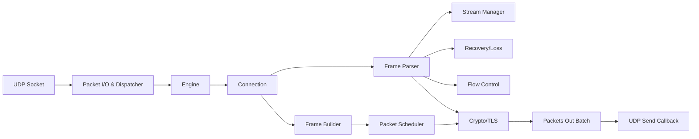
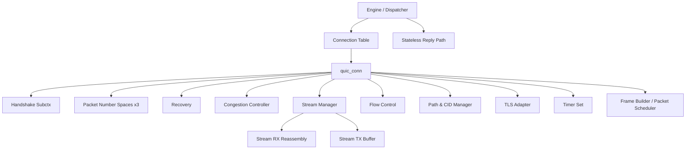
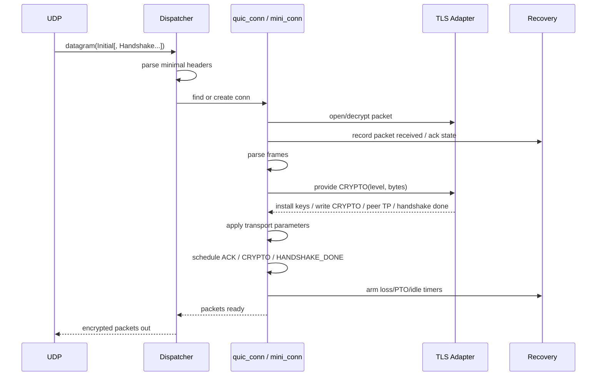
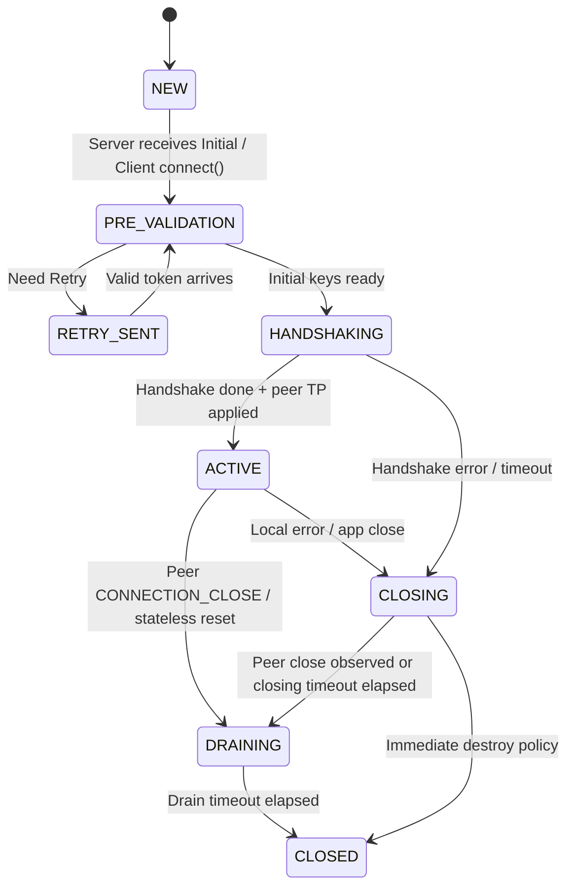
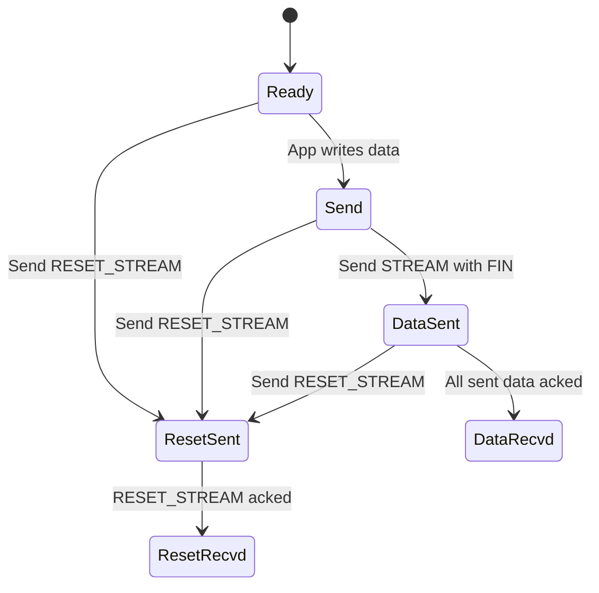
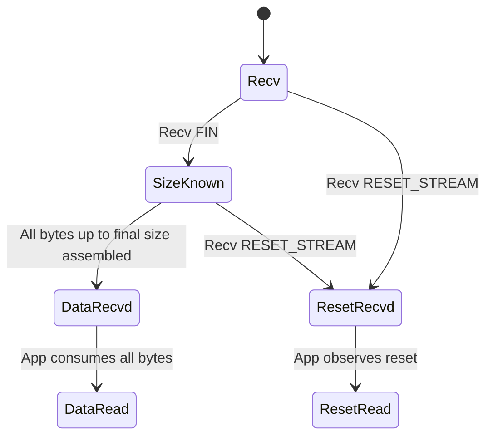

# 基于 `refs/lsquic` 的《QUIC 协议栈实现指导文档》

本文基于 `refs/lsquic` 的源码、内部文档与测试工程整理，目标不是复刻 lsquic 的每一个性能技巧，而是提炼出一套适合“从零用 C 语言实现 RFC 9000/9001/9002 QUIC 协议栈”的高层设计蓝图。

需要先明确三点：

- `lsquic` 是明显的“性能优先”代码库，作者在 `docs/internals.rst` 中明确说明了这一点；因此它的很多实现是“对性能最友好”，并不一定是“对首版实现最清晰”。
- `lsquic` 同时承载了 gQUIC、IETF QUIC、HTTP/3、QPACK、若干扩展与多年兼容包袱。对新栈而言，真正应该吸收的是它的模块边界、事件/定时器组织方式、测试习惯与对象生命周期控制；不应照搬其历史兼容层。
- 新栈的首要目标应是：`IETF QUIC v1 transport first`。架构上要为 v2、DATAGRAM、ACK_FREQUENCY、HTTP/3 预留扩展点，但不要把第一版实现做成“同时支持一切”的巨石系统。

一个很有价值的判断是：**lsquic 的“对象分层”和“事件驱动骨架”值得借鉴；它的某些“极致内联、跨模块耦合、发送控制器一把抓”的写法不值得首版照搬。**

参考实现中与本文直接相关的核心源码分布大致如下：

| 主题 | lsquic 主要文件 |
| --- | --- |
| 引擎与分发 | `src/liblsquic/lsquic_engine.c`, `lsquic_engine_public.h` |
| 连接公共接口 | `src/liblsquic/lsquic_conn.h`, `lsquic_conn.c`, `lsquic_conn_public.h` |
| IETF QUIC 全连接 | `src/liblsquic/lsquic_full_conn_ietf.c` |
| IETF QUIC 轻量握手连接 | `src/liblsquic/lsquic_mini_conn_ietf.c`, `lsquic_mini_conn_ietf.h` |
| 流 | `src/liblsquic/lsquic_stream.c`, `lsquic_stream.h`, `lsquic_data_in_if.h` |
| TLS/加密会话 | `src/liblsquic/lsquic_enc_sess.h`, `lsquic_enc_sess_ietf.c` |
| 报文/帧解析构建 | `src/liblsquic/lsquic_parse.h`, `lsquic_packet_in.h`, `lsquic_packet_out.h`, `lsquic_frame_reader.h`, `lsquic_frame_writer.h` |
| 发送控制/恢复/拥塞 | `src/liblsquic/lsquic_send_ctl.h`, `lsquic_send_ctl.c`, `lsquic_cong_ctl.h`, `lsquic_rtt.h`, `lsquic_rechist.h`, `lsquic_senhist.h` |
| 流控 | `src/liblsquic/lsquic_conn_flow.h`, `lsquic_cfcw.c`, `lsquic_sfcw.h`, `lsquic_sfcw.c` |
| 定时器与调度 | `src/liblsquic/lsquic_alarmset.h`, `lsquic_alarmset.c`, `lsquic_attq.h`, `lsquic_attq.c`, `lsquic_min_heap.c` |
| HTTP/3/QPACK | `src/liblsquic/lsquic_qenc_hdl.h`, `lsquic_qdec_hdl.h`, `lsquic_hcso_writer.h`, `lsquic_hcsi_reader.h` |
| 测试 | `tests/CMakeLists.txt` 与 `tests/test_*.c` |

## 1. 架构概览与核心模块划分

### 1.1 lsquic 的总体骨架

lsquic 的顶层对象关系非常清晰：

- `engine` 负责接收 UDP 数据报、查找/创建连接、驱动 tick、发送批处理、维护全局队列与哈希。
- `connection` 负责连接级协议逻辑：握手、路径、CID、包号空间、恢复、流控、流对象集合、错误处理。
- `stream` 负责字节流语义：重组、读写事件、发送缓冲、接收缓冲、流级状态机、流级流控。
- `crypto session` 负责将 QUIC 与 TLS 1.3 粘合起来：导出 Initial/Handshake/1-RTT 密钥，喂入/取出 CRYPTO 数据，应用 header protection 与 packet protection，读写 transport parameters。

lsquic 的核心事件链可以概括为：



这个骨架是值得直接保留的。真正需要重新设计的是模块之间的“耦合方式”和“对象生命周期形式”。

### 1.2 核心模块清单

#### Packet I/O & Dispatcher

`lsquic` 对应：

- `lsquic_engine_packet_in()`
- `process_packet_in()`
- `find_or_create_conn()`
- `lsquic_packet_in`
- `parse_packet_in_begin()` 一族

职责：

- 从 UDP datagram 中切分一个或多个 QUIC packet。
- 解析最小头部信息，只做“是否能分发”的判断，不在分发层做过多协议处理。
- 按 DCID、地址或特定模式查找连接。
- 对 server side 的首包执行“能否创建连接”的前置筛选：版本、token、cooldown、CID purgatory、轻量连接容量上限。
- 处理不归属任何连接但必须响应的情况：Version Negotiation、Retry、Stateless Reset。

设计指导：

- 新栈必须把“**分发前最小解析**”与“**连接内完整处理**”分开。
- Dispatcher 只能知道“包头最小信息”和“如何把包交给哪个连接”；不要在 dispatcher 内实现 ACK、流控或流状态逻辑。
- 必须支持 coalesced datagram。lsquic 在 `lsquic_engine_packet_in()` 中明确执行了 RFC 9000 Section 12.2 的约束：同一 datagram 的后续 packet 若 DCID 与第一个不同，则忽略。
- 必须把 “stateless reply path” 设计成独立路径，不要强行塞进普通连接逻辑。lsquic 用的是 `Packet Request Queue + Evanescent Connection`，概念上非常正确。

推荐实现方案：

- `udp_rx()` 只产生 `quic_datagram_view`。
- `dispatcher_parse_min_header()` 只解析 long/short header、version、DCID、SCID、token、packet number length、encryption level。
- `dispatcher_lookup_or_create()` 决定目标是：
  - 已有连接；
  - 轻量握手上下文；
  - 无状态响应对象；
  - 直接丢弃。

#### Connection Management

`lsquic` 对应：

- `lsquic_conn`
- `conn_iface`
- `lsquic_full_conn_ietf.c`
- `lsquic_mini_conn_ietf.c`
- `lsquic_engine.c` 中的连接队列、哈希、引用位

职责：

- 维护连接级状态机。
- 持有并协调 packet number spaces、TLS、stream map、flow control、recovery、path、transport parameters、定时器。
- 对内向下调用 crypto、parser、recovery、builder；对外向上向应用暴露连接生命周期与 stream 创建。

lsquic 的实际做法：

- 用 `conn_iface` 把不同连接类型统一到一套接口上。
- server 端存在三类对象：
  - `mini connection`：握手早期的轻量对象；
  - `full connection`：握手后长期存在的对象；
  - `evanescent connection`：一次性无状态响应对象。
- engine 只与 `conn_iface` 交互，不关心底层到底是哪类连接。

优点：

- 生命周期边界清楚。
- 握手前资源占用低，天然利于放大防护与抗 DoS。
- engine 不需要知道连接内部细节。

缺点：

- `mini -> full` promotion 复制/继承状态复杂。
- 同一协议阶段被拆成两套实现，维护成本高。
- 首版实现时容易把正确性问题变成“对象迁移问题”。

推荐方案：

- **逻辑上保留 lsquic 的三段式生命周期概念**：`pending/handshake`、`established`、`stateless reply`。
- **代码上首版不要完全复制 lsquic 的 mini/full 双实现**。更适合从零实现的方案是：
  - 用一个统一的 `quic_conn` 对象；
  - 内部按 phase 划分 `pre_validation`、`handshake`、`active`、`closing` 子状态；
  - 握手成功后再惰性初始化 stream manager、H3/QPACK、完整 recovery 子结构；
  - 若后续遇到明确的内存/DoS 压力，再把 `pending_conn` 独立拆成轻量对象。

这样既保留了 lsquic 的“概念边界”，又避免首版实现被对象迁移拖垮。

连接对象生命周期的额外建议：

- lsquic 的 `engine` 会把连接同时挂在多种所有权容器里：CID 哈希、outgoing queue、tickable queue、ATTQ、closing queue。引用何时增加、何时释放，和“连接当前挂在哪些队列里”是同一个问题。
- 新栈首版不必复制完全相同的 bit-flag/refcount 写法，但必须把“**哈希成员资格**”和“**调度队列成员资格**”显式建模，否则很容易在 `tick -> 发送 -> close -> destroy` 链路里出现 use-after-free。
- client 侧按地址或端口做连接查找，在 lsquic 中是兼容性/工程性优化；对新栈可视为二期特性，但 dispatcher API 最好预留“CID 查找失败后按地址查找”的扩展入口。

#### Cryptographic & TLS 1.3 Integration

`lsquic` 对应：

- `lsquic_enc_sess.h`
- `lsquic_enc_sess_ietf.c`
- `enc_session_funcs_common`
- `enc_session_funcs_iquic`

职责：

- 基于 Initial DCID 导出 Initial secrets。
- 将 CRYPTO frame 的字节流按 encryption level 喂给 TLS。
- 从 TLS 获取握手进度、对端 transport parameters、会话恢复信息、0-RTT 接受/拒绝结果。
- 维护 Initial / Handshake / 0-RTT / 1-RTT 读写密钥。
- 实现 packet protection 与 header protection。

lsquic 中非常值得借鉴的点：

- QUIC 加密层通过函数表与连接主体解耦，而不是把 TLS 调用散在各处。
- IETF QUIC 明确区分 `common encrypt/decrypt API` 与 `IETF 特有 handshake API`。
- `setup_handshake_keys()` 按版本盐值导出 Initial secrets，紧扣 RFC 9001。
- `gen_trans_params()` 把 transport parameters 的生成集中在加密层，避免连接层重复组包。
- `iquic_esfi_data_in()` 通过 `SSL_provide_quic_data()` 与 `SSL_do_handshake()` 驱动 TLS。
- `iquic_esfi_handshake()` 统一处理 `WANT_READ/WANT_WRITE/EARLY_DATA_REJECTED/HANDSHAKE_OK` 等握手事件。

对新栈的关键建议：

- 必须为每个 encryption level 建立单独的 `rx_key/tx_key/header_protection_key` 槽位。
- 必须把 “TLS 负责握手与密钥事件” 和 “QUIC 负责收发 CRYPTO frame 与 transport parameters” 这条边界写死，不要混淆。
- 必须把 “密钥更新、丢弃 Initial/Handshake keys、handshake confirmed” 作为显式事件，而不是隐式布尔值。
- 必须把 transport parameters 看成 TLS 集成的一部分，而不是连接模块随便读写的全局变量。

推荐接口形态：

```c
typedef struct quic_tls_if {
    int  (*init_client)(quic_tls_t *, quic_conn_t *);
    int  (*init_server)(quic_tls_t *, quic_conn_t *);
    int  (*provide_crypto_data)(quic_tls_t *, quic_enc_level_t, const uint8_t *, size_t);
    int  (*do_handshake)(quic_tls_t *, quic_tls_event_t *events, size_t *n_events);
    int  (*seal_packet)(quic_tls_t *, quic_packet_out_t *);
    int  (*open_packet)(quic_tls_t *, quic_packet_in_t *);
    int  (*get_peer_transport_params)(quic_tls_t *, quic_transport_params_t *);
    void (*on_handshake_confirmed)(quic_tls_t *);
    void (*drop_keys)(quic_tls_t *, quic_enc_level_t);
} quic_tls_if_t;
```

#### Frame Parser & Builder

`lsquic` 对应：

- `lsquic_parse.h`
- `parse_funcs`
- `lsquic_packet_in.h`
- `lsquic_packet_out.h`
- `lsquic_frame_reader.h`
- `lsquic_frame_writer.h`

职责：

- 完成 packet header 与 frame 的编解码。
- 在 packet 内记录 frame 元数据，支持 ACK、重传、丢弃、resize、split。
- 将“连接如何决策要发什么”与“具体字节如何编码”剥离。

lsquic 的关键观察：

- `parse_funcs` 是按版本组织的“packet/frame codec vtable”，这对同时支持多个 wire format 很有效。
- `packet_in` 保存的是最小但足够的“已解析元信息”，例如 DCID、PNS、header type、enc level、token offset、SCID offset、ECN、spin bit。
- `packet_out` 不只是字节缓冲，还记录 frame records；这使得 ACK 回调、STREAM frame ack accounting、重传裁剪与 MTU resize 成为可能。
- `docs/internals.rst` 和 `lsquic_parse_ietf_v1.c` 还体现了一个常被忽略但很重要的点：IETF QUIC 的 frame type 是 varint，但必须使用**最小编码**；因此 parser 不能只“能解析”，还必须拒绝非最小表示。

新栈建议：

- 首版只实现 QUIC v1，但也应保留 `codec_ops` 层，避免未来支持 v2 时重写全栈。
- `packet_in` 与 `packet_out` 应当是 recovery/CC 可读的对象，而不是“解包完立即扔掉的临时 buffer”。
- 早期解析层就应完成“协议前置约束”的筛查，而不是等进入连接后才报错，例如：
  - server 侧 Initial 的最小 DCID 长度；
  - client Initial datagram 最小尺寸要求；
  - frame type 的最小 varint 编码；
  - transport parameters 已协商扩展才能使用对应 frame。
- builder 必须支持：
  - ACK frame 独立生成；
  - STREAM/CRYPTO frame 增量拼装；
  - CONNECTION_CLOSE、PATH_CHALLENGE、PATH_RESPONSE、MAX_DATA、MAX_STREAM_DATA、RESET_STREAM、STOP_SENDING、NEW_CONNECTION_ID；
  - packet coalescing；
  - 因 packet number length、path change、PMTU 变化而 resize。

特别建议：

- lsquic 把大量 STREAM 数据直接写进 `packet_out`，性能很好，但会显著抬高重传与 resize 的复杂度。
- 对首版新栈，推荐采用“**帧描述 + 延迟 materialize**”策略：
  - 调度阶段只生成 frame descriptors；
  - 真正发包前再把 descriptors encode 到连续 buffer；
  - 这样重传是“重新编码 frame”，而不是“在旧 packet buffer 上修补”。
- 如果后续证明性能瓶颈明确，再像 lsquic 一样演进到直接 packetization。

#### Stream Management

`lsquic` 对应：

- `lsquic_stream.h`
- `lsquic_stream.c`
- `lsquic_data_in_if.h`
- `di_nocopy` / `di_hash`

职责：

- 维护流发送/接收状态机。
- 接收侧做重组、去重、最终大小验证、向应用提供连续字节读取。
- 发送侧做小写缓冲、大写 packetize、FIN/RESET/STOP_SENDING、优先级与 flush 控制。
- 与流级流控、连接级流控、recovery 的 packet ack accounting 联动。

lsquic 的关键设计：

- stream 自身只处理“字节流语义”；真正的发包依赖 `send_ctl`。
- 接收缓冲通过 `data_in_iface` 抽象，支持两种实现：
  - `nocopy`：高效，但不支持 overlap；
  - `hash`：支持 overlap 与复杂重组。
- `lsquic_stream_sending_state()` / `lsquic_stream_receiving_state()` 直接映射 RFC 9000 的发送/接收状态。
- stream 通过多个队列挂在 connection 上：`read_streams`、`write_streams`、`sending_streams`、`service_streams`。

新栈建议：

- 明确区分三类职责：
  - `stream core`：状态机与偏移；
  - `stream rx buffer`：重组与读取；
  - `stream tx buffer`：待发送数据与 frame 化。
- 不要让 stream 模块直接决定拥塞窗口；它只能知道“当前可写额度”和“下一批可交给 packet scheduler 的数据”。
- 一定要显式实现 RFC 9000 的：
  - final size 校验；
  - send-only / recv-only / bidi / uni 约束；
  - STOP_SENDING 触发 RESET_STREAM；
  - MAX_STREAM_DATA 只作用于发送方向；
  - RESET 与 FIN 的互斥/并存规则。

推荐实现方案：

- `stream_rx_reasm`: 间隔树/红黑树/有序链表 + 小对象池。
- `stream_tx_buf`: 分片链表或 ring buffer。
- `stream_event_flags`: `READABLE`, `WRITABLE`, `SEND_CONTROL`, `FIN_PENDING`, `RESET_PENDING`, `APP_CLOSED`.

#### Loss Detection & Congestion Control

`lsquic` 对应：

- `lsquic_send_ctl.h`
- `lsquic_send_ctl.c`
- `lsquic_cong_ctl.h`
- `lsquic_cubic.c`
- `lsquic_bbr.c`
- `lsquic_bw_sampler.c`
- `lsquic_rtt.h`
- `lsquic_rechist.h`
- `lsquic_senhist.h`

职责：

- 管理 in-flight packets 与 sent history。
- 根据 ACK 更新 RTT、bytes-in-flight、loss、PTO。
- 触发重传、probe、pacing、cwnd 调整。
- 为 frame builder/stream scheduler 分配发送预算。

必须指出的事实：

- lsquic 自己在 `docs/internals.rst` 里明确说明：其 loss detection 逻辑最早来自 Chromium 的早期 gQUIC 恢复逻辑，与 RFC 9002 的现代表述并不一致。
- 这意味着：**send controller 的“模块边界”值得借鉴，但其“具体 loss algorithm”不应直接作为新栈蓝本。**

lsquic 真正值得借鉴的是：

- 发送状态集中管理在一个 recovery/scheduler 对象中，而不是散落在 stream 和 connection 各处。
- `cong_ctl_if` 把 Cubic / BBR / adaptive 模式抽象成统一接口。
- `packet_out` 挂 frame records，ACK 时能直接回溯影响到哪些 stream/frame。
- `rechist` 与 `senhist` 独立成模块，便于测试。

新栈推荐方案：

- 不要把所有内容都塞进一个 `send_ctl` 巨物。
- 应拆为四个协作子模块：
  - `sent_packet_map`：跟踪未确认 packet；
  - `loss_detector`：实现 RFC 9002 packet threshold、time threshold、PTO；
  - `congestion_controller`：Cubic/Reno/BBR 插件；
  - `pacer`：按 pacing rate 派发发送时机。
- 对外再提供一个统一门面 `recovery_ctx` 给 connection 调用。

推荐控制面接口：

```c
typedef struct quic_recovery_if {
    void (*on_packet_sent)(quic_recovery_t *, quic_packet_out_t *, quic_time_t now);
    int  (*on_ack_received)(quic_recovery_t *, const quic_ack_frame_t *, quic_time_t now);
    void (*on_loss_timeout)(quic_recovery_t *, quic_time_t now);
    int  (*can_send)(const quic_recovery_t *);
    quic_time_t (*next_deadline)(const quic_recovery_t *, quic_timer_reason_t *);
    uint64_t (*cwnd)(const quic_recovery_t *);
    uint64_t (*bytes_in_flight)(const quic_recovery_t *);
} quic_recovery_if_t;
```

#### Flow Control

`lsquic` 对应：

- `lsquic_conn_flow.h` / `lsquic_cfcw.c`
- `lsquic_sfcw.h` / `lsquic_sfcw.c`
- `lsquic_stream.c` 中的 `stream_consumed_bytes()`

职责：

- 跟踪连接级接收窗口与流级接收窗口。
- 跟踪本端发送额度 `max_data` / `max_stream_data`。
- 在应用读取数据后决定是否提升窗口并发送 `MAX_DATA` / `MAX_STREAM_DATA`。
- 对对端超过 flow control limit 的行为立即报错。

lsquic 的一个好设计是：

- 连接级与流级流控是两个小模块，而不是大连接对象中的一堆裸字段。
- 两者都维护：
  - `max_recv_off`：观察到的最大偏移；
  - `recv_off`：当前通告的窗口上限；
  - `read_off`：应用实际消耗到哪里；
  - `last_updated`：用于动态窗口扩张。

新栈建议：

- 必须明确分成：
  - `rx_fc_conn` / `rx_fc_stream`；
  - `tx_credit_conn` / `tx_credit_stream`。
- 接收侧是“我允许对方发到哪”；发送侧是“对方允许我发到哪”。不要用同一组字段同时表示两个方向。
- 动态窗口扩展可以借鉴 lsquic：如果应用消费速度快且更新间隔短，逐步扩大窗口；但首版完全可以用固定窗口，等互通稳定后再做自适应。

#### Timer & Event Scheduling

`lsquic` 对应：

- `lsquic_alarmset.h`
- `lsquic_alarmset.c`
- `lsquic_attq.h`
- `lsquic_attq.c`
- `lsquic_min_heap.c`

职责：

- 管理连接内部的多个逻辑定时器。
- 管理 engine 级“哪些连接现在该 tick”与“哪些连接将来某时该 tick”。

lsquic 的分层非常值得借鉴：

- 连接内使用 `alarmset` 管多个 timer。
- engine 外层使用两个全局结构：
  - `Tickable Queue`：现在就能处理的连接；
  - `Advisory Tick Time Queue`：将来某个时刻建议处理的连接。

这套设计非常实用，因为 QUIC 的定时器分两类：

- 连接内语义定时器：loss/PTO、ACK delay、idle、handshake、path validation、cid retire。
- engine 调度定时器：哪个连接该被下一次 `tick()` 调用。

新栈建议：

- 保留“双层调度”：
  - `conn_timer_set` 只关心连接内部。
  - `engine_ready_q + engine_deadline_q` 只关心连接调度。
- 首版不必过早做 timer wheel；`alarm array + min-heap` 已足够。
- 连接的 `next_tick_time` 应是从 recovery deadline、idle deadline、ack deadline、pacer deadline、app-event deadline 中取最小值。

#### 可选上层：HTTP/3 / QPACK / H3 Control Streams

`lsquic` 对应：

- `lsquic_qenc_hdl.h`
- `lsquic_qdec_hdl.h`
- `lsquic_hcso_writer.h`
- `lsquic_hcsi_reader.h`

设计结论：

- 这些模块说明：**HTTP/3 必须建立在“可靠的 transport core”之上，而不是反过来。**
- 新 QUIC 栈第一阶段不要把 H3/QPACK 与传输核心揉在一起。
- 但接口上必须预留“critical unidirectional streams”“control stream parser”“header block decoder”挂点。

### 1.3 推荐的总架构方案

综合 lsquic 的经验，推荐你的新栈采用下面这套结构：



推荐原因：

- 它保留了 lsquic 最成功的分层：`engine -> conn -> stream`。
- 它避免了 lsquic 首版不必要的复杂点：过早实现 mini/full 双对象与 send_ctl 超级对象。
- 它与 RFC 9000/9001/9002 的逻辑章节天然对齐，便于后续 Agent 按规范推进。
- 它允许先做 transport v1，再渐进加入 v2、DATAGRAM、HTTP/3。

## 2. 关键数据结构与接口设计

### 2.1 Connection Context 中必须包含的核心字段

建议把连接对象划分为若干字段组，而不是简单堆一堆 flag。

| 字段组 | 必备字段 | 作用 | lsquic 对应 |
| --- | --- | --- | --- |
| 身份与角色 | `is_server`, `version`, `state`, `peer_sa`, `local_sa` | 决定包解析、路径策略、连接状态机 | `cn_flags`, `cn_version`, `network_path` |
| CID 与路径 | `scid_set`, `dcid_active`, `odcid`, `retry_scid`, `dcid_retire_q`, `paths[]`, `active_path`, `cid_purgatory_ref` | 支撑 Retry、migration、stateless reset、CID retirement、晚到包隔离 | `ifc_cces`, `ifc_dces`, `ifc_paths`, `purga` |
| TLS/密钥 | `tls`, `keys[ENC_INIT..ENC_APP]`, `handshake_done`, `handshake_confirmed`, `peer_tp`, `local_tp` | 支撑 RFC 9001 的各加密级别与 transport parameters | `cn_enc_session`, `esi_*`, `ifc_cfg` |
| 包号空间 | `pns[3]`，每个含 `largest_rx`, `largest_tx`, `recv_history`, `sent_packets`, `ack_state` | 初始/握手/应用数据三个空间独立管理 | `ifc_rechist[]`, `ifc_send_ctl.sc_unacked_packets[]` |
| 恢复与拥塞 | `recovery`, `cc`, `pacer`, `rtt`, `bytes_in_flight`, `amplification_limit` | RFC 9002 核心 | `ifc_send_ctl`, `ifc_pub.rtt_stats` |
| 流管理 | `streams_by_id`, `readable_q`, `writable_q`, `control_q`, `closed_stream_ids` | 连接内所有流的索引与调度 | `ifc_pub.all_streams`, `ifc_closed_stream_ids` |
| 流控 | `conn_rx_fc`, `conn_tx_credit`, `stream_limits`, `max_streams_*` | 连接级与流级发送/接收额度 | `ifc_pub.cfcw`, `ifc_max_streams_in[]`, `ifc_max_stream_data_uni` |
| 传输参数镜像 | `peer_active_cid_limit`, `peer_disable_active_migration`, `peer_preferred_addr`, `peer_max_datagram_frame_size`, `ack_delay_exponent`, `max_ack_delay` | 将 TP 约束显式投影到运行态，避免散落在各模块里 | `lsquic_trans_params.c`, `ifc_tp*`, `ifc_migra` |
| 定时器 | `idle_deadline`, `ack_deadline`, `loss_deadline`, `handshake_deadline`, `path_deadline`, `ping_deadline` | QUIC 的所有关键 timeout | `ifc_alset` |
| 应用接口 | `app_conn_ctx`, `stream_ops`, `packets_out_cb` | 连接向上/向下的 API 边界 | `cn_conn_ctx`, `enp_stream_if`, `ea_packets_out` |
| 观测与调试 | `conn_id_log`, `stats`, `qlog`, `last_progress` | 调试和协议可视化 | `ifc_stats`, `qlog`, `noprogress timer` |

建议额外定义一个包号空间子结构：

```c
typedef struct quic_pn_space {
    quic_pn_space_id_t id;              // initial / handshake / application
    uint64_t           next_tx_pn;
    uint64_t           largest_rx_pn;
    uint64_t           largest_acked_pn;
    quic_recv_hist_t   recv_hist;
    quic_sent_map_t    sent_map;
    quic_ack_state_t   ack_state;
    quic_time_t        loss_time;
    quic_time_t        ack_deadline;
    bool               keys_available_rx;
    bool               keys_available_tx;
} quic_pn_space_t;
```

这是比“把一堆 `ifc_*_init / ifc_*_hsk / ifc_*_app` 平铺在 connection 上”更清晰的做法。

与 transport parameters 和 CID 生命周期强相关的补充建议：

- `original_destination_connection_id`、`initial_source_connection_id`、`retry_source_connection_id` 建议在连接上下文中作为**一组不可分割字段**保存。`Retry` 验证、transport parameters 校验、连接日志都依赖这组三元组。
- `active_connection_id_limit` 不能只在 TP 解析时检查一次。建议把“对端允许的活动 CID 上限”保存成运行态字段，所有 `NEW_CONNECTION_ID`/`RETIRE_CONNECTION_ID` 路径都对它做断言。lsquic 在 `lsquic_trans_params.c` 中也显式维护了默认值、最小值与非法组合检查。
- `preferred_address` 和 `disable_active_migration` 是路径/CID 管理模块的直接输入，不应只保留在 TLS 模块里。迁移逻辑只有在 `handshake confirmed` 后才应真正开放。
- 对 server 而言，首批 client DCID 往往会临时转化成 server 侧可识别的 SCID。lsquic 甚至会在握手成功后通过单独 alarm 延迟退休这类“原始 SCID”。首版实现不一定要复制这一策略，但必须明确“哪些 CID 何时加入映射、何时退休、何时进入 purgatory”。
- 若未来需要把新发放/即将退休的 SCID 通知给上层（例如与负载均衡、可观测性或外部路由组件联动），建议预留成批回调接口。lsquic 的 `ea_new_scids()` / `ea_old_scids()` 就体现了“CID 生命周期可观测”也是一项独立工程能力。

### 2.2 Stream Context 的接收/发送缓冲区设计

#### 接收缓冲区设计

lsquic 的接收路径给出的关键信号是：

- 流接收缓冲必须支持乱序到达。
- 必须能区分 `duplicate`、`overlap`、`gap`、`final size violation`。
- 必须支持零拷贝优化，但不要让零拷贝成为正确性的前提。

推荐 `Stream RX Context`：

| 字段 | 作用 |
| --- | --- |
| `recv_state` | RFC 9000 接收侧状态 |
| `read_offset` | 应用已读到的偏移 |
| `largest_recv_off` | 观察到的最大偏移 |
| `final_size_known` / `final_size` | FIN 或 RESET_STREAM 指定的最终大小 |
| `reasm_map` | 有序区间结构，按 offset 存储片段 |
| `contiguous_ready` | 从 `read_offset` 开始连续可读的字节数 |
| `flow_rx` | 流级接收窗口对象 |
| `stop_sending_sent` | 是否已发 STOP_SENDING |
| `reset_received` / `reset_error` | 是否收到 RESET_STREAM |

推荐 `reasm_map` 元素：

```c
typedef struct quic_rx_seg {
    uint64_t off;
    uint64_t len;
    bool     fin;
    bool     owns_data;
    uint8_t *buf;      // copy path
    void    *pkt_ref;  // zero-copy path
} quic_rx_seg_t;
```

实现建议：

- MVP 先用“复制进入重组区间树”的方式，逻辑最稳。
- 性能优化阶段再增加“packet-backed zero-copy segments”。
- 可以借鉴 lsquic 的 `di_nocopy -> di_hash` 思路：当 overlap/重排复杂度升高时切换到更通用实现。

#### 发送缓冲区设计

lsquic 的发送路径说明了两个现实：

- 小写入若每次都即时 packetize，会导致大量小包与过高调度开销。
- 直接把用户数据写到 packet buffer 中可以极致高效，但会大幅增加重传与 resize 复杂度。

推荐 `Stream TX Context`：

| 字段 | 作用 |
| --- | --- |
| `send_state` | RFC 9000 发送侧状态 |
| `tx_buf` | 尚未 packetize 的用户数据 |
| `next_send_off` | 下一次构造 STREAM frame 的起始 offset |
| `max_send_off` | 对端通告的发送上限 |
| `buffered_bytes` | 当前缓冲的字节数 |
| `fin_requested` / `fin_sent` | FIN 生命周期 |
| `reset_sent` / `reset_acked` | RESET_STREAM 生命周期 |
| `n_unacked_frames` | 仍未被 ACK 的本流 frame 数 |
| `flow_tx_blocked_at` | 最近一次因流控被阻塞的位置 |

发送策略建议：

- `write < flush_threshold` 时先入 `tx_buf`。
- `write >= flush_threshold` 或 `flush()` 时再由 scheduler 切成 STREAM frames。
- retransmission 不应“重新使用旧 packet buffer”，而应根据未确认 frame descriptor 重新编码。

### 2.3 核心模块之间的关键交互接口

建议把模块接口设计成“事件 + 拉取式发送”的组合。

#### Dispatcher -> Connection

```c
int quic_dispatcher_on_datagram(
    quic_engine_t *engine,
    const uint8_t *udp_payload,
    size_t udp_len,
    const struct sockaddr *local_sa,
    const struct sockaddr *peer_sa,
    void *peer_ctx,
    int ecn);

quic_conn_t *quic_engine_find_or_create_conn(
    quic_engine_t *engine,
    const quic_packet_in_t *first_packet);

int quic_conn_on_packet(quic_conn_t *conn, quic_packet_in_t *packet);
```

#### Connection -> Crypto/TLS

```c
int quic_tls_open_packet(
    quic_tls_t *tls,
    quic_packet_in_t *packet,
    quic_plain_packet_t *plain);

int quic_tls_provide_crypto_data(
    quic_tls_t *tls,
    quic_enc_level_t level,
    const uint8_t *data,
    size_t len);

int quic_tls_poll_events(
    quic_tls_t *tls,
    quic_tls_event_t *events,
    size_t *n_events);
```

典型 TLS 事件应包括：

- `TLS_EVT_WRITE_CRYPTO(level, bytes...)`
- `TLS_EVT_INSTALL_RX_KEYS(level)`
- `TLS_EVT_INSTALL_TX_KEYS(level)`
- `TLS_EVT_HANDSHAKE_DONE`
- `TLS_EVT_HANDSHAKE_CONFIRMED`
- `TLS_EVT_PEER_TRANSPORT_PARAMS`
- `TLS_EVT_0RTT_REJECTED`
- `TLS_EVT_ALERT`

#### Connection -> Frame Parser / Builder

```c
int quic_frame_parse_all(
    quic_conn_t *conn,
    const quic_plain_packet_t *packet,
    quic_frame_visitor_t *visitor);

int quic_builder_begin_packet(
    quic_conn_t *conn,
    quic_packet_builder_t *b,
    quic_pn_space_id_t pns);

int quic_builder_append_stream(
    quic_packet_builder_t *b,
    quic_stream_t *stream,
    size_t max_bytes);
```

#### Connection -> Recovery

```c
void quic_recovery_on_packet_received(
    quic_recovery_t *reco,
    quic_pn_space_id_t pns,
    uint64_t pn,
    quic_time_t now,
    bool ack_eliciting);

int quic_recovery_on_ack_received(
    quic_recovery_t *reco,
    const quic_ack_frame_t *ack,
    quic_time_t rx_time);

void quic_recovery_on_packet_sent(
    quic_recovery_t *reco,
    quic_packet_out_t *packet,
    quic_time_t now);
```

#### Connection -> Stream / Flow Control

```c
int quic_stream_on_stream_frame(
    quic_stream_t *stream,
    const quic_stream_frame_t *frame);

int quic_stream_app_read(
    quic_stream_t *stream,
    uint8_t *dst,
    size_t cap,
    size_t *nread);

int quic_stream_app_write(
    quic_stream_t *stream,
    const uint8_t *src,
    size_t len,
    bool fin);
```

#### Connection -> Engine 发送路径

```c
quic_packet_out_t *quic_conn_next_packet_to_send(
    quic_conn_t *conn,
    const quic_coalesce_hint_t *hint);

void quic_conn_on_packet_sent(
    quic_conn_t *conn,
    quic_packet_out_t *packet);

void quic_conn_on_packet_not_sent(
    quic_conn_t *conn,
    quic_packet_out_t *packet);
```

这正是 lsquic `conn_iface` 的核心思想：engine 只知道“如何拿到下一个待发包”和“发完后如何通知连接”。

## 3. 核心工作流与状态机

### 3.1 握手阶段（Handshake Flow）

下面先描述 **server 收到 Initial 包** 时，最接近 lsquic 的实际处理链；随后再给出更适合新栈实现的推荐链。

#### 3.1.1 lsquic 的 server 端实际链路

1. `lsquic_engine_packet_in()` 接收 UDP datagram。
2. 它循环解析 datagram 中的每个 packet，形成 `lsquic_packet_in`。
3. 若是 IETF QUIC coalesced datagram，后续 packet 的 DCID 必须与第一个一致，否则忽略。
4. `process_packet_in()` 调用 `find_or_create_conn()`：
   - 先查哈希；
   - 若不存在连接，则检查 cooldown、mini connection 数量上限、CID purgatory、版本支持、token 校验；
   - 通过后创建 `lsquic_mini_conn_ietf_new()`。
5. `mini_conn_ietf` 只维持最小握手状态：
   - `Initial/Handshake` 包号空间的接收历史；
   - 轻量 crypto streams；
   - 已发/已确认/待发握手包集合；
   - anti-amplification 统计；
   - 延迟的 1-RTT app packets；
   - stash 的乱序 CRYPTO frames。
6. 收到 CRYPTO frame 后，`lsquic_mini_conn_ietf.c` 会：
   - 解析 CRYPTO frame；
   - 若 offset 未连续，则 stash；
   - 若还未初始化 TLS，则 `esfi_init_server()`；
   - 将数据喂入 mini crypto stream，再转给 TLS；
   - TLS 通过 `ci_hsk_done()` 回调 mini connection。
7. 当 TLS 报告握手成功：
   - mini conn 设置 `IMC_HSK_OK` 与 `LSCONN_HANDSHAKE_DONE`；
   - 下一次 `ci_tick()` 可能补发 ACK / HANDSHAKE_DONE；
   - 返回 `TICK_PROMOTE`。
8. engine 在 promotion 前调用 `lsquic_mini_conn_ietf_pre_promote()` 以确保挂起 ACK 被生成。
9. engine 创建 `full_conn_ietf`，把 mini conn 中的关键状态继承过去：
   - receive history；
   - 已发/未发 packet_out；
   - ECN 计数；
   - 延迟的 app packets；
   - 部分 sent history。
10. `handshake_ok()` 在 full conn 中执行真正的后握手初始化：
    - 读取并应用 peer transport parameters；
    - 初始化 DCID/stateless reset token；
    - 启动 HTTP/3/QPACK 相关结构；
    - 初始化 MTU probe、noprogress timer、delayed streams；
    - client 侧把 0-RTT 队列切换到 1-RTT。
11. 连接开始进入正常 `tick()` 循环。
12. 当 1-RTT packet 被 ACK，或者 server 发送/确认 `HANDSHAKE_DONE` 后，`handshake_confirmed()` 丢弃握手级别状态并允许迁移等后续能力。

#### 3.1.2 更适合新栈的推荐握手链

推荐把上述过程压缩为一个统一连接对象上的 phase 变化：

1. Dispatcher 对首个 Initial 做最小解析。
2. 若需要，新建 `quic_conn`，但此时只初始化：
   - 基础身份字段；
   - Initial/Handshake PNS；
   - TLS adapter；
   - path0；
   - anti-amplification 记账；
   - handshake timer。
3. 对包执行 decrypt + frame parse。
4. CRYPTO frame 进入 `crypto_reasm[level]`，连续字节交给 TLS。
5. TLS 通过事件回传：
   - 安装新级别密钥；
   - 产出待发送 CRYPTO 数据；
   - 给出 peer transport parameters；
   - 宣告 handshake done。
6. `conn.phase` 从 `PRE_VALIDATION` 进入 `HANDSHAKING`，再进入 `ACTIVE`。
7. 只有在 `ACTIVE` 之后才初始化：
   - 应用流 map；
   - MAX_STREAMS 管理；
   - H3/QPACK 特殊流；
   - 高成本统计与扩展。

这个方案比 lsquic 的 mini/full promotion 更容易正确实现，同时逻辑上仍与 lsquic 完全同构。

#### 3.1.3 握手阶段时序图



### 3.2 数据收发阶段（Data Flow）

#### 3.2.1 应用写入到 UDP 发送的完整链路

1. 应用调用 `stream_write()` 或等价 API。
2. stream 检查自身发送状态、对端 `MAX_STREAM_DATA`、连接 `MAX_DATA`、是否已 FIN/RESET。
3. 小写入进入 `tx_buf`；大写入或 flush 请求进入“待 packetize”路径。
4. 连接 `tick()` 时，scheduler 轮询：
   - 控制帧优先；
   - crypto / handshake 特殊流；
   - 高优先级应用流；
   - 普通应用流；
   - datagram / probe / ping。
5. frame builder 创建 `STREAM` / `RESET_STREAM` / `MAX_DATA` / `ACK` 等 frame descriptors。
6. packet builder 组装 packet header 与 payload。
7. crypto 模块为该 packet number space 选择对应密钥：
   - Initial / Handshake / 0-RTT / 1-RTT。
8. `seal_packet()` 执行 packet protection 与 header protection。
9. engine 把来自多个连接的 packet 组成 batch。
10. 通过 `packets_out()` 回调交给 UDP 层。
11. 成功发送后，recovery 记录 sent packet；发送失败则 packet 回到 delayed/scheduled 队列。

#### 3.2.2 从 UDP 收包到应用读取的完整链路

1. UDP datagram 进入 dispatcher。
2. minimal header parse 后定位连接。
3. 连接调用 crypto 打开包。
4. recovery 记录 `packet received`，更新 ACK 计划与 ECN 统计。
5. frame parser 逐帧派发：
   - `ACK` -> recovery；
   - `STREAM` -> stream reassembly；
   - `CRYPTO` -> TLS；
   - `MAX_DATA` / `MAX_STREAM_DATA` -> 发送额度更新；
   - `RESET_STREAM` / `STOP_SENDING` -> 流状态机；
   - `PATH_*` / `NEW_CONNECTION_ID` -> path/CID manager；
   - `CONNECTION_CLOSE` -> connection state machine。
6. 若 stream 从不可读变为可读，进入 `readable_q`。
7. 连接 `tick()` 时调用应用 `on_read` 或等价回调。
8. 应用读取数据后推进 `read_offset`。
9. flow control 模块判断是否需要扩大窗口并发送 `MAX_STREAM_DATA` / `MAX_DATA`。

### 3.3 Connection 核心状态流转

下面给出**推荐实现**的连接状态机。它比 lsquic 更规整，但仍覆盖 lsquic 的真实语义。



状态解释：

- `NEW`：仅存在配置与地址信息。
- `PRE_VALIDATION`：首包处理、token/Retry/anti-amplification、生效的只有最小字段。
- `HANDSHAKING`：Initial/Handshake/0-RTT/1-RTT 密钥逐步出现，尚未完全激活应用数据路径。
- `ACTIVE`：transport parameters 已应用，stream manager 与常规 recovery 全部生效。
- `CLOSING`：本端主动进入关闭流程，允许发 CONNECTION_CLOSE。
- `DRAINING`：仅保留足够状态辨认后续包，不再做正常处理。
- `CLOSED`：资源释放。

### 3.4 Stream 核心状态流转

lsquic 的 `lsquic_stream_sending_state()` 与 `lsquic_stream_receiving_state()` 直接映射 RFC 9000 Section 3.1 / 3.2，建议新栈照此实现。

#### 3.4.1 发送侧状态



解释：

- `Ready`：流已创建，但还没有可发数据。
- `Send`：正在发送数据，可能继续收到 `MAX_STREAM_DATA`。
- `DataSent`：已经发送 FIN，但仍等待 ACK。
- `DataRecvd`：发送方向正常结束且被确认。
- `ResetSent` / `ResetRecvd`：发送方向被异常终止。

#### 3.4.2 接收侧状态



实现注意事项：

- `Recv` 状态允许收 `STREAM` / `STREAM_DATA_BLOCKED` / `RESET_STREAM`。
- 只有接收方向处于 `Recv` 时才应该发 `MAX_STREAM_DATA`。
- 收到 `STOP_SENDING` 后，发送方向通常应尽快发 `RESET_STREAM`。
- `final_size` 必须与之后任何 `FIN` / `RESET_STREAM` / `STREAM` 推导出的最终偏移保持一致，否则立即报错。

### 3.5 lsquic 架构中的额外状态机要点

lsquic 还体现了几个值得吸收但容易遗漏的状态逻辑：

- `Initial` keys 与 `Handshake` keys 的丢弃不是“handshake done 立刻发生”，而是与 `handshake confirmed` 或特定条件绑定。
- 对 server 而言，地址未验证前存在 anti-amplification 限额，状态机会直接影响是否允许继续发送。
- `GOAWAY`、`MAX_STREAMS`、`closed_stream_ids` 会影响“流能否再创建”，它们属于连接状态机的一部分，不只是 stream manager 的局部状态。

## 4. 测试策略与测试用例清单

### 4.1 lsquic 测试工程给出的组织方式

`refs/lsquic/tests/CMakeLists.txt` 非常值得学习：

- 每个测试点尽量做成独立可执行文件，失败时定位非常快。
- 多数测试是纯单元测试，不依赖真实网络。
- 少数复杂测试通过 deterministic mock 环境模拟 send controller、stream、packetization。
- 大测试会拆分运行，例如 `test_h3_framing` 按子集拆成多个 `ctest` 项。

这说明一个正确方向：**新栈必须优先建设“可独立运行、可 deterministic 重放”的小测试，而不是一上来只做端到端互通。**

### 4.2 单元测试（Unit Tests）

下面按模块列出“首版必须覆盖”的测试点，并附上 lsquic 中可对照的测试文件。

| 模块 | 必测点 | lsquic 参考测试 |
| --- | --- | --- |
| 变长整数 | 1/2/4/8 字节边界，截断输入，非阻塞增量读取 | `test_varint.c` |
| 包头解析 | long/short header、token、nonce、CID、不同 packet number 长度、截断报文、server Initial 最小 DCID 长度、coalesced datagram 约束 | `test_parse_packet_in.c`, `test_reg_pkt_headergen.c` |
| 帧类型解析 | frame type 最小 varint 编码、未知 frame、非法扩展 frame 编码 | `test_frame_rw.c`, `test_h3_framing.c` |
| ACK 编解码 | ACK range 上限、截断、ACK delay exponent、最大 range 数 | `test_ackparse_ietf.c`, `test_ack.c`, `test_ack_merge.c` |
| receive history | 重复包、洞、stop waiting/cutoff、range 迭代 | `test_rechist.c`, `test_trechist.c` |
| sent history | packet number 连续性、gap warning、关闭场景的 gap 例外 | `test_senhist.c` |
| 流重组 | 乱序、重复、overlap、final size、读偏移推进 | `test_streamparse.c`, `test_di_nocopy.c`, `test_stream.c` |
| 流发送 | 小写缓冲、大写 packetize、FIN、RESET、STOP_SENDING、flush threshold | `test_stream.c`, `test_streamgen.c` |
| 流控 | 连接级/流级窗口、窗口提升、违反 flow control 时报错 | `test_sfcw.c` |
| 传输参数 | `original_destination_connection_id` / `initial_source_connection_id` / `retry_source_connection_id` / `preferred_address` / `active_connection_id_limit` / `max_datagram_frame_size` 的边界与非法组合 | `test_trapa.c` |
| 定时器 | alarm set 排序、同一时刻多个 timer、最小到期时间 | `test_alarmset.c`, `test_attq.c`, `test_min_heap.c` |
| RTT | srtt/rttvar/min_rtt 更新 | `test_rtt.c` |
| 拥塞控制 | Cubic 数学行为、静默期恢复、BBR/BW sampler 生命周期 | `test_cubic.c`, `test_bw_sampler.c`, `test_send_ctl_bw_lifecycle.c` |
| packet_out 元数据 | frame record 记录与迭代、resize/chop 后一致性 | `test_packet_out.c`, `test_packet_resize.c`, `test_frame_chop.c` |
| 密码学原语 | HKDF、export key、clear AEAD、token 生成 | `test_hkdf.c`, `test_export_key.c`, `test_clear_aead.c`, `test_tokgen.c` |
| 版本协商 | version negotiation 包生成/解析、非法版本位图 | `test_ver_nego.c` |
| 关闭后隔离 | closed/retired CID 的晚到包隔离、CID purgatory 生命周期 | `test_purga.c` |
| 观测 | qlog 事件最小可用性 | `test_qlog.c` |

建议你在新栈中把单元测试进一步细化为下面的 TDD 顺序：

1. 编码/解析纯函数。
2. 状态机纯函数。
3. recovery 与 timer 纯逻辑。
4. stream reassembly / flow control。
5. packet builder / encrypt/decrypt 边界。

### 4.3 协议一致性测试（Protocol Conformance）

仅有单元测试远远不够，QUIC 最容易出错的是“合法报文在复杂时序下的状态推进”。结合 lsquic 的源码和测试风格，后续 Agent 应至少构造下面这些确定性协议场景：

#### 报文异常与鲁棒性

- 截断 long header / short header。
- 截断 varint frame 字段。
- frame type 使用了非最小 varint 编码。
- 同一 datagram 中后续 coalesced packet 的 DCID 与首包不同。
- packet number 回退、重复包、超过 ACK 声明范围。
- ACK frame 声称确认未发送过的包。
- ACK range 乱序、重叠、空区间。
- 在错误 encryption level 上收到 frame。
- 收到未支持的 frame type 或关键字段非法编码。

#### 流与流控异常

- `STREAM` 与 `RESET_STREAM` 导出的 final size 不一致。
- 流未创建就收到 `MAX_STREAM_DATA` 或 `STOP_SENDING`。
- receive-only 流上收到 `MAX_STREAM_DATA`。
- send-only 流上收到 `STREAM` / `RESET_STREAM`。
- 超过 stream-level 或 conn-level flow control limit。
- 多次收到旧的 `MAX_DATA` / `MAX_STREAM_DATA`，应忽略退回。

#### 握手与加密异常

- CRYPTO frame 乱序到达，缓存不足或缓存上限触发错误。
- Retry token 缺失/错误/过期。
- Version Negotiation 包中包含客户端已提议版本，应忽略。
- Retry 之后 transport parameters 中的 `odcid/initial_scid/retry_scid` 三元组与握手路径不一致。
- 0-RTT 被拒绝后的发送队列重置。
- Handshake done 与 handshake confirmed 的时机错误。
- 丢弃 Initial/Handshake keys 后收到旧级别包。

#### 路径与 CID 异常

- 地址变化但路径未验证，不得立即切主路径。
- PATH_CHALLENGE / PATH_RESPONSE 不匹配。
- NEW_CONNECTION_ID 重复 sequence number。
- NEW_CONNECTION_ID 携带冲突 reset token。
- `preferred_address` 尚未到达 `handshake confirmed` 就触发主动迁移。
- client 收到来自未知 server 地址的普通包，必须丢弃而不是切换路径。
- retired CID 再次收到晚到包，不得创建新连接。
- 连接关闭后的 late packet 命中 CID purgatory，必须被吞掉而不是重新建连。

#### 关闭与重置

- 初始握手期间立即 close。
- peer CONNECTION_CLOSE 后进入 draining，不再发送常规包。
- stateless reset token 命中后立即进入 draining。
- STOP_SENDING 后发送侧必须尽快转入 RESET_STREAM 路径。

这类测试不一定要使用真实 UDP。更好的做法是：

- 构造 `scripted packet trace`；
- 逐步喂给 `conn_on_packet()`；
- 每一步检查状态字段、待发送 frame、timer、flow credit、stream state；
- 将该 trace 持久化成 golden tests。

lsquic 的 `test_mini_conn_delay.c` 尤其说明了一个重要教训：**延迟包、拷贝语义、生命周期问题必须有专门测试**。这类 bug 往往不在 RFC 章节里，但在真实实现中非常致命。

### 4.4 集成测试与互操作性（Integration & Interop）

建议把集成测试分三层推进：

#### 第一层：进程内 loopback 集成

- client/server 在同进程、同事件循环、同 mock socket 上跑通最小握手。
- 覆盖：
  - Initial -> Handshake -> 1-RTT；
  - 单流请求/响应；
  - 双向数据；
  - close；
  - idle timeout；
  - Retry；
  - stateless reset。

#### 第二层：故障注入集成

- 在 loopback socket 层插入：
  - 丢包；
  - 乱序；
  - 重复；
  - 报文截断；
  - ECN 标记；
  - MTU 缩减；
  - 地址切换。
- 对 recovery、path validation、CID retirement、PTO 做稳定性回归。

#### 第三层：标准互操作测试

lsquic 代码树本身就包含 `qir/` 以及和 interop 密切相关的逻辑；你的仓库也已经包含了 `quic-interop-runner` 相关文档。后续 Agent 应按下面的方式接入：

- 优先阅读：
  - `docs/quic-interop-runner/how-to-run.md`
  - `docs/quic-interop-runner/implement-requirements.md`
  - `docs/quic-interop-runner/quic-test-cases.md`
- 把你自己的实现包装成 runner 期望的 server/client 容器镜像。
- 首轮只跑 transport 核心场景：
  - `handshake`
  - `transfer`
  - `retry`
  - `resumption`
  - `versionnegotiation`
- 在 transport 稳定前，不要把 HTTP/3 失败和 transport 失败混为一谈。

### 4.5 推荐的 TDD 开发节奏

最有效的开发节奏不是“先写连接，再补测试”，而是：

1. 一个模块只暴露极小 API。
2. 先写 unit tests。
3. 再写 deterministic connection simulation tests。
4. 再写 loopback integration tests。
5. 最后跑 interop。

建议每个 Phase 都满足同样的验收标准：

- 该 Phase 新增代码有对应单元测试。
- 至少有一个 deterministic trace 测试。
- 若涉及连接状态变化，则至少有一个 loopback 集成测试。

## 5. 分阶段实现路径（Implementation Roadmap）

### Phase 1：基础工具链

目标：

- 变长整数。
- 基础 endian/helpers。
- packet number truncate/restore。
- 最小 `packet_in` / `packet_out` 数据结构。
- 错误码、日志、对象池、小容器。

必须完成的测试：

- `varint`
- `packno_len`
- `parse_packet_in` 的最小头部子集
- 小容器与对象池稳定性

此阶段不要做：

- TLS
- stream
- congestion control
- HTTP/3

### Phase 2：报文头与帧编解码

目标：

- 实现 QUIC v1 long/short header parse/build。
- 实现核心帧：
  - PADDING
  - PING
  - ACK
  - CRYPTO
  - STREAM
  - RESET_STREAM
  - STOP_SENDING
  - MAX_DATA
  - MAX_STREAM_DATA
  - CONNECTION_CLOSE
- 建立 `codec_ops` 分层。

必须完成的测试：

- 头部生成/解析 golden tests。
- ACK parse/generate。
- STREAM/CRYPTO frame 边界与截断。
- CONNECTION_CLOSE / RESET_STREAM / STOP_SENDING / MAX_* 编解码。

### Phase 3：接收历史、发送历史、定时器骨架

目标：

- 实现 `recv_history`、`sent_history`、`alarm_set`、`deadline queue`。
- 建立 `quic_conn_tick()` 的最小骨架，但尚不做真正发送。

必须完成的测试：

- `rechist`
- `senhist`
- `alarmset`
- `attq/min_heap`
- 连接 `next_tick_time()` 单元测试

### Phase 4：TLS 适配层与 Initial/Handshake 密钥

目标：

- 接入 BoringSSL QUIC API。
- 基于 DCID 导出 Initial secrets。
- 实现 `provide_crypto_data` / `do_handshake` / `install_keys` / `seal/open packet`。
- transport parameters 编解码与 TLS 交互打通。

必须完成的测试：

- HKDF / export key / token 派生。
- Initial packet 加解密回环。
- transport parameters encode/decode。
- TLS 事件序列 golden tests。

关键原则：

- 这一阶段只关注 handshake 与 key schedule 正确性。
- stream manager 先不开放给应用层。

### Phase 5：最小 client/server 握手闭环

目标：

- client 能发 Initial。
- server 能处理 Initial 并回 Handshake。
- 双方获得 1-RTT keys。
- server 发送 HANDSHAKE_DONE。
- 支持 Version Negotiation 与 Retry 的最小路径。

必须完成的测试：

- 进程内握手成功。
- Version Negotiation 正/反例。
- Retry token 正/反例。
- 握手超时。
- 丢弃旧级别 key 的正确时机。

此阶段完成后，协议栈应达到：

- 可以建立连接；
- 还不能稳定承载大量应用流数据。

### Phase 6：Stream Manager 与基础流控

目标：

- 实现 stream map、stream ID 分配、单双向流约束。
- 实现接收重组、发送缓冲、FIN/RESET/STOP_SENDING。
- 实现连接级与流级 flow control。
- 应用层可通过一个最小 `read/write` API 在 1-RTT 上收发数据。

必须完成的测试：

- 单流 request/response。
- 乱序 STREAM 重组。
- final size 校验。
- MAX_DATA / MAX_STREAM_DATA 更新。
- STOP_SENDING 触发 RESET_STREAM。

建议：

- 先只支持一个活动 path。
- 先不做 H3/QPACK。

### Phase 7：RFC 9002 恢复、PTO、拥塞控制、Pacing

目标：

- 实现真正的 sent packet map。
- 实现 packet threshold / time threshold loss detection。
- 实现 PTO。
- 接入 Cubic，后续再接 Reno/BBR。
- 加入 pacer。

必须完成的测试：

- ACK 驱动 RTT 更新。
- 丢包后重传。
- PTO 探测包。
- 静默期后 cwnd 行为。
- app-limited 情况。
- ECN 计数基本路径。

设计要求：

- 这一阶段请明确以 RFC 9002 为规范，而不是复用 lsquic 旧式 gQUIC 逻辑。
- 可借鉴 lsquic 的 `cong_ctl_if` 抽象，但 recovery 算法必须自己按 RFC 9002 落地。

### Phase 8：关闭、CID、路径验证、Stateless Reset

目标：

- 正常 close 与 immediate close。
- closing / draining 生命周期。
- stateless reset token 管理。
- NEW_CONNECTION_ID / RETIRE_CONNECTION_ID。
- 单路径上的 PATH_CHALLENGE / PATH_RESPONSE。

必须完成的测试：

- close during handshake。
- draining state 不再正常发包。
- stateless reset 命中。
- CID retire / late packet ignore。
- 新路径验证成功/失败。

### Phase 9：可选扩展与协议上层

目标：

- QUIC v2。
- DATAGRAM。
- ACK_FREQUENCY。
- qlog 完整事件。
- HTTP/3 / QPACK。

优先级建议：

- 若目标是“先做可用传输层”，HTTP/3 应晚于 transport recovery 和 close/path/CID。
- 若目标是“先跑 interop transfer”，DATAGRAM 与 ACK_FREQUENCY 都可以后置。

### Phase 10：互操作、性能与工程化收口

目标：

- 接入 `quic-interop-runner`。
- 增加故障注入测试。
- 引入 qlog traces 与 Wireshark 可验证性。
- 增加 fuzz targets：
  - packet header parser
  - frame parser
  - transport parameters parser
  - ACK parser
  - stream reassembly
- 处理 PMTU、地址变化、极端乱序与大文件传输。

收口标准：

- 最小互通场景稳定通过。
- 关键 unit/integration tests 在 CI 中全绿。
- qlog 能完整解释一次握手与一次传输。
- 所有 packet number space 的 key discard、ACK、loss、timer 都有可回放测试。

### 5.1 对照 `docs/plans/plan-quic.md` 的阶段建议

下面这组建议不是替代前面的 `Phase 1-10`，而是把你们现有的 interop 梯度计划映射回“协议栈内部该先做什么、该防什么坑、每步应该怎样验收”。

#### 步骤00：Version Negotiation（禁用占位）

- lsquic 的直接启发点不是“版本协商本身有多复杂”，而是**Version Negotiation 必须走无状态回复路径**。源码里这类报文被建模成 `evanescent connection`，不会污染真实连接对象。
- 工程建议是先把 `unsupported version -> build VN packet -> send stateless reply` 这条链打通，但默认不让它成为主发布阻塞项，和你们的计划保持一致。
- 这一阶段要特别确认：
  - VN 包中不得包含客户端已经提议过的版本；
  - 不得为一个未知版本包创建正式连接对象；
  - dispatcher 的最小解析逻辑已经把 version、DCID、SCID 从连接内逻辑里剥离出来。

#### 步骤01：握手最小闭环

- 对应 lsquic 的 `mini_conn -> full_conn` 阶段边界，但对新栈更推荐“统一 `quic_conn` + phase 子状态”的实现。
- 这一阶段只开放最小帧集：`PADDING`、`PING`、`ACK`、`CRYPTO`、`CONNECTION_CLOSE`，不要让 `STREAM` 和应用层 API 抢跑。
- 首次闭环时最值得盯住的是三个事件：
  - Initial keys 是否按 DCID 正确导出；
  - CRYPTO frame 乱序缓存是否会阻塞 TLS 推进；
  - `HANDSHAKE_DONE`、`handshake_confirmed`、旧 keys 丢弃三者是否被分开建模。
- 建议从第一天开始输出最小 qlog/TLS keylog。lsquic 的测试工程说明：握手阶段的 bug 如果没有可视化，很容易把“密钥问题”误判成“状态机问题”。

#### 步骤02：密码套件约束能力

- 这一阶段真正要验证的是“TLS 策略层能否独立变化而 transport 保持不变”。lsquic 的 `enc_sess` 设计值得借鉴的正是这条边界。
- 建议把密码套件策略只放在 TLS 适配层配置里，不要让 connection/recovery/stream 模块感知 “AES 还是 ChaCha20”。
- 需要特别确认：
  - AEAD/tag/header protection 长度都通过 TLS 密钥接口获取，而不是写死；
  - 握手事件流与帧组装逻辑不依赖特定 cipher；
  - 仅启用 ChaCha20 时，Initial/Handshake/1-RTT 切换仍完全按照同一状态机运行。

#### 步骤03：QUIC v2 协商与兼容

- lsquic 源码更能借鉴的是“版本分发表”和 `parse/build vtable`，而不是直接照抄某个 v2 实现细节。
- 对你们的新栈，最清晰的方式是把 v1/v2 的差异压缩到：
  - Initial salt；
  - packet type / header 细节；
  - transport parameter / extension 能见度；
  - version-specific codec ops。
- 不要为了 v2 复制整套连接状态机。正确做法是“同一 connection/recovery/stream 逻辑 + 不同版本 codec/key schedule 表”。
- 这一阶段完成时，建议跑三类回归：
  - v1 正常握手不回退；
  - v1 发起、经版本选择走到 v2；
  - 版本未知时仍能正确走 stateless VN 路径。

#### 步骤04：流控与多流传输基础

- 这一步建议以 lsquic 的 `stream + cfcw/sfcw + send_ctl` 三者分工为参考，但实现上不要做成 send_ctl 大一统对象。
- 最容易出问题的是“窗口更新时机”：
  - `MAX_DATA`/`MAX_STREAM_DATA` 应由**应用已消费**驱动，而不是单纯“收到数据就立即放大窗口”；
  - 否则很容易在 interop `transfer` 中出现看似有窗口、实际无消费推进的死锁。
- 多流调度建议从“公平且可解释”开始，而不是一上来追求极致吞吐。推荐先实现：
  - 控制帧优先于数据帧；
  - 流按轮询或带权轮询发包；
  - 单个流不能无限占满 cwnd。
- 这一阶段的验收不只是“文件能传完”，还应包含：
  - 1MB 级传输期间 `MAX_DATA`/`MAX_STREAM_DATA` 能稳定增长；
  - 同时存在多个活动流时无饿死；
  - `RESET_STREAM`/`STOP_SENDING` 不会把流控状态打乱。

#### 步骤05：Token 与地址验证链路

- 这是 `Retry`、anti-amplification、CID 三元组最容易纠缠的阶段。lsquic 的经验是：尽可能把 token 校验放在“创建连接之前”。
- 建议把 token 服务实现成独立模块，输入至少包含：
  - client 地址；
  - original DCID；
  - 时间戳/有效期；
  - 防伪 MAC。
- 这里最容易遗漏的协议点是 transport parameters 校验链：
  - 没有 Retry 时，要校验 `original_destination_connection_id`；
  - 有 Retry 时，还要把 `retry_source_connection_id` 纳入一致性检查。
- 对 server 端，必须同时验证 anti-amplification 账本是否正确：
  - 地址未验证前，发包预算与收包字节数联动；
  - 不能因为重传或 coalescing 把预算算错；
  - `Retry` 本身应走无状态路径，不应提前占用真实连接资源。

#### 步骤06：握手丢包恢复能力

- `multiconnect` 对内部实现的真正要求是：Initial/Handshake 两个包号空间已经具备独立 ACK、独立 PTO、独立 sent map。
- 这一步不要直接“借 lsquic 的 send_ctl 算法”，而要明确以 RFC 9002 为准，把握手期恢复单独做扎实。
- 必须重点防三类问题：
  - Initial 被 ACK 了，但 Handshake PTO 还没正确重置；
  - 多连接并发时，半开连接对象无限膨胀；
  - CRYPTO 重传与 ACK 生成次序错误，导致握手永久卡死。
- 建议在 loopback harness 里加入“固定随机种子 + N 条并发连接 + 指定丢包模式”，否则 `multiconnect` 的失败会很难重现。

#### 步骤07：会话恢复路径

- lsquic 的架构启发在于：会话恢复属于 TLS 生命周期事件，不属于 stream/path/recovery 模块本身。
- 建议把 ticket 的存储、加载、过期、绑定策略都封装在 TLS 适配层，连接对象只接收“resumption accepted/rejected”事件。
- 这一步先做“恢复握手但不发 0-RTT 数据”最稳。需要特别防住：
  - 直接复用旧连接的 transport parameters；
  - 用旧 stream/cwnd/flow state 污染新连接；
  - 恢复成功但没有重新校验对端新 TP。
- 验收标准应包含“首次连接产生 ticket，第二次连接确实少走完整握手路径”，而不仅是“第二次也能连上”。

#### 步骤08：0-RTT 与重放防护

- 这一步最重要的结构性建议是：**0-RTT 发送队列必须和普通 1-RTT 应用发送队列分开建模**。
- RFC 语义上，0-RTT 与 1-RTT 共享 application data packet number space；因此 sent-map 不能只按 `packet number space` 分桶，还要知道“该包是用哪一级 key 发出的”。
- 必须有一条明确的 “0-RTT rejected” 回滚路径：
  - 清理未确认 0-RTT frame；
  - 让应用知道早期数据未被接受；
  - 在 1-RTT 建立后重新决定哪些请求可以重发。
- 从应用接口角度，建议一开始只允许显式标注“幂等/可重放”的请求走 0-RTT，不要默默自动开启。

#### 步骤09：密钥轮换

- `keyupdate` 阶段最容易犯的错，是把“切换 key phase”误写成“切换包号空间”。实际上应用数据仍在同一 packet number space 中推进。
- 建议把密钥更新实现成恢复模块和 TLS/crypto 模块的协作事件：
  - 发送侧决定何时升 key phase；
  - 接收侧在一个容错窗口内同时接受新旧 key；
  - ACK 与 loss accounting 不得因为换 key 而丢上下文。
- 参考 lsquic 的经验，密钥事件一定要是显式状态，而不是“看到包头位变了就顺手改一下”。
- 必测场景应包含：
  - key update 后马上乱序收到旧 key 包；
  - 新 key 包先到、旧 key ACK 后到；
  - 更新过程中发生 PTO / 重传。

#### 步骤10：端口重绑定路径验证

- 这一步和完整迁移不同，核心更接近 NAT rebinding。lsquic 的 `Path Migration` 代码对 server 路径切换的启发很强。
- 重点建议：
  - 路径对象必须由“四元组变化”驱动创建，而不是只看 CID 变化；
  - 新路径首次出现时先发 `PATH_CHALLENGE`；
  - 路径挑战超时建议独立使用指数退避，不直接依赖旧路径 RTT。
- 对 server 来说，如果新路径上收到了多个非 probing 包，可考虑视为 NAT rebinding 并切主路径；但一定要把“触发条件”写成可测试的纯函数。
- `rebind-port` 通过前，建议确认：
  - 同一连接在新旧端口之间切换时不会新建连接对象；
  - 路径切换不会重置 cwnd/flow state；
  - 日志或 qlog 能明确标出 path ID 的变化。

#### 步骤11：地址重绑定路径验证

- `rebind-addr` 比 `rebind-port` 更敏感，因为它更接近真实迁移场景，也更容易踩到 anti-amplification 与 active migration 约束。
- 这里建议直接把以下判断写成显式 gate：
  - 是否已 `handshake confirmed`；
  - peer 是否发送了禁止主动迁移的 TP；
  - client 是否收到了来自未知 server 地址的普通包。
- lsquic 的实现里，client 对未知 server 地址的包是直接丢弃的；这个规则非常值得保留，否则很容易引入错误迁移。
- 若这一阶段尚未实现 preferred address 主动迁移，也至少要把“未知地址丢弃”和“新地址 path validation”两条被动路径做对。

#### 步骤12：HTTP/3 收敛验证

- 这一步应该被视为“传输层已基本稳定后的上层验证”，而不是 transport 未稳时的主要调试入口。
- lsquic 的架构启发是：QPACK 编解码器、HTTP/3 控制流读写器应当是独立模块，不要和通用 stream 对象混成一团。
- 开发顺序建议：
  - 先把控制流、SETTINGS、QPACK encoder/decoder stream 建立起来；
  - 再做 request stream 的 HEADERS/DATA；
  - 最后再做并行请求与错误映射。
- 验收时一定要分开判断：
  - transport error；
  - application error；
  - H3 framing/QPACK state error。

#### 步骤13：完整连接迁移

- 这是对 CID 池、路径管理、preferred address、retire queue 的总验收，复杂度显著高于 `rebind-port`/`rebind-addr`。
- lsquic 的路径/CID 管理源码给出的最重要提示是：**迁移不是“换个 sockaddr”这么简单，它一定伴随着新的路径对象、CID 选择、PATH_CHALLENGE、旧 CID 退休和 stateless reset token 绑定关系变化。**
- 这一阶段建议明确拆成四条子能力：
  - `NEW_CONNECTION_ID`/`RETIRE_CONNECTION_ID` 生命周期完整；
  - `active_connection_id_limit` 被严格遵守；
  - preferred address 在 `handshake confirmed` 后才可触发；
  - 旧路径上的晚到包不会让连接回退到错误路径。
- 若前面的 `Retry`、路径验证、CID purgatory、stateless reset 没有打牢，这一步往往会出现“看起来像迁移问题，实际上是 CID 生命周期 bug”的假象。

#### 对扩展验证条目的挂靠建议

`docs/plans/plan-quic.md` 末尾列出的 `handshakeloss`、`transferloss`、`blackhole`、`amplificationlimit`、`handshakecorruption`、`transfercorruption`、`longrtt`、`goodput`、`ecn` 等场景，非常适合作为主线阶段的“影子回归”：

- `handshakecorruption`、`amplificationlimit` 建议从步骤01/05开始跟进。
- `handshakeloss`、`multiconnect`、`longrtt`、`blackhole` 建议挂在步骤06/07。
- `transferloss`、`goodput`、`crosstraffic`、`ecn` 建议挂在步骤07以后。
- `ipv6` 可在步骤04之后尽早加入，避免后期把地址族兼容性和迁移问题叠在一起排查。
- `multiplexing` 可作为步骤04和步骤12之间的桥梁测试，帮助提前发现“多流调度没问题，但 H3 控制流优先级错了”的问题。

### 5.2 对后续编码 Agent 的最高指导原则

为了避免后续编码 Agent 陷入混乱，这里给出几条应当始终遵守的“蓝图级原则”：

- 先做 `IETF QUIC v1 transport core`，再做扩展。
- 先做正确的状态机与测试，再做零拷贝和极致 packetization。
- `engine -> connection -> stream` 必须是清晰的主骨架。
- TLS 集成必须集中在单独适配层，transport parameters 也应通过它流转。
- recovery、flow control、stream state machine 必须模块化；不要让 connection 变成无边界巨物。
- 每个包号空间必须独立管理。
- 每次新增一个协议特性，都必须同时补上：
  - 一个 pure unit test；
  - 一个 deterministic trace test；
  - 若涉及握手或连接生命周期，再补一个 loopback 集成测试。
- 对 lsquic 的借鉴应该聚焦在“模块边界与工程经验”，不要照搬其历史兼容层与性能黑魔法。
