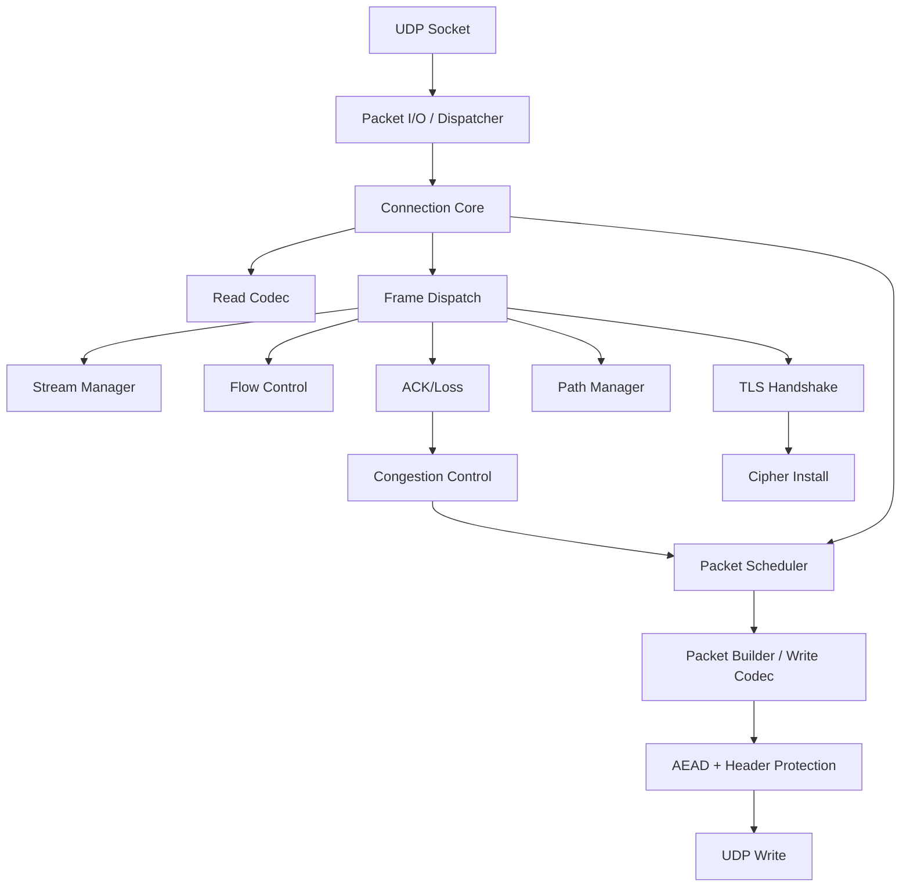
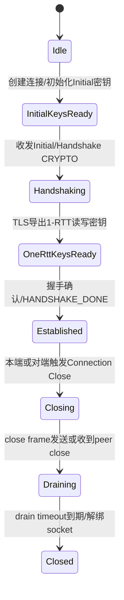
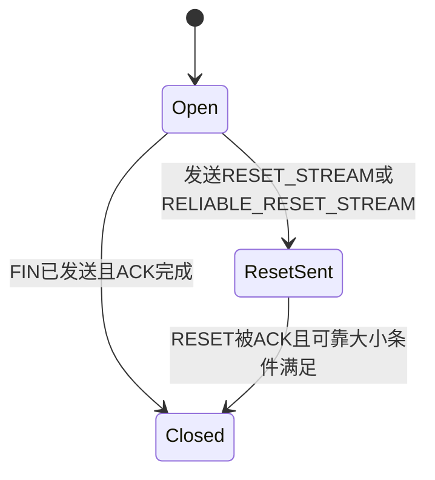
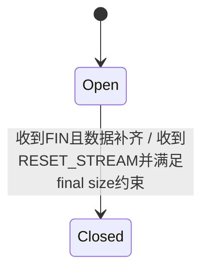

# mvfst 参考实现提炼：《QUIC 协议栈实现指导文档》

本文基于 `refs/mvfst` 源码提炼高层设计，目标不是复述 C++ 细节，而是把其可迁移的协议架构、状态组织方式、事件驱动模型与测试方法，整理成一份适合“从零实现 C 版 QUIC 栈”的蓝图。

本文重点对照的源码锚点包括但不限于：

- 连接与全局状态：`quic/state/StateData.h`
- 客户端/服务端专有状态：`quic/client/state/ClientStateMachine.h`、`quic/server/state/ServerStateMachine.h`
- Transport 主循环：`quic/api/QuicTransportBaseLite.{h,cpp}`、`quic/api/QuicTransportBase.{h,cpp}`
- 包解析/构建：`quic/codec/QuicReadCodec.h`、`quic/codec/QuicWriteCodec.h`、`quic/codec/QuicPacketBuilder.h`
- 写包调度：`quic/api/QuicPacketScheduler.{h,cpp}`、`quic/api/QuicTransportFunctions.{h,cpp}`
- 握手与密钥安装：`quic/handshake/*`、`quic/client/handshake/*`、`quic/server/handshake/*`、`quic/fizz/*`
- 流与流状态机：`quic/state/StreamData.h`、`quic/state/QuicStreamManager.{h,cpp}`、`quic/state/stream/*`
- 丢包恢复与拥塞控制：`quic/loss/QuicLossFunctions.{h,cpp}`、`quic/congestion_control/*`
- 流量控制：`quic/flowcontrol/QuicFlowController.{h,cpp}`
- 服务端收包与分发：`quic/server/QuicServerWorker.cpp`、`quic/server/QuicServerPacketRouter.*`
- 测试：`quic/*/test/*`

---

## 1. 架构概览与核心模块划分

### 1.1 总体架构结论

`mvfst` 的核心思路可以概括为：

1. **以连接对象为中心聚合全部协议状态**  
   `QuicConnectionStateBase` 是事实上的“协议内核对象”。ACK、Loss、CC、流管理、路径管理、TLS、加解密、待发送事件、流控窗口、观测与统计都挂在这个对象上。

2. **以事件循环驱动协议推进，而不是在收包函数中递归做完一切**  
   `QuicTransportBaseLite` 用 `ReadLooper`、`WriteLooper`、多个 timer（loss/ack/idle/path validation/keepalive/drain）驱动状态推进。收包只负责“更新状态并触发需要的后续事件”，真正的写包与回调分发由 looper/timer 在合适时机完成。

3. **严格区分协议层次**
   - 无连接入口层：UDP 收包、首部不变量解析、CID 路由、版本协商、Retry、Stateless Reset
   - 连接层：状态机、ACK/Loss/定时器、路径、关闭流程
   - TLS 层：只负责 secret 演进与握手消息产生/消费
   - 帧层：typed frame 编解码
   - 流层：重排序、重传、流状态机、流控

4. **严格区分 packet number space 与 encryption level**
   - Initial
   - Handshake
   - AppData（包括 0-RTT 和 1-RTT）

5. **通过“pending events + scheduler”解耦状态变化与发包决策**  
   很多协议动作不立即写包，而是仅设置 `pendingEvents` 或更新队列，随后由 `QuicPacketScheduler` 决定如何把 ACK、CRYPTO、STREAM、MAX_DATA、PATH_CHALLENGE 等帧组合进 packet。

对一个新的 C 实现而言，最值得继承的不是其继承体系，而是下面三点：

- 单连接单状态对象
- 单线程事件循环下的显式 timer/looper 驱动
- “接收更新状态，发送靠调度器”的解耦结构

### 1.2 推荐给新 C 协议栈的总体实现风格

`mvfst` 是 C++/Folly/Fizz 风格实现；如果你要写全新 C 栈，我建议保留其协议分层，但在工程形态上做如下简化：

- **保留**：连接中心化状态、三个 packet number space、统一 outstanding 列表、lazy stream materialization、路径管理器、可插拔拥塞控制
- **简化**：不要照搬复杂继承；改为 `struct + 函数表 + 显式模块接口`
- **保留**：服务端的“UDP worker + CID 路由 + 新连接创建”架构
- **简化**：第一版只做一种数据路径（优先链式缓冲区），不要一开始同时支持 continuous memory/GSO 特化
- **保留**：TLS secret 导出与 QUIC AEAD/header protection 的明确边界
- **简化**：不要把回调、observer、stats 框架做得过重，先保留最小观测点

下面按模块说明。

### 1.3 Packet I/O & Dispatcher（数据包接收与分发）

**参考实现锚点**

- 服务端入口：`quic/server/QuicServerWorker.cpp`
- 路由/转发：`quic/server/QuicServerPacketRouter.*`
- UDP 抽象：`quic/common/udpsocket/*`
- 连接级读入口：`quic/api/QuicTransportBaseLite::onNetworkData`

**职责**

- 从 UDP socket 读取 datagram，支持 GRO/GSO、软件时间戳、TOS/ECN
- 解析 QUIC invariant 部分，提取 header form、version、dcid/scid、packet type
- 对服务端进行 CID 路由
- 对不存在连接的报文执行前置协议动作：
  - Version Negotiation
  - Retry
  - Stateless Reset
  - 新连接创建
  - 旧进程/旧 worker 转发（这是 mvfst 的服务端高级能力，不是第一版必需）

**mvfst 的设计特点**

- 服务端先在 worker 层做“轻量不变量解析”，还没有进入连接对象
- 如果是 Short Header，直接按 DCID 查连接
- 如果是 Long Header 且未命中连接：
  - 初始包可能触发新连接创建
  - 0-RTT 包可能先缓存
  - 非 Initial 且无连接，多半视为误路由/旧连接，可能发 reset 或转发
- 客户端没有 dispatcher；客户端 socket 直接送给唯一连接

**对新实现的建议**

- 服务端必须保留“连接外路由层”，不要让所有收到的 datagram 都先构造 connection 对象
- 首次只支持：
  - invariant 解析
  - CID 路由
  - Version Negotiation
  - Retry
  - 新连接创建
  - Stateless Reset
- 端口接管、跨进程转发、健康检查探针都可放后期

### 1.4 Connection Management（连接管理与状态机）

**参考实现锚点**

- 基础 transport：`quic/api/QuicTransportBaseLite.{h,cpp}`、`quic/api/QuicTransportBase.{h,cpp}`
- 客户端 transport：`quic/client/QuicClientTransportLite.cpp`
- 服务端 transport：`quic/server/QuicServerTransport.cpp`
- 通用连接状态：`quic/state/StateData.h`
- 客户端状态：`quic/client/state/ClientStateMachine.h`
- 服务端状态：`quic/server/state/ServerStateMachine.h`

**职责**

- 维护连接生命周期：创建、握手、1-RTT、关闭、draining、销毁
- 挂载所有协议子系统状态
- 驱动 read/write loop 与 timer
- 组织回调：应用层连接就绪、可写、流事件、错误事件
- 维护 connection ID、peer/local address、migration/path 状态

**mvfst 的设计特点**

- 把“协议状态”与“事件驱动外壳”分开：
  - `QuicConnectionStateBase` 只保存状态
  - `QuicTransportBaseLite` 负责 loop/timer/socket/callback 驱动
  - `QuicClientTransportLite` / `QuicServerTransport` 负责端点差异
- 关闭流程不是一个布尔值，而是：
  - `CloseState::OPEN`
  - `CloseState::GRACEFUL_CLOSING`
  - `CloseState::CLOSED`
  再配合 drain timeout 实现 RFC 9000 的关闭语义

**推荐方案**

对新 C 栈，建议拆成：

- `quic_conn_t`
  保存所有协议状态
- `quic_endpoint_t`
  持有 event loop、socket、CID 表、worker 路由信息
- `quic_conn_io.c`
  处理 socket 回调和 timer
- `quic_conn_core.c`
  处理连接状态推进与 frame 语义

不要把连接对象直接耦合到网络线程框架 API；让 socket/event-loop 适配层尽量薄。

### 1.5 Cryptographic & TLS 1.3 Integration（加密层与 TLS 集成机制）

**参考实现锚点**

- 抽象接口：`quic/handshake/HandshakeLayer.h`
- Initial secret 生成：`quic/handshake/CryptoFactory.h`
- 客户端握手：`quic/client/handshake/ClientHandshake.{h,cpp}`、`quic/fizz/client/handshake/FizzClientHandshake.{h,cpp}`
- 服务端握手：`quic/server/handshake/ServerHandshake.{h,cpp}`、`quic/fizz/server/handshake/FizzServerHandshake.{h,cpp}`
- QUIC-TLS 桥接：`quic/fizz/handshake/QuicFizzFactory.cpp`、`quic/fizz/handshake/FizzBridge.cpp`

**职责**

- 生成 Initial AEAD 与 header protection key
- 调用 TLS 1.3 handshake engine
- 处理 `SecretAvailable` 等事件，把 handshake/1-RTT/0-RTT secret 映射到 QUIC cipher
- 提供 key update 所需的 next traffic secret
- 导出 EKM、ALPN、ticket 相关材料

**mvfst 最关键的设计点**

1. **Initial key 与 TLS 派生 key 分层明确**
   - Initial 使用 QUIC version salt + DCID 走 HKDF 派生
   - Handshake/1-RTT/0-RTT secret 来自 TLS `SecretAvailable`

2. **TLS record layer 被“QUIC 化”了**
   - `QuicFizzFactory.cpp` 中的 read/write record layer 几乎不做 TLS record 封装
   - 它直接把 handshake bytes 当作 CRYPTO stream 内容吐出/吃入
   - 这是 RFC 9001 的关键实现要点：QUIC 自己负责传输与包保护，TLS 不再写传统 record

3. **握手层不直接发 UDP 包**
   - 它只写入 crypto stream 或更新 cipher 状态
   - 真实发包仍由 transport/scheduler 决定

4. **密钥安装是“事件式”的**
   - Fizz 产生 `SecretAvailable`
   - handshake object 构造 AEAD 和 header cipher
   - transport 读取这些 cipher 并更新 read codec / write cipher
   - 当 1-RTT key 就绪后，transport 再决定何时丢弃旧 key、通知 transport ready/replay safe

**对新 C 实现的建议**

- 必须把 TLS 抽象成独立模块：
  - `quic_tls_start_handshake`
  - `quic_tls_handle_crypto_data`
  - `quic_tls_poll_event`
  - `quic_tls_get_exporter`
- 不要让 TLS 库知道 stream、ACK、loss、timer 等 QUIC 细节
- QUIC 只从 TLS 模块拿：
  - 要发送的 CRYPTO bytes
  - 新可用 secret
  - transport parameters
  - ALPN / resumption / app token

### 1.6 Frame Parser & Builder（帧的解析与构建）

**参考实现锚点**

- 包读解码：`quic/codec/QuicReadCodec.h`
- 帧写编码：`quic/codec/QuicWriteCodec.h`
- 包构建器：`quic/codec/QuicPacketBuilder.h`
- 调度器：`quic/api/QuicPacketScheduler.{h,cpp}`
- 发包 orchestration：`quic/api/QuicTransportFunctions.{h,cpp}`

**职责**

- 从 datagram 解析出 packet/header/frame
- 完成 header protection 去除、AEAD 解密、packet number 恢复
- 在发送侧把不同来源的 frame 调度进 packet
- 编码长/短首部、ACK、STREAM、CRYPTO、RESET、MAX_DATA 等帧

**mvfst 的设计特点**

- 读取侧：
  - `QuicReadCodec::parsePacket()` 返回 variant 风格结果：
    - regular packet
    - retry
    - stateless reset
    - cipher unavailable
    - nothing / error
  - 这使 transport 能把“暂时解不开的包”缓存起来，等 key 就绪后再处理
- 发送侧：
  - `QuicPacketScheduler` 不是“一个大 if-else”，而是由多个子 scheduler 组成：
    - ACK
    - STREAM
    - CRYPTO
    - RESET
    - WINDOW_UPDATE
    - BLOCKED
    - SIMPLE_FRAME
    - PING
    - DATAGRAM
    - PATH_VALIDATION
    - IMMEDIATE_ACK
  - `FrameScheduler::Builder` 决定某类 packet 允许装哪些帧
- packet builder 把“写 header/body 的字节细节”与“调度什么 frame”解耦

**推荐方案**

新 C 实现建议至少拆成：

- `quic_pkt_parse.c`
- `quic_frame_parse.c`
- `quic_pkt_build.c`
- `quic_frame_build.c`
- `quic_scheduler.c`

并坚持一条原则：

- **解析器只产生 typed frame，不直接修改连接状态**
- **状态修改发生在 transport/core 层的 frame dispatch**

这比“在解析器里顺手改状态”更容易测试，也更接近 `mvfst` 的高层结构。

### 1.7 Stream Management（流的并发与生命周期管理）

**参考实现锚点**

- 流对象：`quic/state/StreamData.h`
- 流管理器：`quic/state/QuicStreamManager.{h,cpp}`
- 流辅助函数：`quic/state/QuicStreamFunctions.h`
- 流状态机：`quic/state/stream/*`

**职责**

- 创建/查找/关闭 stream
- 维护 stream ID 配额与本地/对端双向/单向 stream 空间
- 维护读写缓冲、重传缓冲、loss buffer、acked intervals
- 维护 readable/writable/peekable/deliverable/closed 等集合
- 维护 send/recv 状态机与 reset/reliable reset 语义

**mvfst 的设计特点**

1. **lazy materialization**  
   stream 在“逻辑上已打开”与“实际有状态对象”是两个概念。  
   对端打开的 stream 可以先仅体现在 ID 空间中，真正收发数据时再 materialize 成 `QuicStreamState`。

2. **读写缓冲分层明确**
   - `readBuffer`：按 offset 保存乱序接收数据
   - `writeBuffer/pendingWrites`：应用已写入但未上网的数据
   - `retransmissionBuffer`：已发未确认，需要可重传
   - `lossBuffer`：被判丢失，等待重新调度
   - `ackedIntervals`：确认区间，用于 delivery callback 与清理

3. **流管理器不只是 map**
   它还维护：
   - `readableStreams`
   - `peekableStreams`
   - `writeQueue` / `controlWriteQueue`
   - `blockedStreams`
   - `windowUpdates`
   - `flowControlUpdated`
   - `deliverableStreams`
   - `txStreams`
   - `closedStreams`

这使 transport 可以在事件循环中高效判断“谁需要回调/谁需要写”。

**推荐方案**

对 C 实现：

- `quic_stream_t` 保存 per-stream 状态
- `quic_stream_table_t` 管理 stream 哈希表与 stream ID 空间
- `quic_stream_sched_t` 维护 actionable sets/queues

不要只做“stream 哈希表 + 每次遍历所有流”，否则：

- ACK/可读/可写/流控更新的复杂度会恶化
- 难以实现高效调度

### 1.8 Loss Detection & Congestion Control（丢包恢复与拥塞控制）

**参考实现锚点**

- 丢包状态：`quic/state/LossState.h`
- ACK 状态：`quic/state/AckStates.h`
- outstanding packet：`quic/state/OutstandingPacket.h`
- 丢包逻辑：`quic/loss/QuicLossFunctions.{h,cpp}`
- 拥塞控制接口：`quic/congestion_control/CongestionController.h`
- 算法实现：`quic/congestion_control/*`

**职责**

- 维护 RTT、PTO、loss timer、reordering threshold
- 跟踪 outstanding packet
- 按 ACK 和定时器检测丢包
- 生成 loss event / ack event 反馈给拥塞控制器
- 管理 pacer、app-limited、path degrading/blackhole 检测

**mvfst 的设计特点**

1. **一个统一的 outstanding 列表**
   `OutstandingsInfo.packets` 是连接级、按 packet number 排序的 outstanding 列表；每个元素携带：
   - packet header / frames
   - send time
   - encoded size
   - path id
   - write count
   - per-stream metadata

2. **ACK 处理与 frame 语义解耦**
   - ACK 处理先形成 `AckEvent`
   - loss 检测通过 `LossVisitor` 回调 frame 级副作用
   - CC 只消费 `AckEvent/LossEvent`

3. **PTO 与 early loss timer 共用一套 alarm 基础设施**
   - `setLossDetectionAlarm()`
   - `onLossDetectionAlarm()`
   - 内部判断当前 alarm 来源：
     - EarlyRetransmitOrReordering
     - PTO

4. **0-RTT/clone/path degradation 都被纳入 loss 体系**
   `mvfst` 没把这些作为额外旁路逻辑，而是尽量复用 outstanding/loss/visitor 框架。

**推荐方案**

新实现必须保留以下抽象：

- per-PN-space `ack_state`
- connection-level `outstanding_packet_list`
- `loss_timer`
- `ack_event`
- `loss_event`
- `cc_vtable`
- `pacer`

最重要的设计原则是：

- **CC 不直接扫描 frame**
- **frame 语义由 transport/loss visitor 处理**
- **CC 只看 bytes/packets/time/ack/loss 摘要**

### 1.9 Flow Control（连接级与流级流量控制）

**参考实现锚点**

- `quic/flowcontrol/QuicFlowController.{h,cpp}`
- 连接/流流控字段：`quic/state/StateData.h`、`quic/state/StreamData.h`

**职责**

- 跟踪本端接收窗口、对端通告的发送窗口
- 接收数据时检测 flow control violation
- 应用读取数据后决定是否发送 `MAX_DATA` / `MAX_STREAM_DATA`
- 发送数据后更新 send-side offsets，必要时发 `DATA_BLOCKED` / `STREAM_DATA_BLOCKED`

**mvfst 的设计特点**

- 连接级与流级流控字段显式分开
- 既支持按阈值触发 window update，也支持基于 RTT 的自动调窗
- 流控更新本身进入 pending events / scheduler，不直接在 read path 里发包
- 对 reliable reset 特殊处理：只有当可靠可交付部分被应用读完，才把 read offset 推到 final size

**推荐方案**

第一版就应该实现：

- stream-level advertised max offset
- connection-level advertised max data
- peer-advertised send windows
- flow control violation 检查
- MAX_DATA / MAX_STREAM_DATA / BLOCKED

自动调窗可以第一版先不做，但数据结构要预留：

- `time_of_last_fc_update`
- `window_size`
- `advertised_max_offset`

### 1.10 其他值得继承但可后置的模块

这些模块在 `mvfst` 中是成熟能力，但不建议阻塞第一版：

- `QuicPathManager`：迁移、多路径、PATH_CHALLENGE/PATH_RESPONSE
- Datagram：`DatagramFlowManager`
- ECN/L4S：`EcnL4sTracker`
- ACK_FREQUENCY / IMMEDIATE_ACK
- Knob frame / transport knobs
- takeover / zero-downtime restart / packet forwarding

对新 C 栈，建议把它们全部放到后期 phase。

---

## 2. 关键数据结构与接口设计

### 2.1 连接对象（Connection Context）必须包含的核心字段

建议把连接对象按下面的组组织，而不是做成一个无结构大杂烩。

#### A. 身份与寻址

- 本端角色：client/server
- 版本：negotiated version、original version
- peer/local address
- 当前 path id、fallback path id
- client chosen DCID、client SCID、server SCID
- self-issued / peer-issued connection ID 列表

对应 `mvfst` 字段：

- `clientChosenDestConnectionId`
- `clientConnectionId`
- `serverConnectionId`
- `selfConnectionIds`
- `peerConnectionIds`
- `peerAddress`
- `localAddress`
- `currentPathId`
- `fallbackPathId`

#### B. 加密与握手

- TLS/handshake 对象
- crypto streams（Initial/Handshake/1-RTT）
- Initial/Handshake/1-RTT write cipher
- Initial/Handshake/1-RTT read cipher 容器
- header protection cipher
- key phase / key update 状态

对应 `mvfst` 字段：

- `handshakeLayer`
- `cryptoState`
- `initialWriteCipher`
- `handshakeWriteCipher`
- `oneRttWriteCipher`
- `initialHeaderCipher`
- `handshakeWriteHeaderCipher`
- `oneRttWriteHeaderCipher`
- `readCodec`
- `oneRttWritePhase`
- `oneRttWritePendingVerification`

#### C. ACK / RTT / Loss / Outstanding

- per-PN-space ack state
- loss state
- outstanding packets
- last sent / last acked / PTO count / inflight bytes

对应 `mvfst` 字段：

- `ackStates`
- `lossState`
- `outstandings`

#### D. 流与 datagram

- stream manager
- datagram state
- pending callbacks / stream event queues

对应 `mvfst` 字段：

- `streamManager`
- `datagramState`

#### E. 流控

- connection-level recv window
- connection-level peer-advertised send window
- stream initial windows
- 汇总的 read/write offset

对应 `mvfst` 字段：

- `flowControlState`

#### F. 拥塞控制与 pacing

- congestion controller
- pacer
- app-limited/app-idle 标记
- egress policer（可选）

对应 `mvfst` 字段：

- `congestionController`
- `congestionControllerFactory`
- `pacer`
- `appLimitedTracker`
- `egressPolicer`

#### G. 待发送事件与 timer 驱动状态

`mvfst` 很值得借鉴的一点是：连接对象里有一个统一的 `PendingEvents`，把“要不要发 reset、ping、ack、window update、path challenge、probe packet、close”等全挂在一个命令区里。

建议你的 C 版连接对象至少有：

- `pending_resets`
- `pending_simple_frames`
- `pending_path_challenge`
- `pending_path_response`
- `pending_probe_packets[3]`
- `pending_send_ping`
- `pending_ack_immediately`
- `pending_conn_window_update`
- `pending_schedule_ack_timeout`
- `pending_schedule_loss_alarm`
- `pending_schedule_path_validation_timeout`
- `pending_close_transport`

#### H. 关闭与错误状态

- local error
- peer error
- close state
- drain deadline / idle deadline

#### I. 观测与调试

- stats callback
- qlog / trace sink
- loop debug state
- observer container

这部分第一版可以简化，但字段分组要有预留。

### 2.2 流对象（Stream Context）的接收/发送缓冲区设计

`mvfst` 的 `QuicStreamLike`/`QuicStreamState` 对新实现最有借鉴价值的地方，是**把“应用写入”和“已上网待确认”分开**。

建议你的流对象至少包含：

#### 接收侧

- `read_buffer`：按 offset 排序的片段链表/红黑树/小数组
- `current_read_offset`：应用下一次应读取的 offset
- `current_receive_offset`：当前期望收到的最小 offset
- `max_offset_observed`
- `final_read_offset`：收到 FIN 或 RESET 后的 final size

#### 发送侧

- `write_buffer_start_offset`
- `write_buffer`：应用已提交到 QUIC 层但还未变成 packet 的数据
- `pending_writes`：待封装进 STREAM frame 的数据链
- `current_write_offset`
- `final_write_offset`

#### 重传与确认

- `retransmission_buffer[offset -> chunk]`
- `loss_buffer`
- `acked_intervals`
- `minimum_retransmittable_offset`

#### 流状态机

- `send_state`
- `recv_state`
- `stream_read_error`
- `stream_write_error`
- `app_error_code_to_peer`
- `reliable_size_to_peer`
- `reliable_size_from_peer`

#### 流控

- `window_size`
- `advertised_max_offset`
- `peer_advertised_max_offset`
- `pending_blocked_frame`
- `time_of_last_flow_control_update`

#### 调度元数据

- 是否 control stream
- priority
- tx packet count
- loss count
- 是否在 loss set

### 2.3 核心模块交互接口设计

下面给出推荐的 C 风格接口草图，背后的边界直接对应 `mvfst` 的模块职责。

#### A. 包入口与连接分发

```c
typedef struct quic_endpoint quic_endpoint_t;
typedef struct quic_conn quic_conn_t;
typedef struct quic_udp_pkt quic_udp_pkt_t;

int quic_endpoint_on_udp_datagram(
    quic_endpoint_t *ep,
    const quic_socket_addr_t *local,
    const quic_socket_addr_t *peer,
    quic_udp_pkt_t *pkt);

int quic_dispatch_try_parse_invariants(
    const uint8_t *buf,
    size_t len,
    quic_routing_info_t *info);

quic_conn_t *quic_endpoint_find_conn(
    quic_endpoint_t *ep,
    const quic_routing_info_t *info,
    const quic_socket_addr_t *peer);

quic_conn_t *quic_endpoint_accept_new_conn(
    quic_endpoint_t *ep,
    const quic_routing_info_t *info,
    const quic_socket_addr_t *peer);
```

#### B. 连接收包主入口

```c
int quic_conn_on_udp_packet(
    quic_conn_t *conn,
    const quic_socket_addr_t *local,
    const quic_socket_addr_t *peer,
    quic_udp_pkt_t *pkt);
```

内部应包含：

1. `read_codec` 解包
2. 逐 frame dispatch
3. 更新 ACK/Loss/flow control/path state
4. 如有 crypto data，驱动 TLS
5. 设置 timer/pending events
6. 启动 write looper

#### C. TLS 集成接口

```c
int quic_tls_start(
    quic_conn_t *conn,
    const quic_transport_params_t *local_tp);

int quic_tls_handle_crypto_data(
    quic_conn_t *conn,
    quic_enc_level_t level,
    const uint8_t *data,
    size_t len);

int quic_tls_poll_event(
    quic_conn_t *conn,
    quic_tls_event_t *ev);
```

`quic_tls_event_t` 至少应覆盖：

- `WRITE_CRYPTO_DATA`
- `INSTALL_READ_SECRET`
- `INSTALL_WRITE_SECRET`
- `HANDSHAKE_DONE`
- `TRANSPORT_PARAMS_READY`
- `ERROR`
- `NEW_SESSION_TICKET`

#### D. Loss / ACK / CC 交互

```c
int quic_conn_on_ack_frame(
    quic_conn_t *conn,
    quic_pn_space_t pn_space,
    const quic_ack_frame_t *ack);

int quic_loss_on_alarm(quic_conn_t *conn);

int quic_cc_on_ack_or_loss(
    quic_conn_t *conn,
    const quic_ack_event_t *ack_ev,
    const quic_loss_event_t *loss_ev);
```

关键原则：

- ACK 处理更新 outstanding 与 RTT
- Loss 模块只产生 `loss_event`
- CC 不关心 frame 具体类型
- frame 级重传副作用由 `loss_visitor`/transport 处理

#### E. 发包接口

```c
int quic_conn_write_ready(quic_conn_t *conn);

int quic_scheduler_build_packet(
    quic_conn_t *conn,
    quic_pkt_ctx_t *pkt_ctx,
    quic_packet_builder_t *builder,
    size_t writable_bytes,
    quic_tx_packet_t *out);
```

#### F. Stream API

```c
int quic_stream_write(
    quic_conn_t *conn,
    uint64_t stream_id,
    const uint8_t *data,
    size_t len,
    int fin);

int quic_stream_on_frame(
    quic_conn_t *conn,
    const quic_stream_frame_t *frame);

int quic_stream_read(
    quic_conn_t *conn,
    uint64_t stream_id,
    uint8_t *buf,
    size_t cap,
    size_t *nread,
    int *fin);
```

### 2.4 模块间关键调用关系

可以把 `mvfst` 高层调用关系简化成下面这张图：



这张图对后续编码 Agent 的指导意义是：

- 收包链路与发包链路都应围绕 `quic_conn_t`
- TLS 是“被驱动模块”，不是主控制器
- packet builder 不决定协议语义，只负责编码
- scheduler 不解析 frame，只选择 frame

---

## 3. 核心工作流与状态机

### 3.1 握手阶段（Handshake Flow）

下面以服务端视角描述“从收到 Initial 到 1-RTT 密钥就绪”的主流程，因为这是新实现最容易出错的部分。

#### 3.1.1 服务端握手主流程

1. **UDP worker 收到 datagram**
   - 解析 invariant
   - 检查是不是 Initial
   - 校验最小 1200 字节（RFC 9000 要求）
   - 检查 version，必要时发 Version Negotiation
   - 如配置 Retry 且未通过地址验证/速率限制，发 Retry

2. **根据 DCID 路由**
   - 若没有已有连接，则创建新连接对象
   - 初始化：
     - `QuicServerConnectionState`
     - crypto streams
     - stream manager
     - path manager
     - congestion controller
     - server handshake object

3. **创建 Initial 密钥**
   - 基于客户端 original DCID + version salt 生成 Initial AEAD / header protection
   - 安装：
     - 服务端写 Initial cipher
     - 服务端读 Initial cipher

4. **连接收到 Initial packet**
   - `readCodec` 解包
   - 解析 frame
   - `CRYPTO` frame 写入 Initial crypto stream
   - `ACK`/`PADDING`/`PING` 等按规则处理

5. **驱动 TLS**
   - 从对应 crypto stream 读出连续字节
   - 调用 `serverHandshake->doHandshake(data, Initial)`
   - TLS 可能产生：
     - 需要发回的握手字节
     - handshake read/write secret
     - 1-RTT read/write secret
     - transport parameters ready
     - handshake done

6. **安装 Handshake 密钥**
   - 服务端拿到：
     - Handshake write cipher
     - Handshake read cipher
   - transport 更新：
     - `handshakeWriteCipher`
     - `readCodec.handshakeReadCipher`

7. **安装 1-RTT 密钥**
   - 服务端拿到：
     - 1-RTT write cipher
     - 1-RTT read cipher
     - 对应 header ciphers
   - transport 更新：
     - `oneRttWriteCipher`
     - `oneRttWriteHeaderCipher`
     - `readCodec.oneRttReadCipher`
     - `readCodec.oneRttHeaderCipher`

8. **处理缓冲的 0-RTT / 1-RTT 报文**
   `mvfst` 明确支持“先缓存，后解密”：
   - 服务端在 key 未就绪时缓存 `pendingZeroRttData` / `pendingOneRttData`
   - `onCryptoEventAvailable()` 后再调用 `processPendingData()`

9. **握手完成后的连接推进**
   - 处理 client transport parameters
   - 放开 address validation 限速（如 CFIN 已到）
   - 发送 HANDSHAKE_DONE
   - issue new connection IDs
   - 通知 routing callback：连接已可绑定 server CID
   - 通知 app：transport ready / full handshake done

#### 3.1.2 客户端握手主流程

1. 生成客户端初始 DCID，创建 Initial read/write ciphers
2. 构造并发送 ClientHello 所在的 Initial CRYPTO 数据
3. 收到服务端 Initial/Handshake 包后，解包并把 CRYPTO 数据送入 client handshake
4. 当 `SecretAvailable` 到来时，安装：
   - Handshake read/write
   - 0-RTT write（如果命中 PSK）
   - 1-RTT read/write
5. 当 1-RTT key 派生成功后：
   - 处理 server transport parameters
   - 校验/处理 0-RTT 是否被接受
   - 设置 stateless reset token
   - 通知 transport ready/replay safe
6. 当收到 Handshake packet 且握手推进到对应阶段后，丢弃 Initial key
7. 当握手确认为 established 后，丢弃 Handshake key

### 3.2 数据收发阶段（Data Flow）

### 3.2.1 发送链路：应用写入 -> 封帧 -> 加密 -> UDP 发送

`mvfst` 对应高层链路如下：

```text
app write
  -> QuicSocket::writeChain
  -> writeDataToQuicStream(stream)
  -> stream.pendingWrites / writeBuffer 更新
  -> updateWriteLooper()
  -> writeSocketData()
  -> transport.writeData()
  -> writeQuicDataToSocket() / writeQuicDataExceptCryptoStreamToSocket()
  -> QuicPacketScheduler 选择 ACK/STREAM/CRYPTO/... 帧
  -> PacketBuilder/WriteCodec 编码 packet
  -> AEAD 加密 + header protection
  -> UDP socket write
  -> updateConnection()
  -> outstanding/loss/cc/pacing 状态更新
```

这个链路说明了几个关键原则：

- 应用写入并不直接形成 packet，而是先进 stream buffer
- 真正的 packet 组装发生在写 looper
- 每次发送后都必须调用 `updateConnection()` 统一登记 outstanding、bytes in flight、packet number、ACK state、loss alarm

### 3.2.2 接收链路：UDP 收到 -> 解包 -> 分帧 -> 状态推进

```text
UDP datagram
  -> dispatcher/connection.onNetworkData
  -> readCodec.parsePacket
  -> packet header / packet number / decryption / frame decode
  -> for each frame:
       ACK            -> processAckFrame -> RTT/Loss/CC
       STREAM         -> appendDataToReadBuffer -> readable stream set
       CRYPTO         -> crypto stream -> TLS
       MAX_DATA       -> update peer send window
       RESET_STREAM   -> stream recv/send state update
       PATH_RESPONSE  -> path manager
       CONNECTION_CLOSE -> peerConnectionError
  -> scheduleAckTimeout / setLossDetectionAlarm / pathValidationTimeout
  -> processCallbacksAfterNetworkData
  -> updateReadLooper / updateWriteLooper
```

### 3.3 连接状态流转

为了适配新的 C 实现，建议把连接状态分成**协议状态**与**生命周期状态**两层。

#### 3.3.1 协议状态



#### 3.3.2 生命周期/驱动状态

- `OPEN`
- `GRACEFUL_CLOSING`
- `CLOSED`

建议把“是否进入 draining”和“是否仍允许 app 回调”单独表示，不要试图用一个状态枚举同时表达全部含义。

### 3.4 Stream 核心状态流转

`mvfst` 实际上把 send/recv 分开建模，而不是一个单一枚举。这是正确做法。

#### 3.4.1 发送侧状态



#### 3.4.2 接收侧状态



#### 3.4.3 组合后的实际含义

因为 send/recv 独立，所以一个 stream 真实上会经历：

- 双向打开
- 半关闭（本端写完但仍可读）
- 半关闭（对端写完但本端仍可写）
- reset sent / reset received
- fully closed

对实现者最重要的结论是：

- **stream 生命周期不要用单个状态枚举硬压**
- send/recv 各自建模，最终通过 `inTerminalStates()` 判断是否可回收

### 3.5 为什么推荐保留 mvfst 的“状态 + 事件”模式

这是 `mvfst` 中最值得继承的高层思想：

- 收到 frame 时，优先修改状态
- 不强制立刻发送响应 packet
- 改成：
  - 把 ACK、MAX_DATA、RESET、PING、PATH_CHALLENGE 等记录为 pending
  - 再由 scheduler 在写时机统一选择如何封装 packet

这样做的好处是：

- 更容易满足 packet coalescing
- 更容易实现 pacing/packet limit/cwnd 限制
- 更容易写出 deterministic test

---

## 4. 测试策略与测试用例清单

### 4.1 测试总体策略

`mvfst` 的测试不是“全靠端到端”，而是明显分层的：

1. **纯编解码/数据结构单测**
2. **状态机单测**
3. **ACK/Loss/CC/Path/FlowControl 单测**
4. **握手单测**
5. **连接/客户端/服务端 transport 单测**
6. **小规模集成测试**

这个分层非常适合 TDD 式从零开发。

### 4.2 单元测试（Unit Tests）建议清单

以下清单直接参考 `mvfst` 现有测试文件组织。

#### A. 编解码基础

对应测试：

- `quic/codec/test/QuicIntegerTest.cpp`
- `quic/codec/test/PacketNumberTest.cpp`
- `quic/codec/test/QuicHeaderCodecTest.cpp`
- `quic/codec/test/DecodeTest.cpp`
- `quic/codec/test/QuicReadCodecTest.cpp`
- `quic/codec/test/QuicWriteCodecTest.cpp`
- `quic/codec/test/QuicPacketBuilderTest.cpp`
- `quic/codec/test/QuicPacketRebuilderTest.cpp`
- `quic/codec/test/QuicConnectionIdTest.cpp`

必须覆盖：

- QUIC varint 边界值：1/2/4/8-byte 编码
- packet number 截断/恢复
- 长首部/短首部字段完整性
- ACK frame block 编码边界
- STREAM/CRYPTO frame 长度字段省略与显式长度两种路径
- 首部保护采样位置与 sample 长度
- 不完整包、截断包、长度不足包的失败路径
- 版本协商包、Retry 包、Stateless Reset 识别

#### B. 握手与密钥派生

对应测试：

- `quic/fizz/handshake/test/FizzCryptoFactoryTest.cpp`
- `quic/fizz/handshake/test/FizzPacketNumberCipherTest.cpp`
- `quic/fizz/handshake/test/FizzTransportParametersTest.cpp`
- `quic/fizz/client/handshake/test/FizzClientHandshakeTest.cpp`
- `quic/server/handshake/test/ServerHandshakeTest.cpp`
- `quic/server/handshake/test/RetryTokenGeneratorTest.cpp`

必须覆盖：

- Initial secret 派生是否与 version salt/DCID 匹配
- packet number cipher 加/解密
- Retry integrity tag 校验
- transport parameters 编解码
- HRR
- 0-RTT 成功/拒绝
- 握手成功后 1-RTT key 安装
- 握手错误映射为正确的 transport error / crypto error

#### C. Stream 与 stream state machine

对应测试：

- `quic/state/stream/test/StreamStateFunctionsTest.cpp`
- `quic/state/stream/test/StreamStateMachineTest.cpp`
- `quic/state/test/QuicStreamFunctionsTest.cpp`
- `quic/state/test/QuicStreamManagerTest.cpp`
- `quic/state/test/StreamDataTest.cpp`

必须覆盖：

- 乱序接收后 read buffer 合并
- FIN 与 final size 处理
- RESET_STREAM / RELIABLE_RESET_STREAM
- acked interval 合并
- retransmission buffer -> loss buffer 转移
- send/recv 分离状态机
- 单向流非法操作
- stream limit 超限
- lazy stream materialization
- readable/writable/deliverable/closed 集合更新

#### D. Flow control

对应测试：

- `quic/flowcontrol/test/QuicFlowControlTest.cpp`
- `quic/client/test/ClientStateMachineTest.cpp`
- `quic/server/test/ServerStateMachineTest.cpp`

必须覆盖：

- stream-level flow control violation
- connection-level flow control violation
- `MAX_DATA` / `MAX_STREAM_DATA` 生成逻辑
- BLOCKED frame 生成与丢失重发
- 读取触发 window update
- 自动调窗逻辑
- 0-RTT early params 与正式 transport params 不匹配时的行为

#### E. ACK / Loss / RTT / Outstanding

对应测试：

- `quic/loss/test/QuicLossFunctionsTest.cpp`
- `quic/state/test/AckHandlersTest.cpp`
- `quic/state/test/AckedPacketIteratorTest.cpp`
- `quic/state/test/OutstandingPacketTest.cpp`
- `quic/state/test/StateDataTest.cpp`

必须覆盖：

- ACK range 处理
- RTT 更新（含 ack delay）
- 基于重排阈值判丢
- 基于时间阈值判丢
- PTO 计算与退避
- probe packet 额度
- spurious loss
- outstanding packet clone 处理
- key update 期间旧 key/新 key 包处理

#### F. Congestion control / pacing

对应测试：

- `quic/congestion_control/test/CongestionControlFunctionsTest.cpp`
- `quic/congestion_control/test/NewRenoTest.cpp`
- `quic/congestion_control/test/Cubic*.cpp`
- `quic/congestion_control/test/Bbr*.cpp`
- `quic/congestion_control/test/PacerTest.cpp`
- `quic/congestion_control/test/StaticCwndCongestionControllerTest.cpp`

必须覆盖：

- cwnd 增长/减小公式
- packet ack/loss 对 inflight 的影响
- slow start / recovery / steady state
- pacer burst size 与 interval
- app-limited / app-idle 状态转移
- BDP / pacing rate 推导

#### G. Path / migration / validation

对应测试：

- `quic/state/test/QuicPathManagerTest.cpp`
- `quic/client/test/QuicClientTransportLiteMigrationTest.cpp`
- `quic/server/test/QuicServerTransportMigrationTest.cpp`

必须覆盖：

- add/get/remove path
- PATH_CHALLENGE 生成
- PATH_RESPONSE 匹配
- path validation timeout
- 缓存/恢复 congestion + RTT 状态
- fallback path
- 非当前路径发包

### 4.3 协议一致性测试（Protocol Conformance）

`mvfst` 没有把所有 conformance 都做成外部 runner，而是在单测与 transport 测试里覆盖了很多关键异常场景。对新的 C 栈，建议沿用这种策略。

#### 必测异常场景

1. **报文层**
   - 长首部不完整
   - varint 截断
   - packet length 非法
   - packet number 恢复错误
   - header protection 采样不足

2. **加密层**
   - cipher unavailable 时缓存而不是误判协议错误
   - Retry integrity tag 错误
   - 0-RTT 被拒绝后重发路径
   - key update 包早到/晚到

3. **传输层**
   - 重复包
   - 乱序包
   - ACK 重叠区间
   - truncated ACK ECN 计数
   - CONNECTION_CLOSE 在不同加密级别到达

4. **流层**
   - final size 改变
   - reset offset 与已观察 offset 冲突
   - 单向流上非法 frame
   - 读取到 hole 的 HOL blocking 统计

5. **流控与拥塞**
   - 连接/流流控越界
   - cwnd 为 0 或极小时的探测包行为
   - PTO 过多后连接废弃
   - persistent congestion

6. **路径与地址验证**
   - server amplification limit
   - PATH_RESPONSE 过期/错误匹配
   - 迁移后恢复旧路径

#### 建议的测试方法

- 构造 `ReceivedUdpPacket` 并直接调用连接读入口
- 直接构造 frame/packet 调 `processAckFrame`、`parsePacket`、`writeQuicDataToSocket`
- 使用 fake clock / controllable time point
- 为测试准备专用 packet builder、mock socket、mock congestion controller、mock TLS

`mvfst` 中的测试辅助代码很值得借鉴：

- `quic/common/test/TestPacketBuilders.*`
- `quic/common/test/TestUtils.*`
- `quic/api/test/Mocks.h`
- 各模块的 `Mocks.h`

### 4.4 集成测试与互操作性（Integration & Interop）

#### A. 进程内集成测试

对应测试：

- `quic/server/test/QuicClientServerIntegrationTest.cpp`
- `quic/server/test/QuicServerTransportTest.cpp`
- `quic/client/test/QuicConnectorTest.cpp`
- `quic/client/test/QuicClientTransportTest.cpp`

这些测试体现了 `mvfst` 的一个重要策略：

- 不等到外部互操作环境才验证“能连”
- 先在同一进程/同一事件循环下做 client-server integration
- 再把 transport parameters、握手完成、回调时序等检查清楚

你的 C 栈也应先建立：

- 进程内 echo server/client
- 可控 event loop
- mock UDP socket 或 loopback UDP socket

#### B. 协议工具集成

`mvfst` 仓库本身更偏“库实现 + 单测/集成测”，不是把 interop-runner 深度内嵌在仓库里。  
对你的新栈，建议后续显式补齐这一层：

1. 提供最小 client/server 二进制
   - 纯 QUIC transport 即可
   - 最好有一个简单文件传输或 echo 协议

2. 适配 `quic-interop-runner`
   - server 启动命令
   - client 启动命令
   - 证书与 ALPN 配置
   - 日志输出目录

3. 第一批互操作场景建议
   - handshake
   - transfer
   - retry
   - version negotiation
   - 0-RTT（等 ticket 完整后再开）

4. 为互操作预留观测能力
   - qlog
   - packet trace
   - key log
   - stream/ack/loss debug 日志

#### C. TDD 开发建议

后续编码 Agent 最好按下面的节奏：

1. 先写一个最小 failing test
2. 只实现支撑该 test 通过的最小路径
3. 每完成一个协议点，就补：
   - 正常路径
   - 截断/非法输入
   - 重复/乱序
   - 丢包/超时

不要等“跑起来了”再补测试。  
QUIC 栈最危险的 bug 往往不在 happy path，而在：

- key discard 时机
- ACK/Loss 与 stream buffer 一致性
- final size / reset
- flow control 汇总值
- 0-RTT 与 retry/HRR 交互

---

## 5. 分阶段实现路径（Implementation Roadmap）

下面给出一个适合从零实现 C 版 QUIC 栈的推荐路线。每个阶段都对应 `mvfst` 中一个较清晰的模块闭包，并附带建议的“阶段退出条件”。

### Phase 1: 基础工具链与裸编解码

**目标**

- varint
- connection ID
- packet number encode/decode
- 长/短首部编解码
- 基础 frame 编解码（PING/PADDING/ACK/STREAM/CRYPTO/RESET/MAX_DATA/MAX_STREAM_DATA）

**参考源码**

- `quic/codec/*`

**阶段退出条件**

- `QuicIntegerTest`、`PacketNumberTest` 类测试全能通过
- 能正确解析/编码手工构造的 Initial/Short Header packet

### Phase 2: 连接骨架、ACK 状态与事件循环雏形

**目标**

- `quic_conn_t`
- per-PN-space ack state
- outstanding packet 结构
- read/write looper 雏形
- ack timeout / loss timeout / idle timeout 基础设施

**参考源码**

- `quic/state/StateData.h`
- `quic/state/AckStates.h`
- `quic/api/QuicTransportBaseLite.cpp`

**阶段退出条件**

- 可以创建连接对象
- 收到 packet 后写入 ack state
- 定时器可以驱动 ack/loss 回调

### Phase 3: Initial 密钥与最小握手骨架

**目标**

- Initial secret 派生
- Initial AEAD / header protection
- CRYPTO stream
- TLS 抽象接口
- ClientHello/ServerHello 的最小传输管道

**参考源码**

- `quic/handshake/*`
- `quic/fizz/handshake/*`
- `quic/client/handshake/*`
- `quic/server/handshake/*`

**阶段退出条件**

- client 能发出 Initial + CRYPTO
- server 能解析并回握手字节
- 能安装 Handshake keys

### Phase 4: 1-RTT 密钥就绪与 transport parameters

**目标**

- TLS `SecretAvailable` -> QUIC cipher 安装
- server/client transport parameters 编解码
- 握手完成回调
- Initial/Handshake key discard

**阶段退出条件**

- client/server 都拿到 1-RTT read/write keys
- 能正确处理 handshake done
- 能完成一个最小 handshake integration test

### Phase 5: Stream 管理与可靠字节流

**目标**

- stream manager
- bidi/uni stream ID 空间
- read/write/retransmission/loss buffer
- send/recv state machine
- readable/writable/deliverable 集合

**阶段退出条件**

- 应用层可创建 stream 并收发数据
- 乱序重组、FIN、RESET 正确
- stream 回收逻辑正确

### Phase 6: 流量控制

**目标**

- connection/stream flow control
- MAX_DATA / MAX_STREAM_DATA
- DATA_BLOCKED / STREAM_DATA_BLOCKED
- 读取触发 window update

**阶段退出条件**

- 正常流控下收发不越界
- 越界时抛正确 transport error
- flow control 汇总值与 per-stream 值一致

### Phase 7: ACK 处理、丢包恢复、PTO 与拥塞控制

**目标**

- process ACK
- RTT estimator
- loss detection
- PTO
- Reno 或 Cubic 首个拥塞控制实现
- pacer

**阶段退出条件**

- 丢包后能重传 STREAM/CRYPTO
- cwnd/bytes in flight 正确收敛
- PTO 探测包正常发送

### Phase 8: 完整 client/server transport

**目标**

- 服务端 worker + CID 路由
- 新连接创建
- Version Negotiation
- Retry
- Stateless Reset
- close/draining

**阶段退出条件**

- 能稳定跑 client/server integration
- 服务端能正确处理不存在连接的 short header
- 关闭路径不泄漏状态

### Phase 9: 0-RTT、session ticket、address validation

**目标**

- NewSessionTicket
- app token / transport parameter cache
- 0-RTT accept/reject
- amplification limit

**阶段退出条件**

- 0-RTT 成功路径可用
- 0-RTT rejection 能回滚/重传
- server amplification 规则正确

### Phase 10: 迁移、路径验证、Datagram、ECN、ACK_FREQUENCY

**目标**

- Path manager
- PATH_CHALLENGE/PATH_RESPONSE
- connection migration
- DATAGRAM
- ECN/L4S
- ACK_FREQUENCY / IMMEDIATE_ACK

**阶段退出条件**

- 路径切换/验证可通过测试
- datagram 不影响流语义
- ECN/ACK 控制不会破坏基本收发

### Phase 11: 工程化与互操作

**目标**

- qlog / trace / key log
- 更完整的错误映射
- interop-runner 接入
- 样例 client/server 工具

**阶段退出条件**

- 能与至少一种主流实现完成基本互操作
- handshake/transfer/retry/version negotiation 用例通过

### 5.1 关于“多种架构方案”的对比与推荐

`mvfst` 中存在一些对新实现有选择意义的架构分支：

#### A. 面向对象 transport 继承体系 vs C 风格显式模块

`mvfst` 采用：

- `QuicTransportBaseLite`
- `QuicTransportBase`
- `QuicClientTransportLite`
- `QuicServerTransport`

**优点**

- 多端点复用逻辑较自然
- callback/timer/socket 生命周期封装好

**缺点**

- 对 C 实现不适合直接照搬
- 继承层次会掩盖协议真实边界

**推荐**

- 在新 C 栈中采用“显式模块 + 函数表”而不是继承
- 但保留其逻辑边界：base transport / client / server 的职责切分

#### B. 双数据路径（continuous memory + chained memory） vs 单数据路径

`mvfst` 同时支持优化型 continuous memory datapath 和常规链式 buffer。

**推荐**

- 第一版只保留链式 buffer
- 待协议正确后再增加 GSO/continuous memory 优化

#### C. eager stream creation vs lazy materialization

`mvfst` 选择 lazy materialization。

**优点**

- 更节省内存
- 与 stream ID 空间语义更契合

**推荐**

- 保留 lazy materialization
- 这是值得照搬的设计

#### D. TLS 与 QUIC 紧耦合 vs 事件式 secret 集成

`mvfst` 选择 handshake object + event 驱动。

**推荐**

- 强烈保留事件式 secret 集成
- 不要让 TLS 直接操作 stream manager、loss、ACK、timer

### 5.2 最终推荐的蓝图

如果只给后续编码 Agent 一套最清晰、最适合现代系统编程范式的方案，我推荐：

1. **线程模型**
   - 每个 UDP worker 一个 event loop
   - worker 内多个连接
   - 每连接单线程处理，无锁优先

2. **核心对象**
   - `endpoint`
   - `conn`
   - `stream`
   - `tls_adapter`
   - `read_codec`
   - `scheduler`
   - `cc`
   - `path_mgr`

3. **协议推进方式**
   - 收包：解析 -> typed frame -> 更新状态
   - 发包：pending events/queues -> scheduler -> builder -> encrypt -> udp

4. **状态组织**
   - 一个 connection 对象聚合全部状态
   - send/recv stream state 分离
   - ACK state 按 PN space 分离
   - outstanding packet 连接级统一管理

5. **先后顺序**
   - 先 correctness
   - 再 performance
   - 再 advanced features

### 5.3 本文与源码的对照校验结论

本文在整理完成前后，均以 `refs/mvfst` 源码做了回看，重点反查了以下容易遗漏的点，并确保已纳入上述蓝图：

- `QuicConnectionStateBase` 中的 `pendingEvents` 统一发送命令区
- `QuicTransportBaseLite` 的 read/write looper + loss/ack/idle/path/drain timer 组合
- `QuicReadCodec` 的 `CipherUnavailable` 返回路径
- `QuicPacketScheduler` 的多子调度器模式，而不是单一发包函数
- `QuicStreamLike` 中读缓冲、写缓冲、重传缓冲、loss buffer、acked intervals 的分层
- `ServerHandshake` / `ClientHandshake` 与 `Fizz*Handshake` 的 secret 事件式安装
- `QuicLossFunctions` 中 PTO、early loss timer、LossVisitor、0-RTT 特殊处理
- `QuicFlowController` 中连接级/流级流控与自动调窗
- `QuicPathManager` 的路径验证超时、challenge/response、迁移状态恢复
- 测试分层：codec、state、loss、flow control、cc、handshake、transport、integration

因此，这份文档可以作为后续编码 Agent 的实现蓝图使用；但在真正开工时，仍建议每个 phase 对照相应源码锚点逐项落地，不要跨阶段“偷实现”高级特性。

### 5.4 结合 `docs/plans/plan-quic.md` 的阶段建议

`docs/plans/plan-quic.md` 给出的不是“协议模块分解图”，而是一条以互操作测试为牵引的交付梯度。它和前文第 5 节的能力分层是两条不同维度：

- 前文第 5 节回答的是：一个 QUIC 栈从架构上应先搭什么骨架。
- 本节回答的是：结合你们当前项目的阶段推进，哪些东西应该在哪一步落地，哪些东西虽然 `mvfst` 里有，但不该过早实现。

对后续编码 Agent，我建议遵守下面三条总原则：

1. **每个阶段只放行该阶段必须暴露的协议面**
   例如在步骤01，不要因为已经有了 `STREAM` 帧编码器，就顺手把 0-RTT、Retry、迁移、Key Update 一并做进去。

2. **先把“状态机与定时器边界”做对，再谈吞吐和优化**
   `mvfst` 最成功的地方不是“代码多”，而是 ACK/Loss/Timer/TLS/Path 的边界很清晰。新实现若一开始就混写，很快会在 interop 中失控。

3. **每一阶段都应明确记录“暂不支持”的行为**
   这和 `quic-interop-runner` 的退出码契约一致。未支持与实现错误是两类问题，工程上必须明确区分。

下面按 `plan-quic` 的步骤逐项说明。

#### 步骤00：Version Negotiation（禁用占位）

**`mvfst` 对应锚点**

- `quic/server/QuicServerWorker.cpp`
- `quic/codec/Decode.h`
- `quic/codec/test/DecodeTest.cpp`
- `quic/codec/test/QuicReadCodecTest.cpp`
- `quic/codec/test/QuicPacketBuilderTest.cpp`
- `quic/server/test/QuicServerTest.cpp`

**建议实现方式**

- 即使当前阶段“禁用”，也应保留完整的**不变量解析 + Version Negotiation 编解码能力**。
- Version Negotiation 必须在 **connection object 之外** 处理；它属于 dispatcher/server worker 的职责，而不是已建立连接的职责。
- 建议在 C 实现中保留如下最小接口：

```c
bool quic_pkt_parse_invariant(const uint8_t *buf, size_t len, quic_invariant_t *out);
bool quic_pkt_is_supported_version(uint32_t version);
ssize_t quic_build_version_negotiation(
    const quic_cid_t *scid,
    const quic_cid_t *dcid,
    const uint32_t *versions,
    size_t version_count,
    uint8_t *out,
    size_t cap);
```

- 发布时可以把“收到未知版本后是否真正回 Version Negotiation”做成 endpoint 级开关，但**解析路径本身不要缺席**。

**注意事项**

- Version Negotiation 是无状态、未认证报文，不能污染连接状态。
- Short Header 报文不应触发 Version Negotiation。
- 不能把“未知版本”直接当成“普通解包失败”；日志中应明确区分。
- 如果当前主线确实禁用该能力，也要让代码能清晰表达：
  - 入口存在
  - 默认关闭
  - 非发布阻塞项

**这一阶段的工程建议**

- 单测至少覆盖：
  - 未知版本 Initial 触发 Version Negotiation
  - 空版本列表/畸形 VN 包解析失败
  - VN 包不会被路由进连接对象
- 文档与日志要明确写出“禁用占位”的原因，避免后续 Agent 误判为遗漏。

#### 步骤01：握手最小闭环

**`mvfst` 对应锚点**

- `quic/api/QuicTransportBaseLite.{h,cpp}`
- `quic/client/QuicClientTransportLite.cpp`
- `quic/server/QuicServerTransport.cpp`
- `quic/handshake/HandshakeLayer.h`
- `quic/client/handshake/*`
- `quic/server/handshake/*`
- `quic/fizz/client/handshake/*`
- `quic/fizz/server/handshake/*`
- `quic/codec/QuicReadCodec.h`
- `quic/codec/QuicWriteCodec.h`

**建议实现目标**

- 这一阶段只追求一个目标：**从 Initial 到 1-RTT 可用的最小协议闭环**。
- 必须从第一天就按 RFC 9000 / 9001 把下列边界建对：
  - 三个 packet number space：Initial / Handshake / AppData
  - CRYPTO 数据与普通 STREAM 数据严格分离
  - Initial/Handshake/1-RTT 密钥分别安装与丢弃
  - ACK state 按 packet number space 分离
  - server anti-amplification limit 基本生效

**推荐切分**

1. 先完成 invariant 解析、Initial 包解密、CRYPTO frame 收发。
2. 再打通 TLS 适配器，使其能够：
   - 吃入 CRYPTO bytes
   - 吐出待发送 CRYPTO bytes
   - 事件式导出 Handshake/1-RTT secrets
3. 再补写包调度、ACK 生成、HANDSHAKE_DONE、握手完成通知。
4. 最后接入最小应用数据发送。

**注意事项**

- 一开始就要支持 coalesced packet 的基本处理顺序，否则很多互操作端会失败。
- 1200 字节 Initial 约束必须严格执行。
- 服务端未通过地址验证前，发送量必须受 anti-amplification limit 限制。
- Initial key 的丢弃不能太早；Handshake key 的丢弃也不能太早。
- 不要把 TLS 模块写成“直接发 UDP 包”的控制器。TLS 只产出事件和 CRYPTO 数据。

**这一阶段最值得抄 `mvfst` 的地方**

- `SecretAvailable -> transport 安装 cipher` 的事件式接口。
- key 未就绪时允许 `QuicReadCodec` 返回“暂时不可解密”的状态，而不是直接报错关闭连接。
- 收包只更新状态，真正发包交给 write looper / scheduler。

**验收建议**

- 单连接握手成功。
- 握手完成后能下载小文件。
- 日志中能看见 Initial -> Handshake -> 1-RTT 的明确推进。
- 必须有“错误方向”的测试：
  - Initial 太短
  - 缺失 CRYPTO 数据
  - 错误 encryption level 的 CRYPTO frame

#### 步骤02：密码套件约束能力（ChaCha20）

**`mvfst` 对应锚点**

- `quic/client/handshake/*`
- `quic/server/handshake/*`
- `quic/fizz/client/handshake/*`
- `quic/fizz/server/handshake/*`
- `quic/fizz/handshake/QuicFizzFactory.cpp`
- `quic/fizz/handshake/test/FizzCryptoFactoryTest.cpp`
- `quic/fizz/handshake/test/FizzPacketNumberCipherTest.cpp`

**建议实现目标**

- 把“TLS 选择的密码套件”和“QUIC transport 本身的逻辑”完全解耦。
- 在架构上，transport 不应该关心现在是 AES-GCM 还是 ChaCha20，它只应关心：
  - 当前 encryption level 是否有 read/write AEAD
  - 当前 encryption level 是否有 header protection cipher

**建议实现方式**

- 设计 `quic_cipher_suite_ops` 或等价表驱动结构，集中描述：
  - AEAD key 长度
  - nonce 长度
  - header protection 算法
  - HKDF label / secret derivation 入口
- Initial 的 salt/secret 派生由 QUIC version 决定；Handshake/1-RTT 的具体套件由 TLS 决定。两者不要混在一起。
- 头部保护与 payload AEAD 必须是两个独立对象，不能偷懒合并。

**注意事项**

- 很多新实现容易把“套件切换”写成一堆散落在 transport 各处的 `if (chacha20)`；这是后期最难维护的形态。
- Header protection 的采样位置、密钥长度、掩码生成方式都可能因算法不同而不同，必须有独立单测。
- 不要把 Initial 的 cipher suite 选择和 TLS 的协商结果绑定；Initial 是版本固定推导，不随 TLS 协商改变。

**验收建议**

- 强制 ChaCha20 套件时，握手和小文件下载仍可成功。
- 单测应覆盖：
  - AEAD 加解密
  - header protection/unprotection
  - 错误 key/nonce 的失败路径

#### 步骤03：QUIC v2 协商与兼容

**对 `mvfst` 的客观结论**

- `mvfst` 源码在版本层面确实留有多版本入口，例如：
  - `getQuicVersionSalt(version)`
  - server 侧 `supportedVersions`
  - 若干 codec / test 中的版本列表与别名处理
  - token/cid 等局部逻辑中的版本区分
- 但就本次阅读范围而言，**本文没有把 `mvfst` 当作一个“现成可照抄的 QUIC v2 interop 教程”来使用**。更准确地说，它提供的是“如何把版本差异收敛到少数模块”的架构思路。

**推荐做法**

- 为新 C 栈设计 `quic_version_ops_t`，把版本差异集中进下列位置：
  - Initial salt
  - 长首部类型/首字节映射
  - Retry 相关版本参数
  - 版本支持列表与协商逻辑
  - 与版本相关的调试/日志展示
- 尽量避免在 stream/loss/flow control/path 等高层模块里出现大量版本分支。

**注意事项**

- `v2` 阶段的目标是“把版本差异约束在 codec/crypto/dispatch 边界”，不是重写一套新的连接状态机。
- 不要把“支持 v2”做成编译期宏分裂出两套代码路径；优先使用运行时版本表。
- 如果当前阶段只需要与 interop case 对齐，就只实现 test case 真正需要的 v2 能力，不要提前铺大量实验版本兼容代码。

**验收建议**

- v1 和 v2 至少应共享同一套：
  - connection state
  - stream manager
  - loss recovery
  - flow control
- 新增测试重点应放在：
  - Initial key derivation 是否切换到对应 salt
  - 长首部编解码是否按版本生效
  - 从支持版本集合中正确协商/拒绝

#### 步骤04：流控与多流传输基础（transfer）

**`mvfst` 对应锚点**

- `quic/state/StreamData.h`
- `quic/state/QuicStreamManager.{h,cpp}`
- `quic/state/QuicStreamFunctions.h`
- `quic/state/stream/*`
- `quic/flowcontrol/QuicFlowController.{h,cpp}`
- `quic/api/QuicPacketScheduler.{h,cpp}`

**建议实现目标**

- 这一步不要再把注意力放在 TLS，而要把精力转向：
  - 连接级流控
  - 流级流控
  - 多流调度
  - 接收乱序重组
  - ACK 驱动下的发送窗口释放

**推荐实现顺序**

1. 先把单个 stream 的 send/recv 状态机做完整。
2. 再实现 stream manager：
   - lazy materialization
   - 本地/远端发起方向检查
   - 最大并发流数限制
   - readable/writable/closed 集合
3. 再实现连接级与流级 flow controller。
4. 最后再做 scheduler 中的多流公平性与写入优先级。

**应继承 `mvfst` 的关键结构**

- 接收缓冲应以 offset 区间组织，而不是假设顺序到达。
- 发送侧至少要区分：
  - 应用待发缓冲
  - 已发送未确认区间
  - 丢失待重传区间
  - 已确认区间
- `MAX_DATA` / `MAX_STREAM_DATA` 适合做成 pending event，由 scheduler 在合适时机发送，而不是每次消费一点数据就立即回包。

**注意事项**

- final size 违规必须作为协议错误处理。
- 单向流与双向流的方向性检查要在 stream 创建之初就固定。
- “可读”与“已收到 FIN”不是一回事；“可关闭”也不是“对端发了 FIN”就能立刻成立。
- 多流写调度不要一上来追求复杂的公平算法，先保证不会饿死控制帧和关键 ACK。

**验收建议**

- 约 1MB 文件传输期间，窗口可以增长且无死锁。
- 多个 stream 并发传输时，流控与 ACK 不会相互卡死。
- 覆盖测试应包括：
  - 乱序接收
  - FIN 与 final size
  - RESET_STREAM
  - stream limit 超限
  - `MAX_DATA` / `MAX_STREAM_DATA` 更新时机

#### 步骤05：Token 与地址验证链路（retry）

**`mvfst` 对应锚点**

- `quic/server/QuicServerWorker.cpp`
- `quic/client/QuicClientTransportLite.cpp`
- `quic/client/state/ClientStateMachine.{h,cpp}`
- `quic/server/handshake/TokenGenerator.cpp`
- `quic/server/handshake/test/RetryTokenGeneratorTest.cpp`
- `quic/server/test/QuicServerTest.cpp`
- `quic/fizz/client/handshake/test/FizzClientHandshakeTest.cpp`

**建议实现目标**

- 让 Retry 完整跑通：
  - 服务端无状态生成 Retry token
  - 客户端验证 Retry integrity tag
  - 客户端按 RFC 要求重建 Initial 路径与 CID
  - 服务端基于 token 恢复地址验证上下文

**最值得借鉴的 `mvfst` 设计**

- Retry 在 server worker 层处理，而不是进入连接后再处理。
- 客户端收到 Retry 后，会通过类似 `undoAllClientStateForRetry()` 的路径撤销旧的 Initial 状态，再以新的 token / DCID 重启客户端侧 Initial。

**建议实现方式**

- Token 负载至少绑定：
  - original destination connection ID
  - client address
  - 时间戳
- 需要明确区分：
  - Retry token
  - NEW_TOKEN
  - resumption / application token
  这三类 token 不能共用一套含义不清的结构。

**注意事项**

- Retry 后客户端使用的 DCID/SCID 规则很容易写错，这会直接导致后续 Initial 无法被服务端识别。
- Retry integrity tag 必须独立验证，不能只相信“这是一个长首部 Retry 包”。
- 地址绑定意味着 NAT/源地址变化时 token 可能失效，这不是 bug，而是设计结果。
- 服务端发 Retry 与 anti-amplification / unfinished handshake 限流策略是互相关联的，建议把决策集中到 dispatcher 层。

**验收建议**

- 覆盖：
  - 正常 Retry 成功
  - token 篡改失败
  - client IP 改变后 token 失效
  - original DCID 不匹配
- interop 验收时，应特别观察：
  - 第二个 Initial 是否正确携带 token
  - 客户端是否改用了服务端指定的 CID

#### 步骤06：握手丢包恢复能力（multiconnect）

**`mvfst` 对应锚点**

- `quic/loss/QuicLossFunctions.{h,cpp}`
- `quic/congestion_control/CongestionController.h`
- `quic/api/QuicTransportFunctions.{h,cpp}`
- `quic/common/events/QuicTimer.h`
- `quic/loss/test/QuicLossFunctionsTest.cpp`
- `quic/api/test/QuicTransportFunctionsTest.cpp`
- `quic/server/test/QuicClientServerIntegrationTest.cpp`

**建议实现目标**

- `multiconnect` 虽然名字不是“handshakeloss”，但它实际很考验：
  - 握手期 PTO
  - CRYPTO 重传
  - timer 重新编程
  - 连接级状态清理
  - 多次连接建立过程中的资源回收

**推荐实现顺序**

1. 先有统一 outstanding packet 列表。
2. 每个 outstanding packet 至少记录：
   - packet number
   - packet number space
   - sent time
   - ack-eliciting
   - in flight
   - 携带的 frame 元信息
3. 再实现 ACK 驱动下的：
   - RTT 更新
   - bytes in flight 递减
   - loss marking
4. 最后再接上 PTO timer 与 probe packet 逻辑。

**注意事项**

- 握手阶段的 ACK/Loss 不能偷懒合并；Initial、Handshake、AppData 是三套独立 space。
- CRYPTO 重传语义不同于应用流重传，偏移区间管理不能混用普通 stream 的 final size 逻辑。
- PTO 探测包必须仍然服从 anti-amplification 限制。
- timer 设计上建议采用“连接内多逻辑 timer，event loop 上注册最近截止时间”的方式，和 `mvfst` 的思路一致。

**工程上额外建议**

- `multiconnect` 阶段必须检查：
  - 上一个连接关闭后，timer 是否彻底解绑
  - CID 表是否正确回收
  - 流对象与 outstanding packet 是否泄漏
- 这一阶段非常适合引入 sanitizer 和“重复跑 N 次”测试。

#### 步骤07：会话恢复路径（resumption）

**`mvfst` 对应锚点**

- `quic/server/handshake/test/ServerHandshakeTest.cpp`
- `quic/server/handshake/DefaultAppTokenValidator.cpp`
- `quic/server/handshake/test/DefaultAppTokenValidatorTest.cpp`
- `quic/client/handshake/*`
- `quic/fizz/client/handshake/*`
- `quic/fizz/server/handshake/*`
- `quic/server/QuicServerTransport.cpp`

**建议实现目标**

- 这一阶段的重点是“恢复握手”，不是 0-RTT。
- 你们应先实现：
  - ticket 接收与存储
  - ticket 过期与绑定信息校验
  - 二次连接用 PSK 触发 resumed handshake

**架构建议**

- ticket store 不应直接挂在连接临时对象里，而应挂在客户端 endpoint 或应用会话缓存中。
- resumption 相关状态至少包括：
  - ticket identity
  - resumption secret / PSK
  - ALPN
  - 上次 transport parameters 的可复用子集
  - application token / app params
  - 过期时间

**注意事项**

- resumption token 与 Retry token 不是一类东西，不要复用同一解析器。
- 恢复握手成功不等于 0-RTT 成功；这两件事必须分阶段实现与验收。
- 恢复态下仍要重新得到本次连接的 1-RTT key，不能把“恢复”误解成“跳过密钥建立”。
- 如果应用参数或关键 transport parameters 不兼容，应拒绝恢复或至少拒绝 0-RTT。

**验收建议**

- 首次连接获取 ticket。
- 第二次连接成功走 resumed handshake。
- 拒绝路径也要有测试：
  - 过期 ticket
  - ALPN 不匹配
  - app params 不匹配

#### 步骤08：0-RTT 与重放防护（zerortt）

**`mvfst` 对应锚点**

- `quic/client/handshake/ClientHandshake.{h,cpp}`
- `quic/fizz/client/handshake/FizzClientHandshake.cpp`
- `quic/client/QuicClientTransportLite.cpp`
- `quic/server/QuicServerTransport.cpp`
- `quic/loss/QuicLossFunctions.{h,cpp}`
- `quic/fizz/client/test/QuicClientTransportTest.cpp`
- `quic/server/test/QuicServerTransportTest.cpp`

**建议实现目标**

- 在恢复基础上，增加 early data 通路，但前提是：
  - 客户端可拿到 0-RTT write key
  - 服务端可基于 ticket/app params 决定是否接受
  - 应用层知道“这批数据仍有被拒绝的可能”

**`mvfst` 给出的重要启发**

- 0-RTT 不是一个“附带优化”，而是一条有独立状态的发送通路：
  - 独立 encryption level
  - 独立接受/拒绝结果
  - 被拒绝后需要显式把 0-RTT outstanding packet 标记为 lost
- 服务端会缓存 `pendingZeroRttData`，在 key 或策略准备好后再处理。

**建议实现方式**

- transport 层需要把以下状态显式暴露出来：
  - 是否尝试过 0-RTT
  - 是否被接受
  - 是否可重发为 1-RTT 数据
- 应用层应只对幂等请求开放 0-RTT；transport 不应替应用承担全部重放语义。

**注意事项**

- 0-RTT 被拒绝后，不能简单把原数据“假设已经发送成功”；必须走 lost/retransmit 路径。
- transport parameters 若变化导致早期参数不匹配，可能出现“恢复成功但 0-RTT 不可重发”的情况，这一点 `mvfst` 的测试覆盖得很细。
- 0-RTT key 需要在握手完成后一段时间内保留，不能过早丢弃。
- 服务端接收来自变化地址的 0-RTT 包时，要特别谨慎处理地址与 token 策略。

**验收建议**

- 至少跑通三条路径：
  - 0-RTT accepted
  - 0-RTT rejected but can resend
  - 0-RTT rejected and cannot resend

#### 步骤09：密钥轮换（keyupdate）

**`mvfst` 对应锚点**

- `quic/api/QuicTransportFunctions.{h,cpp}`
- `quic/codec/QuicReadCodec.{h,cpp}`
- `quic/state/StateData.h`
- `quic/api/test/QuicTypedTransportTest.cpp`
- `quic/codec/test/QuicReadCodecTest.cpp`
- `quic/server/state/ServerStateMachine.cpp`
- `quic/client/QuicClientTransportLite.cpp`

**建议实现目标**

- Key Update 不应被当成“再做一次握手”，而应被当成：
  - AppData encryption level 内部的 key phase 切换
  - 新旧 read/write key 的有限并存
  - 由收到新 key phase 包或本端策略触发的密钥前滚

**建议实现方式**

- read codec 至少需要同时理解：
  - 当前 read key phase
  - next read key phase
  - 本端是否存在 pending locally-initiated key update
- write path 需要能够按当前 key phase 生成 short header。
- 建议在连接状态中保留：
  - 当前 key phase
  - pending key update 是否待确认
  - 第一个使用新 phase 发送的 packet number

**注意事项**

- 一次本端发起的 key update，在被对端“验证”之前，不应再次发起新的 key update。
- 收到新 phase 的乱序包、旧 phase 的滞后包、next cipher 尚未安装时的包，这三类情况必须清楚区分。
- ACK 若在错误 phase 中确认了 pending key update 包，应视为严重协议/密码错误。
- key update 的测试一定要覆盖乱序与 phase 回退场景，`mvfst` 在 `QuicReadCodecTest.cpp` 中专门做了这类验证。

**验收建议**

- 触发 key update 后，传输不中断。
- 覆盖：
  - peer 发起 key update
  - local 发起 key update
  - pending key update 未验证前禁止再次更新
  - phase 错配导致错误

#### 步骤10：端口重绑定路径验证（rebind-port）

**`mvfst` 对应锚点**

- `quic/state/QuicPathManager.h`
- `quic/client/QuicClientTransportLite.cpp`
- `quic/client/test/QuicClientTransportLiteMigrationTest.cpp`
- `quic/server/QuicServerTransport.cpp`
- `quic/server/test/QuicServerTransportMigrationTest.cpp`

**建议实现目标**

- 把“源端口变化”当作路径变化的最小子集来实现。
- 这一步应先实现：
  - 新路径检测
  - PATH_CHALLENGE / PATH_RESPONSE
  - 验证通过前的发送限制
  - 旧路径回退或保留策略

**推荐做法**

- 在 connection state 中维护一个显式 path manager：
  - active path
  - validating path
  - path challenge 数据
  - path validation timer
- 路径变化检测不应散落在收包逻辑各处；建议集中在“接收包后、frame 分发前”或 path manager 的入口函数里。

**注意事项**

- 端口重绑定不是连接迁移成功的充分条件，必须经过路径验证。
- 迁移前后都要保持 packet number、stream state、loss state 连续，不能“重新建连接”。
- 若 peer 声明 `disable_active_migration`，应拒绝主动迁移路径。
- 不能在握手尚未完成时接受主动迁移。

**验收建议**

- 握手后客户端端口变化，连接不被立即关闭。
- 收到 PATH_RESPONSE 后切换到新路径。
- path validation timeout 能正确回退或失败。

#### 步骤11：地址重绑定路径验证（rebind-addr）

**`mvfst` 对应锚点**

- `quic/state/QuicPathManager.h`
- `quic/client/QuicClientTransportLite.cpp`
- `quic/server/QuicServerTransport.cpp`
- `quic/server/test/QuicServerTransportMigrationTest.cpp`
- `quic/server/test/QuicServerTransportTest.cpp`

**与步骤10的区别**

- `rebind-port` 更偏“同一主机、不同源端口”。
- `rebind-addr` 已经接近真正的路径迁移，需要更严格地审视：
  - 地址验证
  - anti-amplification
  - token/source address 约束
  - peer 是否允许 active migration

**建议实现方式**

- 在步骤11中，不建议马上做复杂的多候选路径并发管理；先实现“当前 active path + 一个 validating path”即可。
- 把地址变化与端口变化统一抽象成 `peer_address_changed(old, new)` 事件，让 path manager 统一处理。

**注意事项**

- 服务端可能需要重新评估 token/source address 的有效性。
- 迁移期间丢包恢复仍然继续运行，不能因为路径变化就清空 outstanding packet。
- 与步骤10相比，这一步更容易暴露“把地址与连接绑定得过死”的错误设计；dispatcher、CID 表、path manager 的职责必须划清。

**验收建议**

- 对端 IP 变化后仍可维持连接并继续传输。
- 必测：
  - PATH_CHALLENGE 未回时的数据行为
  - 验证失败后的回滚
  - `disable_active_migration` 分支

#### 步骤12：HTTP/3 收敛验证（http3）

**对 `mvfst` 的客观结论**

- `mvfst` README 明确说明：该仓库实现的是 **QUIC transport**，HTTP/3 实现需要参考 `Proxygen`。
- 因此，这一阶段不能指望 `refs/mvfst` 直接给出完整 H3/QPACK 蓝图。

**本阶段对你们的真实意义**

- 它更像是一次“传输层是否已经足够稳定、足以承载 H3”的总体验证。
- 在进入 HTTP/3 前，transport 至少应满足：
  - 多流稳定
  - 流控与乱序处理正确
  - RESET / STOP_SENDING 语义可靠
  - 0-RTT / migration 不会把流语义打乱

**建议实现策略**

- 先把 H3 视为 transport 之上的独立层，不要把 H3 控制逻辑混进 QUIC connection core。
- 建议拆分为：
  - `quic transport`
  - `http3 session`
  - `qpack encoder/decoder`
- QUIC 层只提供：
  - 双向/单向流创建
  - 可靠字节流收发
  - stream reset / stop sending
  - datagram（如后续需要）

**注意事项**

- H3 阶段最容易暴露 transport 里的流状态 bug，而不是 H3 语义本身。
- 在 transport 尚未稳固前，不要过早优化 QPACK 或优先级策略。
- H3 控制流、QPACK encoder/decoder stream 都依赖单向流方向约束，若步骤04 的 stream 方向模型不干净，这一步会非常痛苦。

**验收建议**

- 并行 HTTP/3 请求可稳定完成。
- H3 首次接入前，建议先补 transport 级别的：
  - 多单向流
  - 多双向流
  - RESET / STOP_SENDING
  - Header block 大小变化下的流控压力测试

#### 步骤13：完整连接迁移（connectionmigration）

**`mvfst` 对应锚点**

- `quic/state/QuicPathManager.h`
- `quic/client/QuicClientTransportLite.cpp`
- `quic/client/test/QuicClientTransportLiteMigrationTest.cpp`
- `quic/server/QuicServerTransport.cpp`
- `quic/server/test/QuicServerTransportMigrationTest.cpp`
- `quic/server/test/QuicClientServerIntegrationTest.cpp`

**建议实现目标**

- 到这一步，已经不是“检测地址变化”，而是要把完整 connection migration 跑通：
  - CID 池管理
  - 新路径验证
  - 迁移期间数据面连续
  - 旧路径与新路径状态切换
  - 多次连续失败后的退化/关闭策略

**推荐实现顺序**

1. 先确保 NEW_CONNECTION_ID / RETIRE_CONNECTION_ID 已可用。
2. 再实现 path manager 的“单次迁移成功”。
3. 再补：
   - 连续迁移失败计数
   - 回退策略
   - 迁移后重新签发 session ticket / address token 等附加动作

**`mvfst` 的重要启发**

- 迁移不是 socket 层的小修补，而是 connection state 的一级能力。
- 服务端在迁移后还会考虑写入新的 session ticket，以便未来 0-RTT/地址匹配更合理。
- 迁移失败不是立刻崩溃，而是有 failure counter、revert、再次验证等渐进式逻辑。

**注意事项**

- 没有足够 peer CID 可用时，不应允许完整迁移。
- 迁移中 outstanding packet 的归属、ACK 归属、loss state 归属必须定义清楚。
- 迁移期间的流控、拥塞控制、pacing 可能要按新路径重新收敛，但不能破坏连接语义连续性。
- 这一阶段一定要避免“把 rebind-addr 的简化实现直接冒充完整 migration”。

**验收建议**

- 客户端迁移到新路径后，应用层传输不中断。
- 必测：
  - 成功迁移
  - path validation 超时
  - 连续多次迁移失败
  - 迁移后 ticket/token 刷新策略

#### 对后续编码 Agent 的总收敛建议

如果把 `plan-quic` 和 `mvfst` 的高层架构合起来看，我建议后续开发纪律如下：

1. 步骤01-03 只碰：
   - invariant / codec
   - TLS adapter
   - connection handshake core
   - 基础 timer

2. 步骤04-06 才重点碰：
   - stream manager
   - flow control
   - scheduler
   - loss detection / PTO / congestion control

3. 步骤07-09 把注意力放在：
   - TLS 会话状态外化
   - 0-RTT 接受/拒绝语义
   - AppData key phase 管理

4. 步骤10-13 再逐步开放：
   - path manager
   - CID 池
   - migration policy
   - H3 上层协议

如果某个阶段出现“为了通过当前测试，不得不跨两到三层协议边界打补丁”的情况，优先怀疑架构边界是否已经偏离了 `mvfst` 提炼出的基本原则，而不是继续堆特判。
