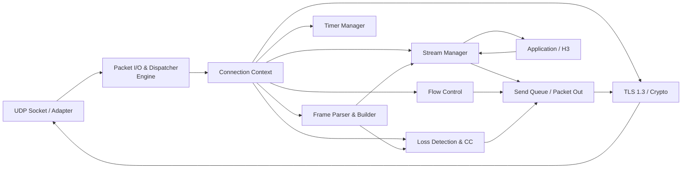
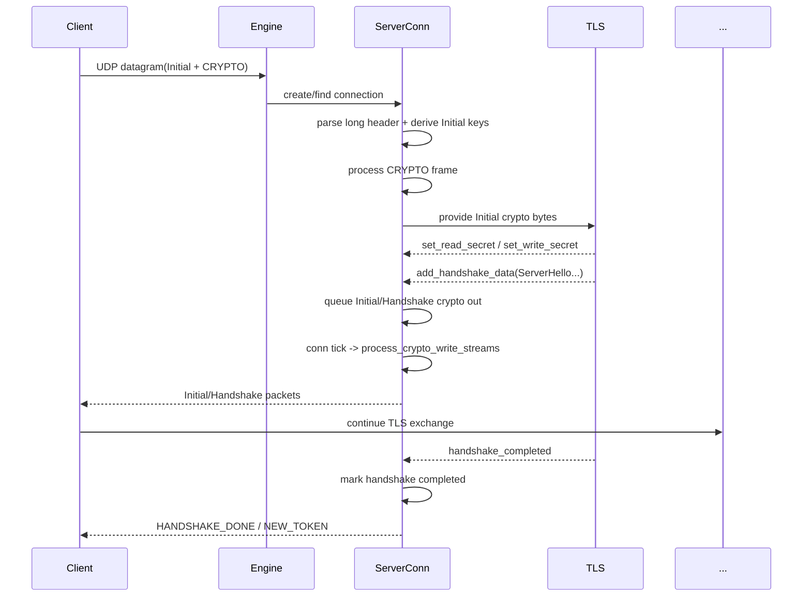
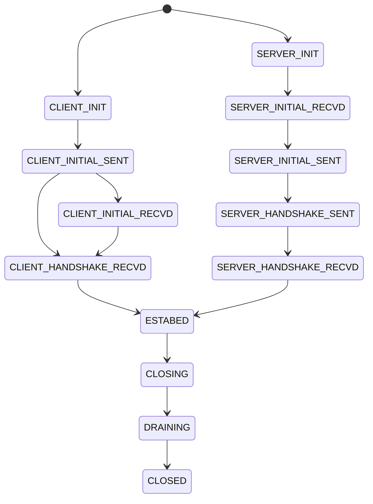
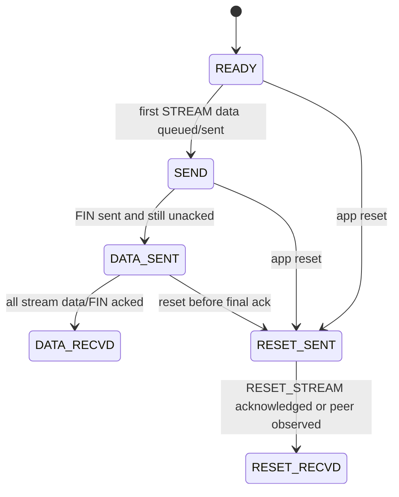
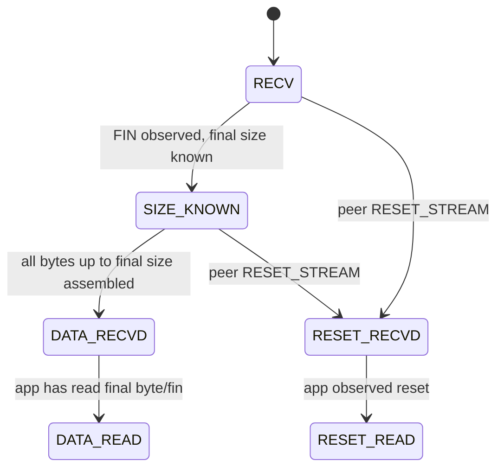

# 基于 `refs/xquic` 的 QUIC 协议栈实现指导文档

本文档以 `refs/xquic` 参考实现为主要样本，提炼一个更适合作为“从零实现全新 QUIC 协议栈”的高层设计蓝图。文档刻意弱化与协议无关的工程性细枝末节，聚焦 RFC 9000 / 9001 / 9002 定义的核心传输语义，并把 xquic 中已经验证过的模块边界、状态推进方式、定时器组织方式和测试工程抽取出来。

阅读与复核范围主要覆盖以下源码区域：

- 传输核心：`refs/xquic/src/transport/`
- TLS/密码学集成：`refs/xquic/src/tls/`
- 拥塞控制：`refs/xquic/src/congestion_control/`
- 单元测试与集成测试：`refs/xquic/tests/`、`refs/xquic/scripts/`
- interop 适配：`refs/xquic/interop/`

需要先说明一个关键判断：

- xquic 是一个“功能非常丰富”的参考实现，不只是 RFC 9000 最小子集，还带有多路径、FEC、DATAGRAM、PMTUD、QLOG、H3/QPACK 等能力。
- 如果目标是“从零写一个清晰、可维护、便于 Agent 逐阶段实现的 QUIC 栈”，不应照抄 xquic 的全部复杂度。
- 最合理的做法是：学习它的模块边界和状态推进方式，但第一版只实现“单路径 + RFC 9000/9001/9002 主线 + 可选 H3 的清晰接口预留”，把多路径、FEC、复杂调度器都放到后续扩展阶段。

---

## 1. 架构概览与核心模块划分

### 1.1 推荐总体架构

xquic 的核心组织方式，可以概括为：

- 一个全局 `Engine` 负责：
  - UDP 数据报入口
  - 连接查找与创建
  - 活跃连接/定时唤醒连接调度
  - TLS 全局上下文
  - ALPN 注册
  - 全局日志、随机数、token 密钥
- 每个 `Connection` 负责：
  - QUIC 连接状态机
  - CID / 地址验证 / token / Retry / Stateless Reset
  - TLS 实例与密钥安装
  - 流管理
  - 帧处理
  - 发送队列
  - 定时器
  - 丢包恢复、拥塞控制、RTT 测量
- 每个 `Stream` 负责：
  - 独立的发送/接收子状态机
  - 收发缓冲
  - 流级流控
  - 应用回调对接
- 每条 `Path` 在 xquic 中还拥有独立的：
  - `send_ctl`
  - `pn_ctl`
  - path-level timer manager

如果要做一个更清晰的新实现，建议保留“Engine -> Connection -> Stream”三级主结构，并把 Path 抽象保留为接口层，但第一版只启用单路径。

推荐架构图：



### 1.2 核心模块说明

#### 1.2.1 Packet I/O & Dispatcher（数据包接收与分发）

参考实现映射：

- `src/transport/xqc_engine.h`
- `src/transport/xqc_engine.c`
- `src/transport/xqc_packet.c`
- `src/transport/xqc_packet_parser.c`

职责：

- 接收单个 UDP datagram。
- 先做最轻量的头部判别和 CID 提取。
- 按 SCID/DCID/Stateless Reset Token 在连接表中查找连接。
- 服务器端在“未知连接 + Initial/0-RTT”场景下创建新连接。
- 对无法归属连接的短包，尝试按 Stateless Reset 解释；否则按策略回发 Stateless Reset。
- 把已归属的数据报递交给连接对象处理。
- 维护连接级唤醒队列和活跃队列。

xquic 的关键设计点：

- `xqc_engine_t` 内部维护三类 hash：
  - `conns_hash`：按 SCID 查找
  - `conns_hash_dcid`：按对端 CID / reset 相关路径查找
  - `conns_hash_sr_token`：按 Stateless Reset Token 查找
- 维护两个优先队列：
  - `conns_active_pq`：当前需要立即处理的连接
  - `conns_wait_wakeup_pq`：下一次到期后再唤醒的连接
- UDP 接收路径与连接 tick 路径分离：
  - `xqc_engine_packet_process()` 负责“收包入系统”
  - `xqc_engine_main_logic()` 负责“跑状态机、发包、重传、定时器推进”

对新实现的指导建议：

- Packet Dispatcher 必须做成“极薄的一层”。
- 它不应承担过多协议逻辑，最多做：
  - 包头粗解析
  - 连接定位
  - 新连接创建
  - 与连接对象的生命周期桥接
- 真正的 QUIC 语义应尽量下沉到 `Connection`。

#### 1.2.2 Connection Management（连接管理与状态机）

参考实现映射：

- `src/transport/xqc_conn.h`
- `src/transport/xqc_conn.c`

职责：

- 管理连接生命周期：初始化、握手、建立、关闭、draining、销毁。
- 管理所有 QUIC 级别状态：
  - 版本
  - 连接状态
  - 标志位
  - 本地/远端地址
  - token / Retry
  - ALPN
  - transport parameters
  - 连接级流控
  - 连接级定时器
- 承接所有子模块：
  - TLS
  - 流
  - 发送队列
  - 丢包恢复
  - path
  - 应用回调

xquic 的特点：

- `xqc_connection_t` 是一个“大聚合对象（aggregate root）”。
- 状态不是分散在很多独立对象里，而是大部分都挂在 connection 上。
- 它使用：
  - 显式 `conn_state`
  - 大量 `conn_flag`
  - 多个 list/hash/timer 子对象
- 这是典型的 C 语言风格：牺牲一定“纯粹抽象”，换取结构清晰和访存局部性。

对新实现的建议：

- 保留“Connection 作为聚合根”的设计。
- 但不要让 `conn_flag` 无限制膨胀。
- 推荐把标志按主题拆成多个子结构：
  - handshake flags
  - close flags
  - address validation flags
  - send availability flags
- 外部只通过一组有限接口操纵 connection，避免模块直接改写过多字段。

#### 1.2.3 Cryptographic & TLS 1.3 Integration（加密层与 TLS 集成机制）

参考实现映射：

- `src/tls/xqc_tls.h`
- `src/tls/xqc_tls.c`
- `src/tls/xqc_crypto.c`
- `src/tls/xqc_tls_defs.h`
- `src/transport/xqc_conn.c` 中的 `xqc_conn_tls_cbs`

职责：

- 创建全局 TLS context 与每连接 TLS instance。
- 依据 ODCID 派生 Initial secret。
- 对接 BoringSSL/BabaSSL 的 QUIC TLS 回调。
- 安装各加密级别的读写密钥：
  - Initial
  - 0-RTT
  - Handshake
  - 1-RTT
- 导出 TLS 产生的握手字节流，并让上层封装成 CRYPTO frame。
- 处理 transport parameters 的导入/导出。
- 处理 key update。

xquic 的关键设计：

- 全局 `xqc_tls_ctx_t`：
  - 存放 `SSL_CTX`
  - ALPN 注册
  - 引擎级 TLS 配置
- 每连接 `xqc_tls_t`：
  - 包含 `SSL *`
  - `crypto[level]`
  - 回调集合
- 通过 QUIC method 回调桥接 TLS 与传输层：
  - `set_read_secret`
  - `set_write_secret`
  - `add_handshake_data`
  - `flush_flight`
  - `send_alert`
- 连接层把 TLS 产出的字节流缓存在：
  - `initial_crypto_data_list`
  - `hsk_crypto_data_list`
  - `application_crypto_data_list`

对新实现的建议：

- 不要把 TLS 直接“塞进” packet parser。
- 正确边界应该是：
  - Packet 层只负责把 CRYPTO frame 数据提交给 TLS 模块
  - TLS 模块只负责：
    - 消费 CRYPTO bytes
    - 产出待发送 CRYPTO bytes
    - 安装/更新密钥
    - 回传 transport parameters / ALPN / session ticket / alert
- 把“密钥是否 ready”作为传输层明确可查询的状态。
- 这会极大简化“0-RTT 缓冲”“Handshake 包乱序到达”“1-RTT 提前到达”的处理。

#### 1.2.4 Frame Parser & Builder（帧的解析与构建）

参考实现映射：

- `src/transport/xqc_frame.c`
- `src/transport/xqc_frame_parser.c`
- `src/transport/xqc_packet_out.c`
- `src/transport/xqc_packet_in.h`
- `src/transport/xqc_packet_out.h`

职责：

- 解析包内 frame。
- 按 frame 类型把语义分派给：
  - ACK / loss
  - stream
  - flow control
  - connection close
  - migration/path validation
  - token/cid 管理
- 构建 outgoing frames，并附着到 packet buffer。
- 在发送侧为重传与 ACK 反馈保留足够元数据。

xquic 的重要经验：

- `xqc_packet_in_t` 是“已收包的中间表示”。
- `xqc_packet_out_t` 是“待发包的中间表示”，不仅包含字节缓冲，还包含丰富元数据：
  - 帧类型 bitset
  - packet number
  - sent_time
  - largest_ack
  - stream frame 元信息
  - path_id
  - 是否 in-flight / lost / retrans / probe
- 这类元数据不是可有可无，而是恢复模块工作的前提。

对新实现的建议：

- 必须设计显式的 `packet_out` 元数据层。
- 不要试图只靠“裸字节数组 + 少量字段”完成恢复逻辑。
- 最少要能回答以下问题：
  - 这个包属于哪个 packet number space？
  - 是否 ack-eliciting？
  - 是否包含 STREAM / CRYPTO / ACK / HANDSHAKE_DONE？
  - 如果它丢了，是否需要重建 frame？
  - 如果它被 ACK 了，需要推进哪些 stream state？

#### 1.2.5 Stream Management（流的并发与生命周期管理）

参考实现映射：

- `src/transport/xqc_stream.h`
- `src/transport/xqc_stream.c`
- `src/transport/xqc_frame.c` 中 STREAM/RESET/STOP_SENDING 处理

职责：

- 创建本地主动流与远端被动流。
- 管理发送/接收两套子状态机。
- 管理 stream 收发缓冲。
- 在应用层和 packet/frame 层之间做桥接。
- 管理流级流控。

xquic 的关键组织方式：

- connection 内维护四条流链表：
  - `conn_write_streams`
  - `conn_read_streams`
  - `conn_closing_streams`
  - `conn_all_streams`
- stream 通过 `READY_TO_WRITE` / `READY_TO_READ` 标记加入连接级待处理队列。
- 引擎 tick 时统一调用：
  - `xqc_process_write_streams()`
  - `xqc_process_read_streams()`
- 这让“应用回调”和“协议状态推进”具有明确节拍。

对新实现的建议：

- 这是一个非常值得保留的模式。
- 在 C 语言里，比起“每个 stream 自己调度自己”，维护 connection 级 ready list 更简单、更稳定。
- 推荐把 stream 的逻辑分成四部分：
  - stream id / direction / ownership
  - send state + send buffer
  - recv state + recv reorder buffer
  - callbacks / app glue

#### 1.2.6 Loss Detection & Congestion Control（丢包恢复与拥塞控制）

参考实现映射：

- `src/transport/xqc_send_ctl.h`
- `src/transport/xqc_send_ctl.c`
- `src/congestion_control/`
- `src/transport/xqc_recv_record.*`

职责：

- 跟踪每个 packet number space 的 sent / acked / lost。
- 更新 RTT：`latest_rtt / srtt / rttvar / minrtt`。
- 计算 loss detection timer。
- 执行 PTO 与 persistent congestion 判断。
- 调用拥塞控制算法回调。
- 维护 pacing。
- 管理 anti-amplification 限制。

xquic 的结构特点：

- 恢复和 CC 被组合在 `xqc_send_ctl_t` 里。
- `send_ctl` 是 per-path 的，这对多路径是自然的。
- 同时配有 `xqc_pn_ctl_t` 记录：
  - packet number
  - recv record
  - ack sent record
  - optimistic ACK attack 检测状态
- 拥塞控制算法采用插件式回调：
  - NewReno
  - Cubic
  - BBR
  - BBRv2
  - Copa
  - Unlimited（测试用）

对新实现的建议：

- 第一版可以只做单路径，但内部接口仍建议做成：
  - `recovery_on_packet_sent(path, packet)`
  - `recovery_on_ack(path, ack_info)`
  - `recovery_detect_loss(path, now)`
- 这样未来加 multipath 时不需要推翻恢复框架。
- 第一版建议只接入 NewReno 或 Cubic，先把 recovery 语义跑通，再扩展 BBR。

#### 1.2.7 Flow Control（连接级与流级流量控制）

参考实现映射：

- `xqc_conn_flow_ctl_t`
- `xqc_stream_flow_ctl_t`
- `src/transport/xqc_stream.c`
- `src/transport/xqc_frame.c`
- `src/transport/xqc_frame_parser.c`

职责：

- 执行连接级 `MAX_DATA`。
- 执行流级 `MAX_STREAM_DATA`。
- 执行 stream count 限制 `MAX_STREAMS`。
- 在应用读取推进后，按窗口策略发送增量更新帧。

xquic 的经验：

- 它不只是“静态窗口”，而是有简单的自适应接收窗口调节：
  - 如果应用读取很快、窗口很快被消耗，就放大接收窗口
  - 可依据接收速率与 RTT 粗略调节
- 这不是 QUIC 最小必需，但对真实吞吐很有帮助。

对新实现的建议：

- 第一版先实现固定窗口 + 半窗口阈值触发更新。
- 第二版再考虑接收窗口自动扩展。
- 绝不要把流控和拥塞控制混在一起：
  - 流控回答“协议允许发多少”
  - 拥塞控制回答“网络当前适合发多少”

### 1.3 推荐补充模块

虽然用户要求的核心模块已经覆盖，但从实现角度，还应显式保留以下模块边界：

#### 1.3.1 Send Queue / Packet Scheduler

参考实现映射：

- `src/transport/xqc_send_queue.h`
- `src/transport/xqc_send_queue.c`

职责：

- 组织：
  - 待发包
  - 高优先级待发包
  - 已发未确认包
  - 丢失包
  - PTO probe 包
  - 1-RTT 待补发包
  - free packet pool
- 提供 packet 复用与重传复制语义。

建议：

- 发送队列是“恢复逻辑的底盘”，必须独立。
- 不要让 stream 直接把字节写 socket。

#### 1.3.2 Connection ID / Token / Address Validation

参考实现映射：

- `src/transport/xqc_conn.c`
- `src/transport/xqc_cid.*`
- `src/transport/xqc_packet_parser.c`

职责：

- ODCID / Initial SCID / Retry SCID 维护
- NEW_CONNECTION_ID / RETIRE_CONNECTION_ID
- Retry token / NEW_TOKEN
- Address validation
- Stateless Reset

建议：

- 这是 QUIC 连接安全模型的一部分，不应晚于主干实现太多。
- 至少要在“支持 Retry”之前，把这部分对象模型先设计好。

#### 1.3.3 Timer & Event Loop

参考实现映射：

- `src/transport/xqc_timer.h`
- `src/transport/xqc_timer.c`
- `src/transport/xqc_engine.c`

职责：

- 管理连接级 timer
- 管理路径级 timer
- 计算下次唤醒时间
- 把 connection 放入 active/wakeup 队列

建议：

- 不要把 timer 逻辑散落在每个模块中。
- 统一 timer manager + `next_wakeup_time()` 的模型最适合后续 Agent 分阶段开发。

### 1.4 模块边界与依赖关系

| 模块 | 只应该知道什么 | 不应该直接知道什么 | 建议接口方向 |
| --- | --- | --- | --- |
| Packet I/O & Dispatcher | UDP datagram、CID、连接表、唤醒队列 | stream 细节、H3 细节 | `engine_on_udp_datagram()` |
| Connection | 所有 QUIC transport 状态 | H3/QPACK 编解码细节 | `conn_on_packet()`、`conn_run()` |
| TLS/Crypto | crypto bytes、keys、TP、ALPN | stream 调度、ACK/loss 细节 | `tls_process_crypto_data()`、`tls_poll_output()` |
| Frame Parser | packet payload、frame types | socket / scheduler | `parse_frames()` |
| Frame Builder | packet_out、frame 元数据 | app 对象细节 | `append_*_frame()` |
| Stream Manager | stream 状态、缓冲、回调 | UDP 收发、CID | `stream_send()`、`stream_recv()` |
| Recovery/CC | sent/acked/lost、RTT、bytes_in_flight | H3 语义 | `on_packet_sent/acked/lost()` |
| Flow Control | data/window counters | 拥塞窗口 | `fc_on_data_received/read()` |
| App/H3 | 请求语义 | packet number / key phase | `on_stream_readable/writable()` |

### 1.5 架构设计对比与推荐方案

#### 方案 A：像 xquic 一样，以 Connection 作为“大聚合根”

优点：

- 适合 C 语言。
- 所有核心状态可在一个对象上追踪。
- 与事件循环、定时器、恢复、流管理的耦合非常自然。
- 容易做调试日志。

缺点：

- 标志位容易膨胀。
- 如果没有良好约束，`conn.c` 会变得很大。

#### 方案 B：强拆成很多 Actor / 消息队列子系统

优点：

- 理论上模块边界更纯粹。

缺点：

- 在 C 里开发成本高。
- 调试时要跨很多对象跳转。
- 对后续编码 Agent 来说，理解和保持一致性更难。

#### 推荐方案：A 的主结构 + B 的接口纪律

推荐结论：

- 保留 xquic 式的三层骨架：
  - `Engine`
  - `Connection`
  - `Stream`
- 但在 `Connection` 内部再按子结构分区：
  - handshake state
  - transport params / flow control
  - send queue
  - recovery
  - streams
  - cid/token/path validation
- 第一版只做单路径，内部接口保留 path 参数。
- 第一版不实现 multipath/FEC，只预留扩展点。

这是最清晰、最易于用现代工程方式逐步推进的方案。

---

## 2. 关键数据结构与接口设计

### 2.1 连接对象（Connection Context）必须包含的核心字段

下面不是对 xquic 原结构的逐字段翻译，而是抽取“真正必须有”的字段集合。

#### 2.1.1 身份与路由

- 协议版本：
  - `version`
- 关键 CID：
  - `original_dcid`
  - `initial_scid`
  - `retry_scid`
  - `current_dcid`
  - `current_scid`
- CID 池：
  - 本地可发的 SCID 集合
  - 对端可用的 DCID 集合
  - retire / ack 状态
- 地址：
  - `peer_addr`
  - `local_addr`
- token：
  - 当前收到的 token
  - token 长度

#### 2.1.2 生命周期与状态机

- `conn_state`
- handshake flags：
  - 是否已收 Initial
  - 是否 TLS Finished complete
  - 是否 handshake completed
  - 是否 handshake confirmed
  - 是否可以发送 1-RTT
  - 是否收到/发送 `HANDSHAKE_DONE`
- closing state：
  - `conn_err`
  - `close_reason`
  - `closing/draining/linger`

#### 2.1.3 子模块句柄

- `tls`
- `crypto_stream[enc_level]`
- `send_queue`
- `timer_manager`
- `recovery/path/send_ctl`
- `streams_hash`
- ready lists：
  - write streams
  - read streams
  - closing streams
  - all streams

#### 2.1.4 流控与传输参数

- `local_transport_params`
- `remote_transport_params`
- `conn_flow_ctl`

#### 2.1.5 乱序与延迟处理

- 各加密级别的 undecrypt packet buffer：
  - 0-RTT
  - Handshake
  - 1-RTT
- TLS 产出的待发送 crypto buffer：
  - Initial crypto out
  - Handshake crypto out
  - Application crypto out

#### 2.1.6 回调与上层协议桥接

- 传输层回调：
  - write socket
  - save token
  - save session ticket
  - handshake finished
  - connection close notify
- ALPN / 应用协议回调：
  - conn create
  - stream create/read/write/close
  - datagram notify
- 用户态上下文：
  - `user_data`
  - `proto_data`

#### 2.1.7 时间与统计

- `conn_create_time`
- `conn_last_send_time`
- `conn_last_recv_time`
- `handshake_complete_time`
- `first_data_send_time`
- 统计项：
  - packet sent / recv
  - bytes sent / recv
  - max PTO count
  - max packet size acked

#### 2.1.8 推荐伪结构

```c
typedef struct quic_conn_s {
    quic_version_t version;
    quic_conn_state_t state;
    quic_conn_flags_t flags;

    quic_cid_set_t scids;
    quic_cid_set_t dcids;
    quic_cid_t original_dcid;
    quic_cid_t initial_scid;
    quic_cid_t retry_scid;

    sockaddr_storage peer_addr;
    sockaddr_storage local_addr;

    uint8_t token[MAX_TOKEN_LEN];
    size_t token_len;

    quic_tls_t *tls;
    quic_stream_t *crypto_stream[QUIC_ENC_LEVEL_MAX];

    quic_send_queue_t *sendq;
    quic_timer_mgr_t timer_mgr;
    quic_recovery_t recovery;

    quic_transport_params_t local_tp;
    quic_transport_params_t remote_tp;
    quic_conn_flow_ctl_t conn_fc;

    quic_stream_map_t streams;
    list_head ready_read_streams;
    list_head ready_write_streams;
    list_head closing_streams;
    list_head all_streams;

    list_head undecrypt_pkts[QUIC_ENC_LEVEL_MAX];
    list_head crypto_out[QUIC_ENC_LEVEL_MAX];

    quic_transport_callbacks_t transport_cbs;
    quic_app_callbacks_t app_cbs;
    void *user_data;
    void *proto_data;

    uint64_t conn_err;
    const char *close_reason;

    uint64_t create_time_us;
    uint64_t last_send_time_us;
    uint64_t last_recv_time_us;
    uint64_t handshake_done_time_us;
} quic_conn_t;
```

### 2.2 流对象（Stream Context）的接收/发送缓冲区设计

#### 2.2.1 接收侧

xquic 的接收缓冲模型是：

- `frames_tailq`：按 offset 有序的 `STREAM frame` 片段链表
- `merged_offset_end`：当前连续收到的前缀终点
- `next_read_offset`：应用下一次可读位置
- `stream_length`：一旦看到 FIN 就得到 final size
- `stream_determined`：是否已知 final size

这是一个非常典型、也非常实用的 QUIC 接收缓冲设计。

优点：

- 很符合 QUIC 的“乱序片段 + 最终大小”语义。
- 简单直观。
- 易于做重复帧、重叠帧、final size 冲突检查。

缺点：

- 链表在高乱序、大数据量下效率一般。

对新实现的建议：

- 第一版可以直接采用“有序片段链表/有序区间树”的语义模型。
- 如果更看重后续扩展性，建议抽象成：

```c
typedef struct quic_recv_buf_s {
    range_map_t segments;        // [offset, offset+len)
    uint64_t merged_end;         // 连续可读前缀终点
    uint64_t next_read_offset;   // 应用读取位置
    uint64_t final_size;         // 已知则有效
    bool final_size_known;
} quic_recv_buf_t;
```

接收缓冲必须支持：

- 插入新片段
- 去重/合并
- 判断是否越过 final size
- 判断是否形成连续可读区
- 读取后释放前缀片段

#### 2.2.2 发送侧

xquic 的发送缓冲模型分两部分：

- 即时发送路径：
  - 当前 `stream_send_offset`
  - 当前 packet 中附着的 STREAM frame 元数据
- 兜底缓冲路径：
  - `stream_write_buff_list`
  - 用于：
    - 0-RTT 在 1-RTT 建立后重发
    - send queue 满或暂时不能发时缓存

这说明一个非常重要的设计原则：

- QUIC 发送 API 不能假设“应用一写就立即发完”。
- 即使 API 语义看起来像“write”，内部仍必须保留可靠的发送缓存与重构能力。

建议的发送缓冲字段：

```c
typedef struct quic_send_buf_s {
    chunk_list_t app_chunks;       // 还未完全编码进 packet 的数据
    uint64_t next_stream_offset;   // 下一个待发送 offset
    uint64_t bytes_acked;          // 已确认的终点
    bool fin_buffered;             // 应用已提交 FIN
    bool fin_sent;
    bool fin_acked;
} quic_send_buf_t;
```

发送缓冲必须支持：

- 写入应用数据
- 以 MTU 限制切片
- 在 packet 丢失时重建 STREAM frame
- 在 0-RTT 被拒绝时重放到 1-RTT
- FIN 与数据分离发送

### 2.3 各核心模块之间的关键交互接口

下面给出适合新实现的接口草图。核心目标不是“完全复刻 xquic 函数名”，而是保留相同的数据流边界。

#### 2.3.1 Engine 与 Connection

```c
int engine_on_udp_datagram(
    quic_engine_t *eng,
    const uint8_t *buf, size_t len,
    const sockaddr *local, socklen_t local_len,
    const sockaddr *peer, socklen_t peer_len,
    uint64_t recv_time_us);

void engine_run(quic_engine_t *eng);
uint64_t engine_next_wakeup(quic_engine_t *eng);
```

语义：

- `engine_on_udp_datagram()` 做连接查找/创建与收包入队。
- `engine_run()` 处理所有活跃连接。
- `engine_next_wakeup()` 返回最近到期时间，交给外部事件循环设置 timer。

#### 2.3.2 Connection 与 Packet/Frame

```c
int conn_on_datagram(quic_conn_t *conn,
                     const uint8_t *buf, size_t len,
                     uint64_t recv_time_us);

int conn_on_packet(quic_conn_t *conn, quic_packet_in_t *pkt);
int conn_process_frames(quic_conn_t *conn, quic_packet_in_t *pkt);
void conn_run(quic_conn_t *conn, uint64_t now_us);
```

语义：

- datagram 中可含多个 QUIC packet。
- 每个 packet 先 parse header，再 decrypt，再 parse frames。
- `conn_run()` 统一处理：
  - timer expire
  - crypto read/write
  - stream read/write
  - ACK 写包
  - 重传/探测
  - 发包

#### 2.3.3 Connection 与 TLS

```c
int tls_init(quic_tls_t *tls, quic_version_t ver, const quic_cid_t *odcid);
int tls_process_crypto_data(quic_tls_t *tls, enc_level_t level,
                            const uint8_t *data, size_t len);

bool tls_is_key_ready(quic_tls_t *tls, enc_level_t level, key_dir_t dir);
bool tls_is_ready_for_early_data(quic_tls_t *tls);
int tls_update_1rtt_keys(quic_tls_t *tls, key_dir_t dir);
```

TLS 到连接的回调：

```c
int conn_tls_on_crypto_data(enc_level_t level, const uint8_t *data, size_t len, void *conn);
void conn_tls_on_transport_params(const uint8_t *tp, size_t len, void *conn);
void conn_tls_on_handshake_completed(void *conn);
void conn_tls_on_alert(uint8_t alert, void *conn);
```

#### 2.3.4 Stream 与 Packet Builder

```c
ssize_t stream_send(quic_stream_t *s, const uint8_t *data, size_t len, bool fin);
ssize_t stream_recv(quic_stream_t *s, uint8_t *buf, size_t cap, bool *fin);

int packet_builder_append_stream_frame(
    quic_conn_t *conn,
    quic_packet_out_t *po,
    quic_stream_t *stream,
    bool fin,
    const uint8_t *data, size_t len,
    size_t *consumed);
```

#### 2.3.5 Recovery 与 Connection

```c
void recovery_on_packet_sent(quic_recovery_t *r, quic_packet_out_t *po, uint64_t now_us);
int recovery_on_ack(quic_recovery_t *r, const quic_ack_info_t *ack, uint64_t now_us);
void recovery_detect_lost(quic_recovery_t *r, pkt_space_t pns, uint64_t now_us);
void recovery_set_loss_timer(quic_recovery_t *r, uint64_t now_us);
```

#### 2.3.6 Flow Control 与 Stream/Connection

```c
int conn_fc_on_stream_data_received(quic_conn_t *c, quic_stream_t *s, uint64_t new_end);
void conn_fc_on_app_read(quic_conn_t *c, quic_stream_t *s, uint64_t bytes);

bool conn_fc_can_send(quic_conn_t *c, size_t n);
bool stream_fc_can_send(quic_stream_t *s, size_t n);
```

### 2.4 数据包与发送元数据设计要点

参考 xquic，可以得出一个强约束：

- `packet_out` 必须是“协议对象”，不是单纯“字节数组”。

至少包含以下字段：

- packet header 基本信息：
  - packet type
  - packet number
  - pns
  - DCID / SCID
- 字节缓冲：
  - `buf`
  - `payload ptr`
  - `pn ptr`
  - `used_size`
  - `enc_size`
- 发送恢复元数据：
  - `sent_time`
  - `frame_types`
  - `in_flight`
  - `lost`
  - `retransmitted`
  - `acked`
- stream 元数据：
  - 涉及哪些 stream id
  - 每个 stream frame 的 offset / len / fin
- path / probe 元数据：
  - `path_id`
  - 是否 PTO probe
  - 是否 PMTUD probe

这是后续 Agent 写恢复、重传、流状态推进时的前提。

---

## 3. 核心工作流与状态机

### 3.1 握手阶段（Handshake Flow）

以下按“服务端首次收到客户端 Initial”展开。

#### 3.1.1 数据报进入系统

1. UDP adapter 收到 datagram。
2. `engine_on_udp_datagram()` 解析 CID。
3. 若找不到连接：
   - 如果是服务器端且包类型为 Initial/0-RTT，则创建新连接。
   - 如果是短头包，则尝试按 Stateless Reset 解释。
   - 若仍无法归属，则按策略发送 Stateless Reset。

#### 3.1.2 服务端首次接受连接

xquic 在 `xqc_conn_server_accept()` 中体现出的正确顺序是：

1. 先检查 token 是否有效。
2. 如果 token 无效，且策略要求 Retry，则发送 Retry，并结束本轮处理。
3. 否则创建 server TLS instance。
4. 基于：
   - `original_dcid`
   - 或 `retry_scid`
   派生 Initial secret。
5. 注册回调并准备消费 CRYPTO。

这说明“连接对象创建”和“连接真正被服务器 accept”不是同一个时刻。

建议新实现也区分：

- `conn_allocated`
- `conn_accepted`

否则 Retry / anti-amplification / before-accept send path 会变得混乱。

#### 3.1.3 Initial 包解析与 CRYPTO 数据进入 TLS

1. `conn_process_packet()` 遍历 datagram 内各 QUIC packet。
2. `packet_parse_single()` 解析 long header。
3. 对 Initial：
   - 检查当前状态下是否仍允许接收 Initial
   - 用 Initial secret 去 header protect / AEAD decrypt
4. `process_frames()` 解析包内 frame。
5. 遇到 CRYPTO frame：
   - 插入 Initial crypto stream 的接收缓冲
   - 调 `tls_process_crypto_data(level=Initial, bytes)`
6. TLS 通过 `SSL_provide_quic_data()` 消费这些 bytes。

#### 3.1.4 TLS 反向产出握手字节

TLS 在处理 ClientHello / ServerHello / EncryptedExtensions / Finished 的过程中，会通过 QUIC method 回调：

- `set_read_secret`
- `set_write_secret`
- `add_handshake_data`

连接层需要完成两件事：

1. 当 `set_*_secret` 到来时安装密钥。
2. 当 `add_handshake_data` 到来时，把字节流缓存到对应加密级别的待发列表里。

这就是 xquic 的：

- `initial_crypto_data_list`
- `hsk_crypto_data_list`
- `application_crypto_data_list`

存在的原因。

#### 3.1.5 引擎 tick 推动握手发送

在 `engine_process_conn()` 中，xquic 的处理顺序很值得借鉴：

1. expire timers
2. closing notify
3. 处理 deferred undecrypt packets
4. `process_crypto_read_streams()`
5. `process_crypto_write_streams()`
6. 若已可发 1-RTT，再处理 app streams
7. 写 ACK
8. 发 ping / VN / PMTUD
9. schedule -> retransmit/probe -> send

关键启发：

- 握手数据流和应用数据流必须分阶段推进。
- crypto stream 的读写优先级高于普通 stream。

#### 3.1.6 1-RTT 密钥就绪与握手完成

在 xquic 中，握手完成不是单一条件，而是若干条件共同收敛：

- TLS 已报告 handshake completed
- 连接状态推进到 `ESTABED`
- 1-RTT 写密钥 ready
- 服务器：
  - handshake complete 时立即视为 handshake confirmed
  - 发送 `HANDSHAKE_DONE`
  - 必要时发送 `NEW_TOKEN`
- 客户端：
  - 首次成功发送 Handshake 后丢弃 Initial keys
  - 收到 `HANDSHAKE_DONE` 后进入 handshake confirmed
  - 丢弃 Handshake keys

建议新实现明确区分四个概念：

- `tls_handshake_completed`
- `transport_established`
- `can_send_1rtt`
- `handshake_confirmed`

这四者不是同义词。

### 3.2 握手阶段序列图



### 3.3 数据收发阶段（Data Flow）

#### 3.3.1 发送链路：应用写入 -> 封帧 -> 加密 -> UDP 发出

推荐链路：

1. 应用调用 `stream_send()`。
2. stream manager 做：
   - send state 合法性检查
   - 0-RTT/1-RTT 可发送性判断
   - 连接级/流级流控检查
3. 把数据切成若干 STREAM frame，写入 `packet_out`。
4. `packet_out` 进入 send queue。
5. 连接 tick 时：
   - ACK 先写
   - 重传包/PTO probe 包先调度
   - 新数据包再调度
6. packet builder 写 packet header。
7. recovery 为 packet 分配 packet number。
8. TLS 执行 payload encryption + header protection。
9. UDP adapter 发出。
10. recovery 记录 `on_packet_sent()`。

这一链路中，xquic 的经验是：

- `stream_send()` 不直接碰 socket。
- 发送的最小原子是 `packet_out`，不是 `stream`。
- 发送成功后才进入 unacked list。

#### 3.3.2 接收链路：UDP -> 解密 -> 帧解析 -> 流可读 -> 应用读取

推荐链路：

1. UDP 收到 datagram。
2. Engine 定位连接。
3. 连接逐包解析：
   - parse header
   - 判断 key 是否 ready
   - 若 key 未 ready，放入 undecrypt buffer
4. 解密 payload。
5. 解析 frame。
6. 对 STREAM frame：
   - 找/建 stream
   - 插入 recv reorder buffer
   - 更新 `merged_offset_end`
   - 若形成可读区，则把 stream 放进 `conn_read_streams`
7. 连接 tick 时调 `process_read_streams()`。
8. 应用在 `stream_recv()` 中真正拷贝数据。
9. 读取推进后更新：
   - `next_read_offset`
   - 流级接收窗口
   - 连接级接收窗口
10. 若需要，排队 `MAX_STREAM_DATA` / `MAX_DATA`。

### 3.4 Connection 核心状态流转

xquic 使用的连接状态更偏“握手推进阶段”而非 RFC 文本式超高层状态，这很适合实现层调试。推荐第一版保留类似粒度。



说明：

- `ESTABED` 在 xquic 中表示“握手主链路已走通，可以进入 1-RTT 正常阶段”。
- 但 `HANDSHAKE_COMPLETED` 与 `HANDSHAKE_CONFIRMED` 仍是独立 flag。
- 因此状态 + flag 共同构成最终连接语义。

### 3.5 Stream 核心状态流转

建议像 xquic 一样，发送和接收状态机分开实现。

#### 3.5.1 发送侧



#### 3.5.2 接收侧



#### 3.5.3 关闭条件

xquic 的关闭条件非常值得复用：

- 双向流：
  - send terminal 且 recv terminal
- 单向发送流：
  - 只看 send terminal
- 单向接收流：
  - 只看 recv terminal

达到终态后不立刻销毁，而是：

- 标记 `NEED_CLOSE`
- 放入 `conn_closing_streams`
- 设置 `STREAM_CLOSE` timer

这能避免由于 ACK/重传尾声导致的过早回收问题。

### 3.6 定时器与事件循环

#### 3.6.1 xquic 的 timer 分层

xquic 把 timer 分成：

- path-level timer
- connection-level timer
- general-purpose timer

这是一种非常稳妥的设计。

#### 3.6.2 path-level timer

来自 `xqc_timer_type_t`：

- `ACK_INIT`
- `ACK_HSK`
- `ACK_01RTT`
- `LOSS_DETECTION`
- `PACING`
- `NAT_REBINDING`
- `PATH_IDLE`
- `PATH_DRAINING`

作用：

- ACK 延迟合并
- 丢包检测 / PTO
- pacing 放行
- 路径空闲/关闭
- NAT rebinding 验证窗口

#### 3.6.3 connection-level timer

- `CONN_IDLE`
- `CONN_DRAINING`
- `STREAM_CLOSE`
- `PING`
- `RETIRE_CID`
- `LINGER_CLOSE`
- `KEY_UPDATE`
- `PMTUD_PROBING`
- `QUEUE_FIN`

其中最关键的是：

- `CONN_IDLE`
  - 空闲超时
- `STREAM_CLOSE`
  - 延迟销毁终态流
- `PING`
  - keepalive / NAT 保活
- `KEY_UPDATE`
  - 1-RTT 密钥轮换
- `LINGER_CLOSE`
  - 关闭尾声

#### 3.6.4 Engine 调度策略

xquic 的调度策略可以概括为：

1. 收包或应用写入时，把连接放进 active queue。
2. `engine_main_logic()` 循环处理所有 active connections。
3. 每个连接跑完后计算 `next_tick_time`。
4. 若未来还有工作，则放入 wakeup queue。
5. 引擎最终把最近到期时间通过 `set_event_timer()` 回调交给外部事件循环。

建议伪代码：

```c
for (;;) {
    now = clock_now();
    move_expired_wakeup_to_active(now);

    while (active_queue_not_empty()) {
        conn = pop_active();
        conn_run(conn, now);

        if (conn->state == CLOSED) {
            destroy_conn(conn);
            continue;
        }

        conn->next_wakeup = conn_next_wakeup(conn);
        if (conn->next_wakeup != 0) {
            push_wakeup(conn, conn->next_wakeup);
        }
    }

    set_external_timer(engine_next_wakeup());
    wait_for_udp_or_timer();
}
```

这是非常适合单线程 C 实现的主循环。

---

## 4. 测试策略与测试用例清单

### 4.1 参考实现的测试工程结构

xquic 的测试工程不是单一层次，而是四层组合：

#### 4.1.1 单元测试

入口：

- `refs/xquic/tests/CMakeLists.txt`
- `refs/xquic/tests/unittest/main.c`

框架：

- `CUnit`

覆盖模块：

- 基础工具：
  - `xqc_random_test`
  - `xqc_pq_test`
  - `xqc_common_test`
  - `xqc_vint_test`
  - `xqc_recv_record_test`
  - `xqc_id_hash_test`
  - `xqc_cid_test`
  - ring/huffman/hash utils
- 传输层：
  - `xqc_conn_test`
  - `xqc_engine_test`
  - `xqc_packet_test`
  - `xqc_stream_frame_test`
  - `xqc_process_frame_test`
  - `xqc_tp_test`
  - `xqc_retry_test`
  - `xqc_datagram_test`
  - `xqc_ack_with_timestamp_test`
- TLS/密码学：
  - `xqc_tls_test`
  - `xqc_crypto_test`
- 恢复/拥塞控制：
  - `xqc_reno_test`
  - `xqc_cubic_test`
- H3/QPACK：
  - `xqc_h3_test`
  - `xqc_qpack_test`
  - `xqc_encoder_test`
  - `xqc_prefixed_str_test`
  - `xqc_dtable_test`
  - `xqc_stable_test`
  - `xqc_h3_ext_test`
- 可选 FEC：
  - `xqc_galois_test`
  - `xqc_fec_scheme_test`
  - `xqc_fec_test`

#### 4.1.2 事件驱动集成测试

入口：

- `refs/xquic/tests/test_client.c`
- `refs/xquic/tests/test_server.c`

特点：

- 基于 `libevent`
- 用真实 socket + 真实引擎
- 能模拟：
  - 连接建立
  - 文件传输
  - H3
  - token/session ticket
  - drop/corrupt/reorder/fail path

#### 4.1.3 case test 脚本

入口：

- `refs/xquic/scripts/case_test.sh`

特点：

- 启动 `test_server` / `test_client`
- 按 case id 驱动异常场景
- 检查日志中是否出现预期结果

它覆盖的异常场景非常有参考价值，包括：

- server refuse
- server initiated stream
- pure FIN
- create stream fail
- illegal packet
- duplicate packet
- wrong CID
- socket send/recv fail
- token verify fail/success
- send after FIN

#### 4.1.4 interop runner

入口：

- `refs/xquic/interop/run_endpoint.sh`

特点：

- 通过 `TESTCASE` 驱动标准 interop case
- 使用挂载目录：
  - `/www`
  - `/downloads`
  - `/certs`
- 使用环境变量：
  - `REQUESTS`
  - `SSLKEYLOGFILE`
  - `QLOGDIR`
- 不支持的用例必须退出 `127`

#### 4.1.5 全量脚本

入口：

- `refs/xquic/scripts/xquic_test.sh`

特点：

- 先跑 unit tests
- 再跑 case tests
- 同时使用：
  - BoringSSL
  - BabaSSL
- 最后收集 coverage

这说明参考实现非常重视“多 TLS 后端一致性”。

### 4.2 单元测试（Unit Tests）建议清单

下面分模块列出后续 Agent 必须覆盖的测试点。标注“xquic 已显式覆盖”的，代表在参考实现中能直接看到同类测试；未标注的，是基于参考实现结构推导出的必测点。

#### 4.2.1 基础编码与整数工具

- 变长整数边界：
  - `63`
  - `16383`
  - `1073741823`
  - `4611686018427387903`
  - xquic 在 `xqc_vint_test.c` 已显式覆盖这四个边界
- 变长整数非法编码
- packet number 截断与恢复
- ACK range 编解码
- prefixed int / prefixed str

#### 4.2.2 包头与包类型解析

- short header CID 解析
- long header CID 解析
- 空包 / 极短包处理
- Initial/Handshake/0-RTT/1-RTT 类型识别
- Retry / Version Negotiation 编解码
- Stateless Reset 检测

#### 4.2.3 帧解析与构建

- PADDING 连续 0 字节解析
- 大 ACK range 解析
- NEW_TOKEN 零长度错误
- Initial/Handshake 中出现非法 STREAM frame
- CRYPTO frame offset/length 解析
- STREAM frame：
  - offset
  - length bit on/off
  - FIN
  - 空数据 + FIN
- RESET_STREAM / STOP_SENDING
- MAX_DATA / MAX_STREAM_DATA / MAX_STREAMS
- NEW_CONNECTION_ID / RETIRE_CONNECTION_ID
- HANDSHAKE_DONE

#### 4.2.4 流缓冲与流状态机

- 重复 STREAM frame 去重
- 重叠片段合并
- 乱序片段插入
- final size 改变时报错
- 超过 final size 报错
- `RECV -> SIZE_KNOWN -> DATA_RECVD -> DATA_READ`
- `READY -> SEND -> DATA_SENT -> DATA_RECVD`
- RESET 路径
- 单向流和双向流终态判断
- send-after-fin 防护
- pure FIN 处理

#### 4.2.5 流控

- 连接级发送窗口阻塞
- 流级发送窗口阻塞
- 接收后触发 MAX_DATA
- 接收后触发 MAX_STREAM_DATA
- 被动创建远端新流时触发 `MAX_STREAMS` 扩展
- 超出 `MAX_STREAMS` 上限时报 `STREAM_LIMIT_ERROR`

#### 4.2.6 TLS 与密码学

- TLS ctx 创建/销毁
- client/server TLS instance 创建
- Initial secret 派生
- Initial key 安装
- Handshake key / 1-RTT key 安装
- ALPN 选择
- transport params 传递
- session ticket 保存
- early data accepted/rejected
- retry integrity tag
- key update

#### 4.2.7 恢复与拥塞控制

- `recv_record` 区间记录
- ACK 接收推进最大确认号
- RTT 更新公式
- PTO 计算
- time-threshold loss detection
- packet-threshold loss detection
- persistent congestion
- anti-amplification 解锁后重启 loss timer
- Reno：
  - slow start
  - loss
  - congestion avoidance
- Cubic：
  - slow start
  - loss
  - congestion avoidance
- spurious loss 检测与 reorder threshold 调整
- optimistic ACK 攻击检测

#### 4.2.8 连接安全与特殊包路径

- Retry token 生成/校验
- NEW_TOKEN 保存/复用
- 地址验证标志推进
- Stateless Reset 后连接进入 draining
- Version Negotiation 处理
- 0-RTT rejection 后回退到 1-RTT

### 4.3 协议一致性测试（Protocol Conformance）

参考 xquic 的 `test_client/test_server + case_test.sh`，建议后续 Agent 为新栈建立“可控故障注入层”，至少支持以下异常场景：

#### 4.3.1 包级异常

- 丢包
- 重复包
- 乱序包
- 截断包
- 非法 frame type
- 错误 CID
- 包体损坏
- header protection 解密失败

#### 4.3.2 握手级异常

- Initial 丢失
- Handshake 丢失
- 0-RTT 提前到达
- 1-RTT 提前到达
- Retry 后重新派生 Initial keys
- 服务器未验证地址前的反放大限制

#### 4.3.3 流与应用级异常

- pure FIN
- send after FIN
- send header after FIN
- server initiated bidi stream 在客户端侧被拒绝
- reset stream / stop sending 路径

#### 4.3.4 建议的故障注入实现

建议仿照 xquic 的做法，做一层 packet filter / adapter：

```c
typedef ssize_t (*quic_pkt_filter_pt)(
    const uint8_t *buf, size_t len,
    const sockaddr *peer, socklen_t peer_len,
    void *user_data);
```

基于它实现：

- `drop_nth_packet`
- `duplicate_next_packet`
- `corrupt_byte_at(offset)`
- `rewrite_cid`
- `delay_packet(ms)`

这样就能在不改协议内核的情况下做大量一致性测试。

### 4.4 集成测试与互操作性（Integration & Interop）

#### 4.4.1 本地集成测试建议

建议至少保留两类本地集成测试：

- 传输层裸流：
  - 不引入 H3
  - 验证握手、传输、关闭
- H3 层：
  - 控制流
  - 请求流
  - QPACK

#### 4.4.2 interop runner 接入要求

根据 `refs/xquic/interop/run_endpoint.sh` 和仓库中的 interop 文档，后续实现接入标准测试环境时至少要满足：

- server：
  - 监听 `443`
  - 从 `/certs/priv.key`、`/certs/cert.pem` 加载证书
  - 从 `/www` 提供文件
- client：
  - 从 `REQUESTS` 获取 URL 列表
  - 把下载结果写到 `/downloads`
- 测试用例选择：
  - 通过 `TESTCASE`
- 退出码：
  - `0` 成功
  - `1` 失败
  - `127` 不支持

#### 4.4.3 推荐 interop 递进顺序

建议按以下顺序做：

1. `handshake`
2. `transfer`
3. `retry`
4. `resumption`
5. `zerortt`
6. `keyupdate`
7. `http3`
8. `rebind-port`
9. `rebind-addr`
10. `connectionmigration`

#### 4.4.4 参考实现已接入的 interop 用例全集

对照 `refs/xquic/interop/run_endpoint.sh`，xquic 当前在容器入口脚本中显式接入了以下 `TESTCASE`：

- `versionnegotiation`
- `handshake`
- `longrtt`
- `transfer`
- `zerortt`
- `multiconnect`
- `chacha20`
- `resumption`
- `http3`
- `retry`
- `keyupdate`
- `mphandshake`
- `mptransfer`
- `mppathabandon`
- `mppathstatus`

这些用例可以按能力域分组理解：

- 握手与基础连通性：
  - `handshake`
  - `longrtt`
  - `multiconnect`
- TLS/密钥路径：
  - `chacha20`
  - `resumption`
  - `zerortt`
  - `keyupdate`
- 传输与应用：
  - `transfer`
  - `http3`
- 安全与地址验证：
  - `retry`
  - `versionnegotiation`
- 多路径扩展：
  - `mphandshake`
  - `mptransfer`
  - `mppathabandon`
  - `mppathstatus`

对新实现的直接启发：

- 第一版主线验收不应被 `mphandshake/mptransfer/...` 这类多路径扩展阻塞。
- `longrtt` 和 `multiconnect` 很适合作为恢复模块进入“真实可用”状态前的压力门槛。
- `versionnegotiation` 在当前计划里即使是禁用占位，也应该保留对象模型与编解码入口。

### 4.5 TDD 开发工作流建议

为了避免后续 Agent 在大功能上失控，建议严格采用“从内到外”的 TDD 节奏：

1. 先写最小单元测试。
2. 通过 in-memory fake packet 驱动传输核心。
3. 再接真实 UDP + 事件循环。
4. 再做 fault injection。
5. 最后接 interop runner。

推荐每个阶段都保持“三重验收”：

- 单元测试通过
- 本地端到端测试通过
- 至少一个 interop case 通过

---

## 5. 分阶段实现路径（Implementation Roadmap）

下面分两层给建议：

- 第一层：推荐的协议栈实现阶段
- 第二层：对照 `docs/plans/plan-quic.md` 的步骤 00-13，给出每阶段建议、注意事项与验收重点

### 5.1 推荐的总实现路线

#### Phase 1：基础工具链

目标：

- 变长整数
- packet number 工具
- range/recv record
- 基础 buffer / list / map
- 日志与时间接口

完成标准：

- 单元测试可覆盖所有边界编码
- ACK range 相关工具可单独工作

注意事项：

- 这一阶段不要引入 socket。
- 先把所有“小数学”做对，后续 recovery 才不会漂。

#### Phase 2：包头与 packet/frame codec

目标：

- 长短包头编码/解析
- Retry / VN / Stateless Reset 基础编解码
- STREAM / ACK / CRYPTO / MAX_* 等核心 frame codec

完成标准：

- 能构造和解析独立 packet/frame
- codec 单测稳定

注意事项：

- 不要在这一阶段耦合连接状态机。
- codec 要尽量纯函数化。

#### Phase 3：TLS 对接与 Initial/Handshake 报文处理

目标：

- TLS ctx / TLS instance
- Initial secret 派生
- QUIC method 回调桥接
- CRYPTO stream

完成标准：

- client/server 能在内存管道中互换 CRYPTO bytes
- Handshake/1-RTT keys 可安装

注意事项：

- transport parameters 从第一天就纳入设计。
- 明确 key-ready 检查接口。

#### Phase 4：最小连接状态机

目标：

- `CLIENT_INIT -> ESTABED`
- `SERVER_INIT -> ESTABED`
- Closing / Draining / Closed

完成标准：

- 单连接握手闭环
- 成功发送/接收简单 1-RTT PING/ACK/STREAM

注意事项：

- 区分 `handshake completed` 与 `handshake confirmed`。
- 提前设计好 close path。

#### Phase 5：发送队列、ACK、RTT、Loss、PTO

目标：

- send queue
- unacked/lost/probe 管理
- ACK 解析与 ACK 构造
- RTT 更新
- loss detection timer
- PTO

完成标准：

- 在可控丢包下能恢复握手和数据传输

注意事项：

- 先做单路径。
- 先接 Reno 或 Cubic，不要同时引入多个 CC。

#### Phase 6：流与流控

目标：

- 流创建
- 收发缓冲
- send/recv 子状态机
- 连接级/流级流控
- MAX_DATA/MAX_STREAM_DATA/MAX_STREAMS

完成标准：

- 1MB 级别传输稳定
- 无窗口死锁

注意事项：

- send buffer 与 retransmission 元数据要一起设计。
- 不要让流控逻辑散落在 app 层。

#### Phase 7：Retry、Token、Address Validation、Stateless Reset

目标：

- Retry token
- NEW_TOKEN
- 地址验证
- anti-amplification
- Stateless Reset

完成标准：

- server 可在策略控制下发 Retry
- client 可带 token 重试成功

注意事项：

- 这是协议安全路径，不要“先糊一个能跑的，再回来补”。

#### Phase 8：Resumption、0-RTT、Key Update

目标：

- session ticket 复用
- 0-RTT early data
- 0-RTT reject fallback
- key phase update

完成标准：

- 二次连接恢复
- 0-RTT 请求可发
- key update 后传输持续

注意事项：

- 0-RTT 的“发送成功”与“最终被接受”必须分离。
- 一定要设计 replay-safe 的上层接口策略。

#### Phase 9：H3/QPACK 与观测

目标：

- H3 control/request stream
- QPACK 基础
- qlog / keylog / event log

完成标准：

- `http3` interop case 通过

注意事项：

- H3 一定构建在稳定 transport 之上。
- 不要把 H3 的复杂度带回 transport 核心。

#### Phase 10：迁移与扩展能力

目标：

- rebind-port
- rebind-addr
- connection migration
- 可选 DATAGRAM / multipath / PMTUD

完成标准：

- 路径变化时连接不中断

注意事项：

- multipath 不要作为 transport 主线的前置。
- 第一版迁移只需要把 CID/path validation 做对。

### 5.2 对照 `docs/plans/plan-quic.md` 的阶段建议

下面直接对照你们现有阶段计划，给出基于 xquic 架构和实现经验的建议。

#### 步骤00：Version Negotiation（禁用占位）

建议：

- 保留编码/解析入口，但不要把它作为主线阻塞项。
- 在连接入口处先设计好：
  - `unsupported_version -> emit VN`
  - `client_on_vn -> restart with negotiated version`

注意事项：

- VN 与 Retry 一样，属于“早期握手岔路”，对象模型要先预留。
- 如果当前阶段禁用，代码里也要明确记录“保留但未验收”。

#### 步骤01：握手最小闭环

对应 xquic 核心：

- `engine_packet_process`
- `conn_server_accept`
- `crypto_stream`
- `tls_init`
- `engine_process_conn`

建议先做：

- 单路径
- 单连接
- Initial + Handshake + 1-RTT 最小闭环
- 只支持一个稳定 TLS 后端

验收重点：

- `handshake completed`
- `can_send_1rtt`
- `handshake confirmed`
  这三者是否按正确时机推进

注意事项：

- 不要一开始就把 H3 接进去。
- 先用裸传输 stream 或“下载一个小文件”的极简应用层。

#### 步骤02：密码套件约束能力

建议：

- 不要把“密码套件选择”散落在多个地方。
- 引擎级 TLS 配置和连接级 TLS 配置各自职责要明确：
  - 全局允许哪些套件
  - 单连接是否强制某套件

验收重点：

- 限制到 ChaCha20 时，握手仍完整走通
- key derivation、header protection、AEAD tag 长度与所选 cipher 配套

注意事项：

- 这一步不应引入新的 transport 逻辑。
- 只改 TLS 配置与握手兼容性。

#### 步骤03：QUIC v2 协商与兼容

建议：

- 把“版本依赖项”集中管理：
  - Initial salt
  - transport parameters codepoint
  - 包头细节差异
- 不要把版本判断散落在 frame/stream/recovery 里。

验收重点：

- `tls_init(version, odcid)` 与 `tls_reset_initial(version, odcid)` 是否统一处理版本差异

注意事项：

- 如果 v2 暂不立即做，也建议把“版本表驱动”的基础框架先搭好。

#### 步骤04：流控与多流传输基础

建议：

- 这是 transport 主干真正开始复杂化的阶段。
- 必须同时引入：
  - stream send/recv state
  - conn flow control
  - stream flow control
  - ACK
  - send queue

验收重点：

- 多流并发时不会因为单个流阻塞而拖死整个连接
- `MAX_DATA` / `MAX_STREAM_DATA` 更新时机正确

注意事项：

- 不建议一开始做“智能接收窗口扩展”，先固定窗口即可。
- 但接口要允许后续加自适应窗口。

#### 步骤05：Token 与地址验证链路

建议：

- 这一阶段要把：
  - Retry token
  - NEW_TOKEN
  - 地址验证标志
  - anti-amplification
  一起做完

验收重点：

- Retry 前后：
  - ODCID / Retry SCID / current DCID 的一致性
- server 在地址未验证前：
  - 是否严格受反放大限制约束

注意事项：

- Retry 不是孤立特性，它和地址验证、CID 更新、Initial key 复派生是同一条链。

#### 步骤06：握手丢包恢复能力

建议：

- 这一步本质上是 recovery 模块的第一个真正验收。
- 优先把：
  - PTO
  - Handshake 包重传
  - ACK 处理
  - loss timer
  做扎实

验收重点：

- 多连接下 recovery 状态互不污染
- 丢包环境下 Initial/Handshake 能收敛

注意事项：

- 不要先做激进 CC。
- 先让 recovery 正确，再考虑性能。

#### 步骤07：会话恢复路径

建议：

- 会话恢复只需要：
  - session ticket 存储
  - ticket 恢复
  - 二次连接握手路径
- 先不要把 0-RTT 和 resumption 混成一件事。

验收重点：

- 首次连接是否真的拿到票据
- 二次连接是否真正走了恢复路径，而不是普通全握手

注意事项：

- ticket 生命周期、失效条件、跨 server 兼容性要写清楚。

#### 步骤08：0-RTT 与重放防护

建议：

- 需要显式区分：
  - `client can send early data`
  - `server accepted early data`
  - `0-RTT rejected and fallback to 1-RTT`

验收重点：

- 0-RTT 被拒绝后，应用数据是否能正确重发
- 远端 transport params 不兼容时，是否触发票据清理/禁用

注意事项：

- 应用层接口必须有能力声明“此操作是否允许 0-RTT”。
- 否则重放风险无法控制。

#### 步骤09：密钥轮换

建议：

- 把 key phase 状态抽成独立子结构。
- 明确记录：
  - 当前发送 key phase
  - 下一个预期接收 key phase
  - 首个使用新 key phase 的包号
  - old/new key 并存窗口

验收重点：

- 切换时能同时接受短暂的旧密钥和新密钥流量
- ACK/重传不因 key update 乱掉

注意事项：

- 不要只实现“发新 key”，必须实现“确认后丢弃旧 key”。

#### 步骤10：端口重绑定路径验证

建议：

- 先实现“检测 peer address 变化”
- 再实现：
  - 发送 `PATH_CHALLENGE`
  - 校验 `PATH_RESPONSE`
  - 切换路径状态

验收重点：

- 连接状态保持连续
- 恢复模块不会把新路径和旧路径数据混为一谈

注意事项：

- 即使先做单路径，也要把 path 抽象做对。

#### 步骤11：地址重绑定路径验证

建议：

- 与步骤10共享同一套 path validation 基础设施。
- 区别只是五元组变化更大，安全检查更严格。

验收重点：

- 地址变化后：
  - CID 是否仍足够支撑迁移
  - anti-amplification / path validation 是否重新生效

注意事项：

- 地址变化不能只靠“更新 sockaddr”糊过去。

#### 步骤12：HTTP/3 收敛验证

建议：

- H3 必须在 transport 已稳定后接入。
- 控制流、请求流、QPACK 动态表要清楚分层。

验收重点：

- 并发请求
- 控制流不会阻塞请求流
- QPACK 状态在多请求间一致

注意事项：

- 不要让 H3 反向污染 transport 内核。
- H3 只通过 stream/datagram 抽象与内核交互。

#### 步骤13：完整连接迁移

建议：

- 这一步应建立在：
  - CID 池管理
  - path validation
  - 地址变更检测
  都已经稳定之上

验收重点：

- 迁移期间应用数据不中断
- 旧路径资源最终能回收
- 新路径 RTT / loss / pacing 能单独建模

注意事项：

- 如果第一版还未实现完整 multipath，仍可以先实现“单活动路径迁移”。
- 这比一上来做完整 multipath 更可控。

### 5.3 给后续编码 Agent 的总执行原则

#### 原则 1：先单路径，再多路径

- xquic 的 path-based recovery 设计是正确方向。
- 但第一版不要把 multipath 当主线依赖。

#### 原则 2：先 transport，后 H3

- transport 正确性是基础。
- H3/QPACK 在 transport 未稳定时接入，只会放大排错难度。

#### 原则 3：先正确，再优化

- 先做：
  - 正确状态机
  - 正确恢复
  - 正确定时器
- 再做：
  - sendmmsg
  - pacing 优化
  - 自适应窗口
  - PMTUD

#### 原则 4：每阶段都要有可观测性

- keylog
- qlog
- packet/frame 日志
- state transition 日志

缺少这些，后续 interop 调试会极其痛苦。

#### 原则 5：所有复杂特性都要先准备对象模型

包括：

- Retry / token
- migration
- key update
- 0-RTT

即使先不完全实现，也要先把对象边界设计出来。

### 5.4 源码复核清单与偏差说明

按你的要求，本文档在成稿后又对照参考实现做了一轮“从结论回看源码”的复核。第二轮重点核对了以下文件中的事实：

- `refs/xquic/src/transport/xqc_engine.h`
- `refs/xquic/src/transport/xqc_engine.c`
- `refs/xquic/src/transport/xqc_conn.h`
- `refs/xquic/src/transport/xqc_stream.h`
- `refs/xquic/src/transport/xqc_timer.h`
- `refs/xquic/src/tls/xqc_tls.h`
- `refs/xquic/tests/CMakeLists.txt`
- `refs/xquic/interop/run_endpoint.sh`
- `docs/plans/plan-quic.md`

本轮明确复核过的关键点包括：

- `Engine` 级三张连接哈希表与两级优先队列：
  - `conns_hash`
  - `conns_hash_dcid`
  - `conns_hash_sr_token`
  - `conns_active_pq`
  - `conns_wait_wakeup_pq`
- `Connection` 状态枚举的细粒度握手推进：
  - server/client 各自的 Initial/Handshake 中间态
  - `ESTABED`
  - `CLOSING`
  - `DRAINING`
  - `CLOSED`
- `Connection` 关键 flag 的独立存在，而非单一状态机替代：
  - `HANDSHAKE_COMPLETED`
  - `HANDSHAKE_CONFIRMED`
  - `CAN_SEND_1RTT`
  - `ADDR_VALIDATED`
  - `RETRY_RECVD`
  - `RETRY_SENT`
- `Stream` 的独立收发状态机与缓冲字段：
  - `XQC_SEND_STREAM_ST_*`
  - `XQC_RECV_STREAM_ST_*`
  - `merged_offset_end`
  - `next_read_offset`
  - `stream_determined`
  - `stream_write_buff_list`
- `Timer` 的 path-level / connection-level 分层与具体定时器种类：
  - ACK timer
  - `LOSS_DETECTION`
  - `PACING`
  - `CONN_IDLE`
  - `STREAM_CLOSE`
  - `KEY_UPDATE`
  - `PMTUD_PROBING`
  - `QUEUE_FIN`
- 单元测试、集成测试、interop 脚本三层测试工程的真实目录与用例来源
- `docs/plans/plan-quic.md` 的 00-13 阶段顺序与本文中的阶段建议映射关系

复核后的结论是：

- 当前文档没有发现与上述源码事实直接冲突的高层设计错误。
- 文档中对 xquic 的“单路径主线 + path 参数预留 + Connection 聚合根 + send queue/recovery/timer 分层”抽象，和源码真实结构是一致的。
- 文档中没有把 xquic 的所有扩展特性都原样抄进主线蓝图，这是刻意取舍，不是遗漏。

这里要特别说明哪些内容是“有意抽象掉”，以避免后续 Agent 误认为文档不完整：

- xquic 已支持或部分支持的高级扩展：
  - multipath
  - FEC
  - DATAGRAM
  - PMTUD
  - H3/QPACK 扩展
  - 更丰富的拥塞控制插件
- 本文档对这些特性的处理策略是：
  - 在对象模型中预留扩展点
  - 在测试与路线图中标出未来阶段
  - 但不让它们污染“从零实现 RFC 9000 主线 QUIC 栈”的第一版骨架

因此，后续编码 Agent 在使用本文档时可以把它理解为：

- 对 xquic 高层架构的忠实抽象
- 对 RFC 9000 主线实现更友好的重组
- 对复杂扩展特性的“保留接口、延后落地”版本
